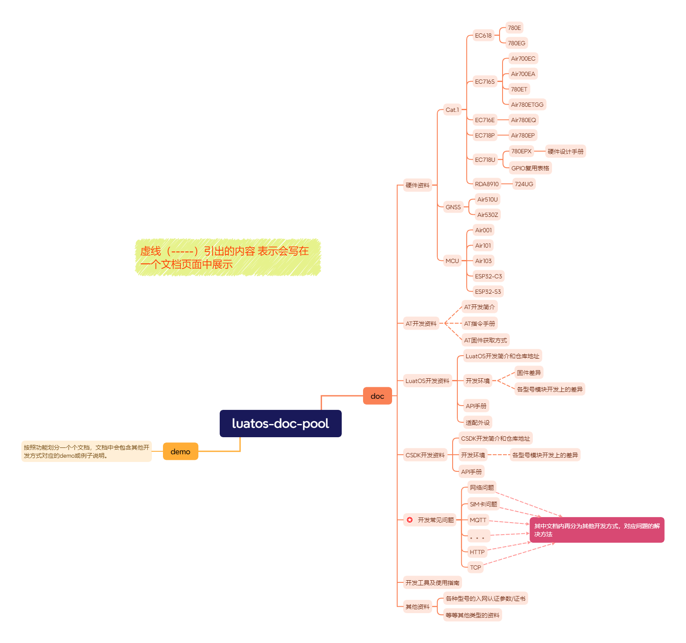

# luatos-doc-pool

#### 介绍

luatos文档池，用于存放luatos相关文档

#### 软件架构
软件架构说明

| 目录  | 说明                                                         |
| ----- | ------------------------------------------------------------ |
| doc   | 存放所有的文档文件                                           |
| image | 存放文档中使用到的本地图片，以相对路径使用。例："./doc/开发工具及使用说明/开发工具.md"中的图片，存放到"./image/开发工具及使用说明/开发工具"目录下 |

