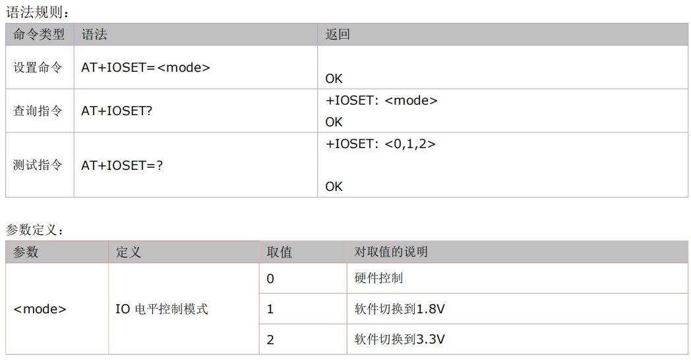
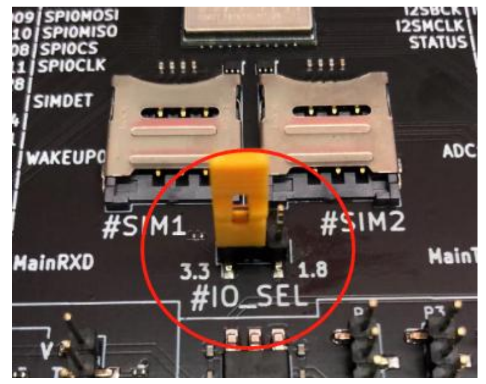

# 780E模块设备锁定应用指南

# 简介

> - 文档和工具
>   - AT指令手册：[Luat4G模块EC618&EC716&EC718系列AT命令手册](https://doc.openluat.com/article/4985)
>   - 780E模块AT固件：[合宙Air780E&600E AT固件更新说明](https://doc.openluat.com/article/4922)
>   - 本示例所烧录的AT固件版本： **AirM2M_780E_LTE_AT_V1165**
>   - 如果不会烧录，可参考 [烧录教程](https://doc.openluat.com/wiki/21?wiki_page_id=6072)
>   - 如果没有串口工具，推荐 [LLCOM | 能跑Lua代码的串口调试工具！](https://llcom.papapoi.com/index.html)
>   - 硬件资料： [模块硬件资料]([Luat社区 (openluat.com)](https://doc.openluat.com/wiki/21?wiki_page_id=6036))

# 简介

**IO电平**可以通过**AT+IOSET**控制为1.8V和3.3V，780E模块软件版本**>=V1155 版本**支持。

# 准备工作

1. 780E全IO开发板一套，包括天线、数据线和SIM卡，并烧录AT固件。

   

2. PC电脑，串口工具

# AT命令说明



硬件控制说明：模块的100管脚为IO_SEL。VDD_EXT 电压选择管脚；悬空为 1.8V ；0 欧姆接地为 3.3V。（此管脚会影响所有 IO 口的电平）。

780E全IO开发板一套，在排针#IO_SEL 通过短路帽选择模组的 GPIO 电平。



## IO电平设置示例

```LUA

[15:37:11.116]发→◇AT+IOSET=0  //硬件控制
□
[15:37:11.141]收←◆AT+IOSET=0

OK

[15:37:33.454]发→◇AT+IOSET=1  //软件切换到1.8V
□
[15:37:33.478]收←◆AT+IOSET=1

OK

[15:37:36.052]发→◇AT+IOSET=2  //软件切换到3.3V
□
[15:37:36.077]收←◆AT+IOSET=2

OK

```


# 常见问题

> 合宙支持AT功能的模组型号，除本文介绍的Air780E外，
> 还有Air780EPA、Air780EP、Air780EPT、Air780EPS等型号，
> 本文介绍的IO 电平控制应用应用指南的AT流程，同样也适用于这些型号。


