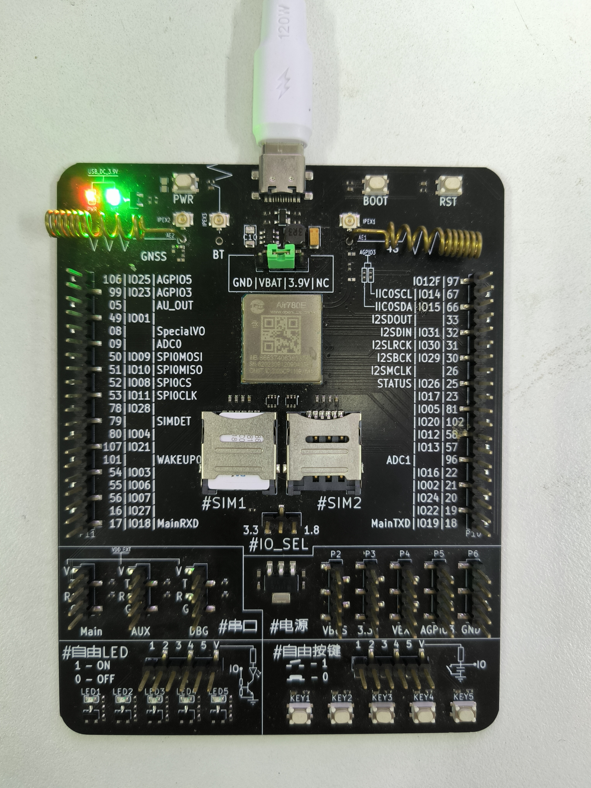

# 780E模块RI指示功能应用指南

# 简介

> - 文档和工具
>   - AT指令手册：[Luat4G模块EC618&EC716&EC718系列AT命令手册](https://doc.openluat.com/article/4985)
>   - 780E模块AT固件：[合宙Air780E&600E AT固件更新说明](https://doc.openluat.com/article/4922)
>   - 780E模块硬件资料：[模块硬件资料](https://doc.openluat.com/wiki/21?wiki_page_id=6036)
>   - 本示例所烧录的AT固件版本： **AirM2M_780E_LTE_AT_V1165**
>   - 如果不会烧录，可参考 [烧录教程](https://doc.openluat.com/wiki/21?wiki_page_id=6072)
>   - 如果没有串口工具，推荐 [LLCOM | 能跑Lua代码的串口调试工具！](https://llcom.papapoi.com/index.html)
>   - TCP/UDP测试网页：[TCP/UDP测试网页](https://netlab.luatos.com/)

# 简介

设置命令设置 RI 脚（模块中对应 MAIN_RI 脚）在收到 URC 上报的时候是否会有低脉冲指示。如果打开指示功能(<status>=1)，则相应的 URC 到来时，RI 会产生一个 120ms 的低脉冲(缺省设置)。也可以通过**AT+CFGRI**设置脉冲 的个数，以及低脉冲和高脉冲持续时间（单位ms）。

# 准备工作

1. 780E全IO开发板一套，包括天线、数据线和SIM卡，并烧录AT固件

   

2. PC电脑，串口工具

# 硬件连接

RI 脚（模块中对应 MAIN_RI 脚），可以通过模块硬件手册里的管脚排列图查看：


从上图可以看到RI 脚为模块20管脚，开发实际测试连接实物图如下所示：


# 示例

> 下面是AT命令序列，如果不理解AT命令含义，请自行参考AT手册。

## 测试示例

**默认拉低120ms脉冲示例**

```
[14:42:30.346]发→◇AT+CFGRI?        //查询命令AT+CFGRI?  
□
[14:42:30.350]收←◆AT+CFGRI?

+CFGRI: 0                         //默认0：RI指示功能关闭

OK

[14:42:36.187]发→◇AT+CFGRI=1  	//只有设置AT+CFGRI=1后，数据业务（包括TCPIP,HTTP,MQTT,FTP）

       							到来时的URC上报，才会使RI产生低脉冲
[14:42:36.190]收←◆AT+CFGRI=1

OK

[14:42:38.340]发→◇AT+CFGRISAVE=1   //设置是否保存 AT+CFGRI 指令设置的值，0 不保存，1 保存
□
[14:42:38.343]收←◆AT+CFGRISAVE=1

OK

[14:42:41.394]发→◇AT+CIPSTART="TCP","112.125.89.8",46056  //连接TCP服务器
□
[14:42:41.398]收←◆AT+CIPSTART="TCP","112.125.89.8",46056

OK

[14:42:41.789]收←◆
CONNECT OK

[14:42:51.105]收←◆test     //收到TCP数据
```

RI管脚对应脉冲波形图：


**通过AT+CFGRI=1,200,150,3设置脉冲个数和脉冲高低电平持续时间示例**

```
[15:47:55.915]发→◇AT+CFGRI=1,200,150,3  //设置成收到数据业务的URC时，会产生3个150ms的低脉冲，低脉										 冲之间的拉高时间为200ms
□
[15:47:55.920]收←◆AT+CFGRI=1,200,150,3

OK

[15:47:57.971]发→◇AT+CIPSTART="TCP","112.125.89.8",46056  //连接TCP服务器
□
[15:47:57.975]收←◆AT+CIPSTART="TCP","112.125.89.8",46056

OK

[15:47:58.252]收←◆
CONNECT OK

[15:48:03.702]收←◆test  //收到TCP数据

```

RI管脚对应脉冲波形图：


# 常见问题

**无低脉冲输出排查**

1. 只有设置AT+CFGRI=1后，数据业务（包括TCPIP,HTTP,MQTT,FTP）到来时的URC上报，才会使RI产生低脉冲。
2. 确认管脚是否正确。

> 合宙支持AT功能的模组型号，除本文介绍的Air780E外，
> 还有Air780EPA、Air780EP、Air780EX、Air201、Air780EQ、Air780EPT、Air780EPS等型号，
> 本文介绍的SIM应用指南的AT流程，同样也适用于这些型号。


