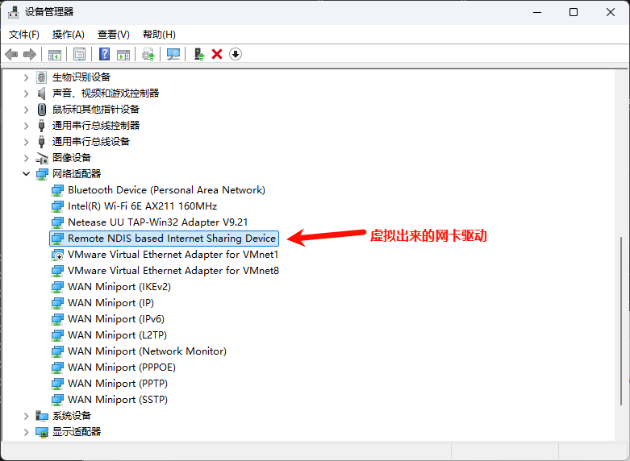
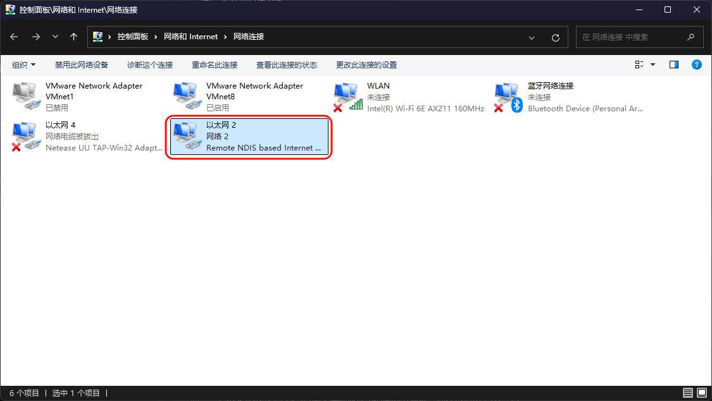
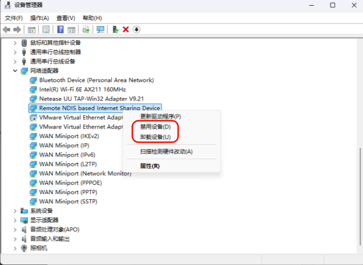
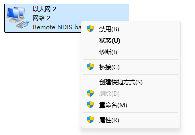

# 780E模块AT开发RNDIS网卡应用指南

# 简介

> - 文档和工具
>
>   - AT指令手册：[Luat4G模块EC618&EC716&EC718系列AT命令手册](https://doc.openluat.com/article/4985)
>
>   - 780E模块AT固件：[合宙Air780E&600E AT固件更新说明](https://doc.openluat.com/article/4922)
>
>   - 本示例所烧录的AT固件版本： **AirM2M_780E_LTE_AT_V1165**
>   
>   - 如果不会烧录，可参考 [烧录教程](https://doc.openluat.com/wiki/21?wiki_page_id=6072)
>   
>   - 如果没有串口工具，推荐 [LLCOM | 能跑Lua代码的串口调试工具！](https://llcom.papapoi.com/index.html)

# 概述

​	RNDIS是指Remote NDIS，基于USB实现RNDIS实际上就是TCP/IP over USB，就是在USB设备上跑TCP/IP，让USB设备看上去像一块网卡。从而使Windows /Linux可以通过 USB 设备连接网络。

# 准备工作

1. Air780E开发板

    .jpg)

2. 数据线

3. win10系统的电脑

4. 串口调试工具

# 打开RNDIS功能

## 发送AT+RNDISCALL=1打开

> 仅以示例进行简单参数描述，AT指令的详细描述请自行参考AT手册

~~~c
// 780E的标准AT固件 其实默认都是有打开USB和RNDIS功能，这里先演示一下如果有关闭过怎么重新开启

AT+RNDISCALL?       // 查询一下RNDIS的状态

+RNDISCALL:0        // 返回0，目前处于关闭状态

OK

AT+RNDISCALL=1      // 打开RNDIS功能

OK                  // 设置成功

// 设置成功之后 需要重启下模块，或者发下面的重启指令
AT+RESET

OK
~~~

通过AT指令配置成功之后，就可以通过USB连接到电脑，查看下是否有网卡显示。

window系统支持RNDIS直接用usb连接就可以使用，模块会虚拟一个网卡。

 

然后到"控制面板->网络和Internet->网络连接"中查看该RNDIS的以太网改为启用状态，这时等一段时间，再看电脑右下角的网络图标 就变成了以太网已连接的状态。

 

### Windows10上如何安装RNDIS驱动

RNDIS驱动是Windows10/11的一部分，默认驱动都是已安装的，不需要重新安装驱动。但如果接上模块后，发现RNDIS加载失败，可以尝试下面行为安装RNDIS驱动。

连接设备：‌首先，‌将USB RNDIS设备连接到计算机上。‌
进入设备管理器：‌在Windows 10中，‌按下Win + X键，‌选择设备管理器，‌或者通过搜索功能找到设备管理器并打开。‌
更新驱动程序：‌在设备管理器中，‌展开网络适配器部分，‌找到RNDIS设备。‌右键点击RNDIS设备，‌选择更新驱动程序。‌
浏览计算机查找驱动程序：‌在更新驱动程序的窗口中，‌选择浏览我的计算机以查找驱动程序软件。‌
选择驱动程序：‌在接下来的窗口中，‌选择让我从计算机上的可用驱动程序列表中选择，‌然后在设备列表中选择网络适配器。‌
选择制造商和设备型号：‌在制造商列表中选择Microsoft Corporation，‌然后在设备列表中选择USB RNDIS Adapter或者Remote NDIS Compatible Device（‌远程NDIS兼容设备）‌。‌
完成安装：‌点击下一步开始安装过程，‌等待安装完成。‌可能需要重启计算机以使更改生效。‌

# 关闭RNDIS功能

由于标准AT固件会打开USB和RNDIS功能，导致客户在首次调试的时候，连接电脑，加载了RNDIS网卡，然后电脑就变成了用780E模块上的SIM卡流量在上网。
可能客户会遇到怎么模块测试着TCP互传数据，突然断网了（实际是没流量了），所以再没有使用RNDIS网卡功能的场景时，可以将功能关闭，避免偷跑流量。

## 1、发送AT指令关闭 AT+RNDISCALL=0 
~~~c
// 关闭RNDIS功能的步骤和打开功能相似

AT+RNDISCALL?       // 查询一下RNDIS的状态

+RNDISCALL:1        // 返回0，目前处于关闭状态

OK

AT+RNDISCALL=0      // 打开RNDIS功能

OK                  // 设置成功

// 设置成功之后 需要重启下模块，或者发下面的重启指令
AT+RESET

OK
~~~

## 2、直接在设备管理器，或者控制面板禁用网卡

### 设备管理器

找到RNDIS的网卡，选择禁用设备或者卸载设备都可以

 

### 控制面板

找到模块对应的RNDIS驱动的以太网，右键后选择禁用即可

 

 
# 常见问题

## 1、我用的是linux系统，该怎么配置驱动呢

一般情况下，不是特别精简的linux 已经支持rndis 功能，如果插上合宙的4G 模块，但是不能上网的话，

能否检测到rndis 设备

> 在命令行中输入 dmesg ,如此出现  rndis_host 1-1:1.0 eth1 这样的打印，则证明已经识别到了，如果没有，可能是硬件问题，也可能是linux 真的不支持rndis，[linux 驱动配置](https://doc.openluat.com/wiki/21?wiki_page_id=6889") 
此时查看ifconfig ,如果没有出现    rndis_host 1-1:1.0 eth1 中的 eth1 ，则发送ifconfig -a ,此时发现有eth1 但是 没有ip 地址，发送 udhcpc -i eth1  出现地址后，即可使用此网卡进行上网

## 2、可以出现设备网卡，但是无法上网

> 这可能是由于模块没有注册上网络，可以通过模块串口发送AT指令查询。

常用 AT :

AT+CPIN?  查看卡是否在位

AT+CEREG?  查看是否注册上网络

AT+CSQ    查看信号值

# 适用型号&选型手册

> 合宙支持AT功能的模组型号，除本文介绍的Air780E外，
> 还有Air780EPA、Air780EP、Air780EX、Air201、Air780EQ、Air700ECQ、Air700EAQ、Air780EPT、Air780EPS等型号，
> 本文介绍的是TTS与音频文件播放应用指南的AT流程，同样也适用于这些型号。

