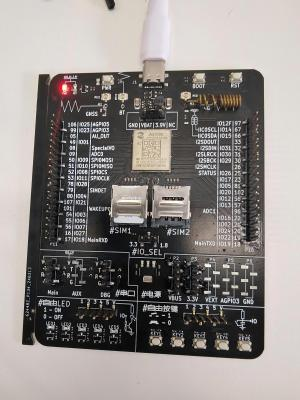

# 780E模块AT开发TE-TA本地流量控制应用指南

# 简介

> - 文档和工具
>
>   - AT指令手册：[Luat4G模块EC618&EC716&EC718系列AT命令手册](https://doc.openluat.com/article/4985)
>
>
>   - 780E模块AT固件：[合宙Air780E&600E AT固件更新说明](https://doc.openluat.com/article/4922)
>
>
>   - 本示例所烧录的AT固件版本： **AirM2M_780E_LTE_AT_V1165**
>
>
>   - 如果不会烧录，可参考 [烧录教程](https://doc.openluat.com/wiki/21?wiki_page_id=6072)
>
>
>   - 如果没有串口工具，推荐 [LLCOM | 能跑Lua代码的串口调试工具！](https://llcom.papapoi.com/index.html)
>   - 需要注意780E模块目前只支持软件流控

# 准备工作

1. Air780E 全IO开发板、SIM卡、数据线

    

2. Win10电脑、串口工具

3. 包含有RTS/CTS的串口线

   线序说明：红5V, 黑GND, 绿TXD,白RXD,黄RTS,蓝CTS（预留3.3V焊盘）

    .jpg)


4. 串口线连接板子示意图

   以780E开发板为例，接线如下，若线的长度不够时可通过杜邦线续接

   黑（GND）-> GND

   绿（TXD） -> MAIN_RXD

   白（RXD） -> MAIN_TXD

   黄（RTS） -> MAIN_RTS（GPIO17）

   蓝（CTS） -> MAIN_CTS（GPIO16）

    

# 流控介绍

对于模块与数据终端设备（DTE）之间可靠的通信而言，流控是非常重要的。假使在数据传输过程中，当发送端的发送速度大于接收端的接收速度，而此时接收缓存将近满的时候，接收端应该有办法让发送端暂停发送，直到它重新赶上，这便是流控。

一般来说，实现流控的方法有软件流控与硬件流控两种。在多路复用模式下，推荐采用硬件流控。

**软件流控：**

​	软件流控是指通过发送不同字符去暂停（XOFF，十进制 19）和恢复（XON，十进制 17）数据流。它适用于仅仅有三根线的串口通信。

​	需要注意的是，当模块传送的是二进制或十六进制数据时，不适合进行软件流控方式，因为TE可能会将二进制数据当成流控字符。

**硬件流控：**

​	硬件流控通过RTS/CTS信号来实现。当接收缓存快满的时候，模块会把CTS信号设置为无效，数据传输就会被暂停。等到模块的接收缓存可以继续接收更多数据时，CTS信号会被重新设置为有效。合宙LTE模块如果要使用硬件流控，则需要通过 **AT+IFC=2,2** 来配置，又因为这个配置不能自动保存，所以若希望在重启后能继续使用硬件流控，需要通过 **AT&W** 指令保存到用户配置表中。

​	需要注意的是，要实现硬件流控功能，请先确保你的应用串口包含有RTS/CTS线。

# AT指令参数说明

> 注意，目前780E模块只支持硬件流控

```lua
AT+IFC=<dce_by_dte>,[<dte_by_dce>]

//该指令为流控设置指令
//<dce_by_dte>表示TE接收来自TA数据时采用的流控方法，该参数有0，1，2三个取值，分别表示无流控、软件流控、硬件流控，默认值为0
//<dte_by_dce>表示TA接收来自TE数据时采用的流控方法，该参数有0，1，2三个取值，分别表示无流控、软件流控、硬件流控，默认值为0

```

# 示例

**由于780E模块只支持硬件流控操作，因此下方只进行硬件流控操作示例**

1. 查询操作

```lua
[19:54:31.677]发→◇AT+IFC=?		//查询<dce_by_dte>和<dte_by_dce>取值范围
□
[19:54:31.679]收←◆AT+IFC=?

+IFC: (0,2), (0,2)

OK

[19:54:40.225]发→◇AT+IFC?		//查询当前的流量控制方式
□
[19:54:40.227]收←◆AT+IFC?

+IFC: 0, 0						//0, 0表示无流控

OK


```

2. 设置流控方式为硬件流控

```lua
[19:55:12.263]发→◇AT+IFC=2,2		//设置为硬件流控
□
[19:55:12.266]收←◆AT+IFC=2,2

OK

[19:55:16.198]发→◇AT+IFC?		//再次查询当前的流量控制方式
□
[19:55:16.201]收←◆AT+IFC?

+IFC: 2, 2						//2, 2表示硬件流控

OK

AT&W						//如果希望掉电配置不丢失，再发送 AT&W 即可，
							//或者直接发送 AT+IFC=2,2;&W 。
```

3. 验证

​	在设置为硬件流控之后，此时打开串口工具，选择串口线对应的串口（注意不是模块虚拟出来的串口）；**注意RTS、CTS要正确与板子相连接，这样才能保住后续操作正常进行**


​	开始正常发送指令，这时候在串口工具上不会显示对应指令的回显和指令的返回值；


​	然后勾选上RTS，再次发送指令，若显示有对应指令的回显和指令的返回值则表明硬件流控设置成功。


# 适用型号&选型手册

> 合宙支持AT功能的模组型号，除本文介绍的Air780E外，
> 还有Air780EPA、Air780EP、Air780EX、Air724UG、Air201、Air780EQ、Air700ECQ、Air700EAQ、Air780EPT、Air780EPS等型号，
> 本文介绍的是TE-TA本地流量控制应用指南的AT流程，同样也适用于这些型号。


