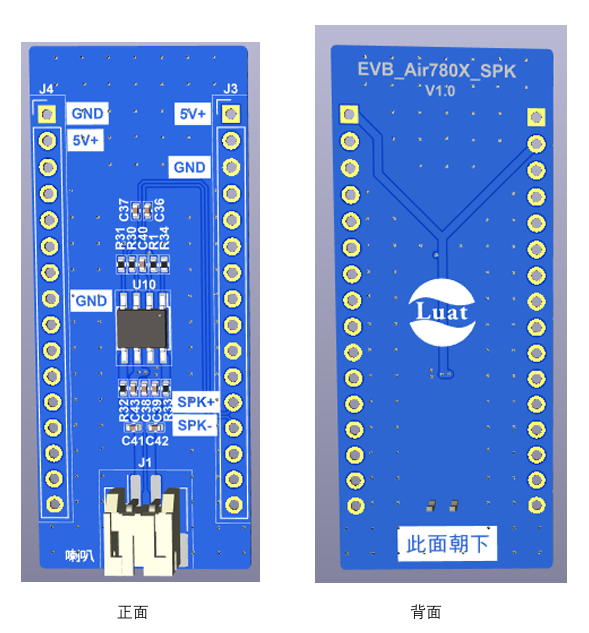
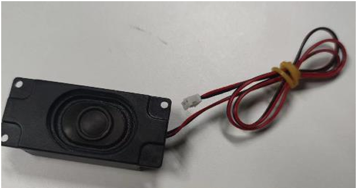

# 780E模块AT开发TTS与音频文件播放应用指南

# 简介

> - 文档和工具
>
>   - AT指令手册：[Luat4G模块EC618&EC716&EC718系列AT命令手册](https://doc.openluat.com/article/4985)
>
>   - 780E模块AT固件：[合宙Air780E&600E AT固件更新说明](https://doc.openluat.com/article/4922)
>
>   - 内置模拟音频功能原理设计：
>     - [Air780E内置模拟语音功能使用说明V1.1.pdf](https://cdn.openluat-luatcommunity.openluat.com/attachment/20230426152046436_Air780E内置模拟语音功能使用说明V1.1.pdf)
>
>     - [EVB_Air780E_CODEC_V2.0.zip](https://cdn.openluat-luatcommunity.openluat.com/attachment/20230322172438811_EVB_Air780E_CODEC_V2.0.zip)
>
>   - 本示例所烧录的AT固件版本：
>     - TTS播放测试： **AirM2M_780E_LTE_LSAT_V1167**
>   
>     - 音频文件播放测试：**AirM2M_780E_LTE_AUAT_V1165**
>   
>   - 如果不会烧录，可参考 [烧录教程](https://doc.openluat.com/wiki/21?wiki_page_id=6072)
>   
>   - 如果没有串口工具，推荐 [LLCOM | 能跑Lua代码的串口调试工具！](https://llcom.papapoi.com/index.html)

# 概述

​	由于780E模块无内置音频解码器，因此合宙官方设计了两种方案：

​	（1）利用Air780E模块内置的模拟语音输出功能。该功能是基于移芯EC618平台通过软件算法模拟，将数字语音转换成模拟语音输出，从而实现声音的输出。**合宙官方提供有内置音频硬件参考设计图，需要客户自己设计。**

​	（2）利用外置音频解码芯片。**合宙官方推出Air780E模块喇叭扩展板，该扩展板增加了驱动扬声器的功能，可用于语音播报等应用。**

# 准备工作

1. Air780E开发板

    .jpg)

2. 喇叭扩展板

    

3. 配套扬声器：8欧姆2W, 2.0MM接线头; 15cmx线长

    

4. 数据线，PC电脑，串口工具

# AT指令参数描述

> 仅以示例进行简单参数描述，详细描述请自行参考AT手册

## AT+CTTS

```lua
AT+CTTS=2,"123，欢迎你的到来",0

//该指令为TTS功能设置指令
//第一个参数用于设置TTS工作模式，取值范围为0~4，此处设置为2，表示使用GBK编码（中文）和ASCII编码（数字）格式内容进行TTS播放。
//第二个参数用于设置播放的内容，注意最大长度不能超过2047字节
//第三个参数用于设置TTS模式，取值范围为0~1，此处设置为0，表示仅播放TTS；该参数为非必填参数，默认值为0。
//特别需要注意的是，对于AT固件来说，需要烧录_LSAT后缀且版本号 >= V1111的固件才能够使用第三个参数

//如果需要查询TTS播放状态，可以发送AT+CTTS?进行查询，返回值0为非播放状态，1为播放状态
```

## AT+CTTSPARAM

```lua
AT+CTTSPARAM=50,0,50,50,0,0,25,1500,150,1,0,1

//该指令为TTS播放模式设置指令
//第一个参数用于设置TTS播放音量，取值范围为0~100，此处设置为50，表示播放音量强度为50，缺省值也为50。
//第二个参数用于设置TTS播放模式，共有4种模式，此处设置为0，表示根据数字规则主动读数字。
//第三个参数用于设置TTS播放音高，取值范围为0~100，此处设置为50，表示播放音高为50，缺省值也为50。
//第四个参数用于设置TTS播放速度，取值范围为0~100，此处设置为50，表示播放速度为50，缺省值也为50。
//第五个参数用于设置TTS播放通道，取值范围为0~1，0为主通道，1为辅通道，此处选择的是主通道。
//第六个参数用于选择解码芯片，取值范围为0~3，此处设置为0，表示使用ES7149解码芯片。需要注意的是，当取值为2时，表示选择内置模拟音频模式，使用该模式之前需要用户自行进行这部分电路的设计，合宙官方提供有对应电路的原理图和PCB。
//第七个参数用于设置PA管脚的GPIO号，780EP模块的PA管脚的GPIO号为25，用户需要根据自己选择的模块通过参考对应的硬件手册进行填写对应的GPIO号。
//第八个参数用于设置输入空白声音的时长，取值范围为1~2000，单位为ms，此处设置为1500，表示输入空白声音的时长为1500ms，默认值为1500ms
//第九个参数用于设置指令开启后多久打开PA，取值范围为1~2000，单位为ms，此处设置为150，表示指令开启150ms后打开PA，默认值为150ms
//第十个参数用于设置播放结束后关闭pa和codec之间间隔的时间，取值范围为1~2000，单位为ms，，此处设置为1，表示播放结束1ms后关闭pa和codec。
//第十一个参数用于设置控制pa播放时io的电平高低，取值范围为0~1，此处设置为0,表示播放时为高电平静音时为低电平，取值1与取值0正好相反，默认值为0.
//第十二个参数用于设置播放完TTS后多久关闭pa使能，取值范围为1~2000，单位为ms，此处设置为1，表示播放完TTS1ms后关闭pa使能，默认值为1。
```

**注意事项：**

> 第六个参数需要满足AT固件为_LSAT后缀固件且固件版本号 >= V1103。
>
> 第七个参数需要满足AT固件为_LSAT后缀固件且固件版本号 >= V1121。再次说明，使用该模式之前需要用户自行进行这部分电路的设计，合宙官方提供有对应电路的原理图和PCB。
>
> 第八、九、十个参数需要满足AT固件为_LSAT后缀固件且固件版本号 >= V1131。
>
> 第十一个参数需要满足AT固件为_LSAT后缀固件且固件版本号 >= V1149。
>
> 第十二个参数需要满足AT固件为_LSAT后缀固件且固件版本号 >= V1155。

## AT+CAUDPLAY

> **注：本命令仅适用于 EC618 平台系列模块（Air780E 系列）AUAT 版本 >= V1146 版本支持**

```lua
AT+CAUDPLAY=1,"test.mp3"

//该指令为音频文件播放设置指令
//第一个参数用于设置使用模式，取值范围为1~4，此处设置为1，表示开始播放。
//第二个参数用于填写对应音频文件名字，可以是AMR、WAV、MP3格式。需要加后缀，且支持8K采样音频数据。
//第三个参数用于设置播放持续时间，单位为ms。

//在使用该指令时，需要先通过AT+FSCREATE创建音频文件，再通过AT+FSWRITE输入音频文件内容，最后才能通过AT+CAUDPLAY进行播放。
```

# TTS播放示例

> **注意注意注意看这里！！！在使用TTS播放时，AT固件一定要选择带_LSAT后缀的版本**
> **下面将进行TTS播放测试，如果对AT指令不明白可自行查阅AT手册**

## 不同TTS工作模式下的TTS播放

```lua
[12:34:54.659]发→◇AT+CTTS=1,003100320033FF0C6B228FCE4F60768452306765 //模式1，UCS2编码格式内容
□
[12:34:54.665]收←◆AT+CTTS=1,003100320033FF0C6B228FCE4F60768452306765

OK

[12:34:59.013]收←◆
+CTTS:0

[12:35:05.335]发→◇AT+CTTS=2,"123，欢迎你的到来"		//模式2，GBK编码（中文）和ASCII编码（数字）格式内容
□												  //注意，目前不支持播放英文单词，只支持单个字母依次播放
[12:35:05.340]收←◆AT+CTTS=2,"123，欢迎你的到来"

OK

[12:35:09.686]收←◆
+CTTS:0

[12:35:16.558]发→◇AT+CTTS=3,\x31\x32\x33\xef\xbc\x8c\xe6\xac\xa2\xe8\xbf\x8e\xe4\xbd\xa0\xe7\x9a\x84\xe5\x88\xb0\xe6\x9d\xa5													//模式3，uft-8编码格式内容
□												  //该模式要求固件版本为LSAT版本，且版本号 >= V1103
[12:35:16.564]收←◆AT+CTTS=3,\x31\x32\x33\xef\xbc\x8c\xe6\xac\xa2\xe8\xbf\x8e\xe4\xbd\xa0\xe7\x9a\x84\xe5\x88\xb0\xe6\x9d\xa5

OK

[12:35:20.910]收←◆
+CTTS:0
```

## 不同TTS播放模式下的TTS播放

> 该示例中
>
> ​	TTS工作模式为2，即使用GBK编码（中文）和ASCII编码（数字）内容进行TTS播放
>
> ​	TTS播放通道为0，即主通道
>
> ​	解码音频芯片为0，即ES7149
>
> ​	PA管脚选择 25
>
> ​	其余参数设置为默认值（缺省值）

```lua
[12:43:49.975]发→◇AT+CTTSPARAM=50,0,50,50,0,0,25,1500,150,1,0,1		//TTS播放模式为0
□																	 //自动读数字，先根据数字规则读数字
[12:43:49.983]收←◆AT+CTTSPARAM=50,0,50,50,0,0,25,1500,150,1,0,1

OK

[12:43:57.366]发→◇AT+CTTS=2,"123，欢迎你的到来"
□
[12:43:57.373]收←◆AT+CTTS=2,"123，欢迎你的到来"

OK

[12:44:01.718]收←◆
+CTTS:0

[12:44:21.895]发→◇AT+CTTSPARAM=50,1,50,50,0,0,25,1500,150,1,0,1		//TTS播放模式为1，
□																	 //自动读取数字，首先根据电报规则读取数字
[12:44:21.904]收←◆AT+CTTSPARAM=50,1,50,50,0,0,25,1500,150,1,0,1

OK

[12:44:28.815]发→◇AT+CTTS=2,"123，欢迎你的到来"
□
[12:44:28.821]收←◆AT+CTTS=2,"123，欢迎你的到来"

OK

[12:44:33.167]收←◆
+CTTS:0

[12:44:43.047]发→◇AT+CTTSPARAM=50,2,50,50,0,0,25,1500,150,1,0,1		//TTS播放模式为2
□																	 //根据电报规则读取数字
[12:44:43.054]收←◆AT+CTTSPARAM=50,2,50,50,0,0,25,1500,150,1,0,1

OK

[12:44:48.186]发→◇AT+CTTS=2,"123，欢迎你的到来"
□
[12:44:48.191]收←◆AT+CTTS=2,"123，欢迎你的到来"

OK

[12:44:52.539]收←◆
+CTTS:0

[12:45:16.038]发→◇AT+CTTSPARAM=50,3,50,50,0,0,25,1500,150,1,0,1		//TTS播放模式为3
□																	 //根据数字规则读取数字
[12:45:16.046]收←◆AT+CTTSPARAM=50,3,50,50,0,0,25,1500,150,1,0,1

OK

[12:45:25.601]发→◇AT+CTTS=2,"123，欢迎你的到来"
□
[12:45:25.607]收←◆AT+CTTS=2,"123，欢迎你的到来"

OK

[12:45:30.204]收←◆
+CTTS:0
```

## 不同TTS播放通道下的TTS播放

> 该示例中
>
> ​	TTS工作模式为2，即使用GBK编码（中文）和ASCII编码（数字）内容进行TTS播放
>
> ​	解码音频芯片为0，即ES7149
>
> ​	PA管脚选择 25
>
> ​	其余参数设置为默认值（缺省值）

```lua
[12:54:10.487]发→◇AT+CTTSPARAM=50,0,50,50,0,0,25,1500,150,1,0,1		//主通道
□
[12:54:10.496]收←◆AT+CTTSPARAM=50,0,50,50,0,0,25,1500,150,1,0,1

OK

[12:54:18.636]发→◇AT+CTTS=2,"123，欢迎你的到来"
□
[12:54:18.641]收←◆AT+CTTS=2,"123，欢迎你的到来"

OK

[12:54:22.987]收←◆
+CTTS:0

[12:54:33.400]发→◇AT+CTTSPARAM=50,0,50,50,1,0,25,1500,150,1,0,1		//辅通道

□
[12:54:33.407]收←◆AT+CTTSPARAM=50,0,50,50,1,0,25,1500,150,1,0,1

OK

[12:54:40.335]发→◇AT+CTTS=2,"123，欢迎你的到来"
□
[12:54:40.340]收←◆AT+CTTS=2,"123，欢迎你的到来"

OK

[12:54:44.686]收←◆
+CTTS:0
```

## 不同解码芯片下的TTS播放

> 该示例中
>
> ​	TTS工作模式为2，即使用GBK编码（中文）和ASCII编码（数字）内容进行TTS播放
>
> ​	TTS播放通道为0，即主通道
>
> ​	PA管脚选择 25
>
> ​	其余参数设置为默认值（缺省值）
>
> 注意：使用内置模拟音频模式时，需要使用内置模拟音频模式专用板测试

```lua
[12:57:27.647]发→◇AT+CTTSPARAM=50,0,50,50,0,0,25,1500,150,1,0,1		//解码芯片为ES7149
□
[12:57:27.653]收←◆AT+CTTSPARAM=50,0,50,50,0,0,25,1500,150,1,0,1

OK

[12:57:34.641]发→◇AT+CTTS=2,"123，欢迎你的到来"
□
[12:57:34.646]收←◆AT+CTTS=2,"123，欢迎你的到来"

OK

[12:57:38.991]收←◆
+CTTS:0

[12:57:47.055]发→◇AT+CTTSPARAM=50,0,50,50,0,1,25,1500,150,1,0,1		//解码芯片为TM8211
□
[12:57:47.062]收←◆AT+CTTSPARAM=50,0,50,50,0,1,25,1500,150,1,0,1

OK

[12:57:52.901]发→◇AT+CTTS=2,"123，欢迎你的到来"
□
[12:57:52.907]收←◆AT+CTTS=2,"123，欢迎你的到来"

OK

[12:57:57.253]收←◆
+CTTS:0

[12:58:05.883]发→◇AT+CTTSPARAM=50,0,50,50,0,2,25,1500,150,1,0,1		//内置模拟音频
□																	 //注意：需要使用内置模拟音频扩展板测试
[12:58:05.889]收←◆AT+CTTSPARAM=50,0,50,50,0,2,25,1500,150,1,0,1

OK

[12:58:11.747]发→◇AT+CTTS=2,"123，欢迎你的到来"
□
[12:58:11.751]收←◆AT+CTTS=2,"123，欢迎你的到来"

OK

[12:58:16.119]收←◆
+CTTS:0

[12:58:27.386]发→◇AT+CTTSPARAM=50,0,50,50,0,3,25,1500,150,1,0,1		//解码芯片为ES8311
□
[12:58:27.394]收←◆AT+CTTSPARAM=50,0,50,50,0,3,25,1500,150,1,0,1

OK

[12:58:32.748]发→◇AT+CTTS=2,"123，欢迎你的到来"
□
[12:58:32.754]收←◆AT+CTTS=2,"123，欢迎你的到来"

OK

[12:58:37.101]收←◆
+CTTS:0
```

# 音频文件播放示例

> **注意注意注意！！！在需要播放音频文件时，AT固件需要烧录带_AUAT后缀的固件版本**
>
> **下面将进行TTS播放测试，如果对AT指令不明白可自行查阅AT手册**

```lua
[11:33:06.846]发→◇AT+FSCREATE="test.mp3"				//创建音频文件
□
[11:33:06.848]收←◆AT+FSCREATE="test.mp3"

OK

[11:33:29.102]发→◇AT+FSWRITE="test.mp3",0,1268,20	//输入音频文件。这里长度1268只是举例，请以实际为准
□
[11:33:29.106]收←◆AT+FSWRITE="test.mp3",0,1268,20

[11:33:29.132]收←◆
>
//这里输入音频文件内容（二进制，即16进制），也可以使用带发送文件功能的串口工具直接发送音频文件
[11:33:31.622]收←◆
OK

[11:33:39.618]发→◇AT+CAUDPLAY=1,"test.mp3"			//播放音频文件
□													 //注：音频文件名字需要加后缀
[11:33:39.623]收←◆AT+CAUDPLAY=1,"test.mp3"

OK

+CAUDPLAY: 1,4745										//播放结束上报
```

# 常见问题

1. 在进行TTS播报时，手动中止后，继续发送下一条TTS，出现报错

   主要原因在于TTS不管自动播放还是手动中止都会有个URC上报（+CTTS:0）,只有在收到该URC上报后再发送下一条TTS才不会报错。

2. 模块TTS功能最长能支持播放多长的文本

   支持最长播放2047字节的内容。

3. TTS播放支持英语单词播放吗?

   不支持

4. TTS播放对AT固件有要求吗？

   需要烧录_LSAT后缀的AT固件，版本号尽量选择最新版本。

5. 音频文件播放对AT固件有要求吗？

   需要烧录_AUAT后缀的AT固件，版本号尽量选择最新版本。

6. 在进行TTS播放配置中，一直配置错误是什么原因？

   先确认固件是否选择正确，一定要选择_LSAT后缀的AT固件，其次要选择最新版本。

# 适用型号&选型手册

> 合宙支持AT功能的模组型号，除本文介绍的Air780E外，
> 还有Air780EPA、Air780EP、Air780EX、Air724UG、Air201、Air780EQ、Air700ECQ、Air700EAQ、Air780EPT、Air780EPS等型号，
> 本文介绍的是TTS与音频文件播放应用指南的AT流程，同样也适用于这些型号。


[,]:
