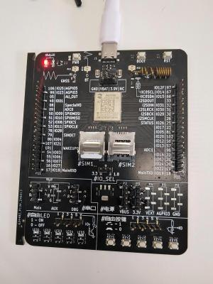
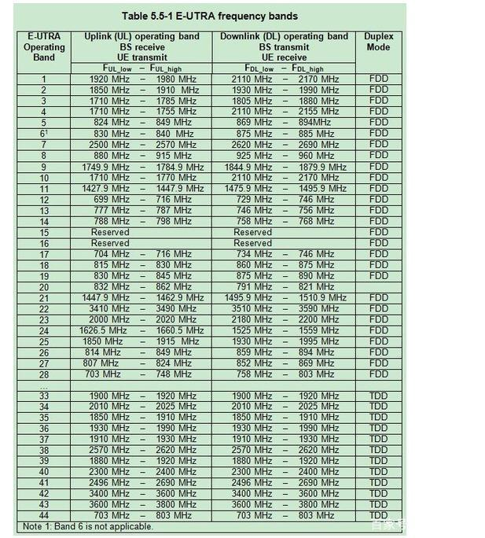
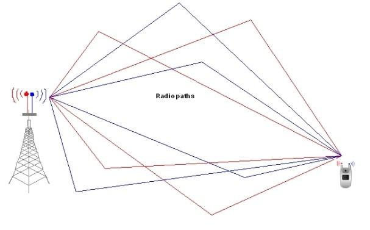
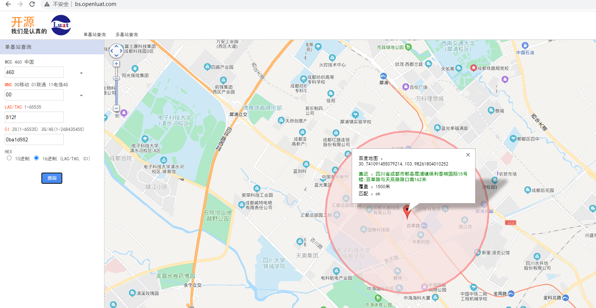

# 780E模块AT开发网络状态与信号强度查询应用指南

# 简介

> - 文档和工具
>
>   - AT指令手册：[Luat4G模块EC618&EC716&EC718系列AT命令手册](https://doc.openluat.com/article/4985)
>
>
>   - 780E模块AT固件：[合宙Air780E&600E AT固件更新说明](https://doc.openluat.com/article/4922)
>
>
>   - 本示例所烧录的AT固件版本： **AirM2M_780E_LTE_AT_V1165**
>
>
>   - 如果不会烧录，可参考 [烧录教程](https://doc.openluat.com/wiki/21?wiki_page_id=6072)
>
>
>   - 如果没有串口工具，推荐 [LLCOM | 能跑Lua代码的串口调试工具！](https://llcom.papapoi.com/index.html)

# 准备工作

1. Air780E 全IO开发板、SIM卡、数据线

    

2. Win10电脑、串口工具

# 名词解释

**位置区（Location Area，简称LA）：**它是指由一组小区（Cell）组成的特定区域。在GSM（Global System for Mobile Communications，全球移动通信系统）网络中，位置区用于管理移动设备的移动性，确保在接收到对移动设备的呼叫时能够快速准确地进行定位和连接。位置区码（Location Area Code，简称LAC）用于标识位置区的编码，通常由16位数字组成，与小区标识符（Cell Identity，简称CI）结合使用，可以唯一地标识网络中的每个位置区和小区。而在UMTS（Universal Mobile Telecommunications System，通用移动通信系统）网络和LTE（Long-Term Evolution，长期演进技术）网络中，即3G网络和4G网络中，位置区码的概念与GSM网络中的类似，但具体的编码方式和长度可能有所不同，用TAC（Tracking Area Code）进行标识。因此在以下章节中，LAC等价于TAC。

**基站区（Base Station Area，简称BSA）：**它是指由一个或多个基站覆盖的区域。在移动通信网络中，基站是无线信号的发送和接收装置，它与移动设备通过无线电波进行通信。基站区可以覆盖一个城市、一个乡村地区或任何其他特定的地理区域。基站区的大小取决于基站功率、天线配置、地形地貌以及网络规划等因素，一个基站区内可以包含多个小区（Cell），每个小区都有自己的标识符（如小区标识符CI）和特定的无限频率资源。基站区内的所有小区通常由同一个基站控制，它们共同构成了一个基站区。

**小区（Cell）：**它是移动通信网络中最基本的覆盖单元，由基站和其覆盖的区域组成。在无线通信中，小区是指在特定频率上上由基站发射的信号所能覆盖的一块区域。每个小区都有一个唯一的小区标识符（Cell Identity，简称CI），用于在网络中区分不同的小区。

**频段：**这个概念太过抽象，直接以中国三大运营商为例来阐述：

中国的三大运营商，建设了全球最多的4G基站。同时，工信部也分配了不同频段给运营商作为4G覆盖使用。三大运营商的4G，都要相对的高、中、低频段。中国电信有B1、B3、B5，中国联通有B1、B3、B8，中国移动是TD-LTE/FDD-LTE混合组网，有着最多的频段，包括B3、B8、B34、B38、B39、B40、B41，下图为4G频段表及上下行频率范围（未必准确，仅供参考）：



运营商在建设自己的4G基站时，根据工信部分配的频段，可以决定某个基站是支持分配的全部频段还是部分频段；例如中国移动在某个地区建设自己的基站，可以配置这个基站支持B3、B8、B34、B38、B39、B40、B41全部频段，也可以仅支持B3、B8频段，完全取决于运营商。

**信号强度：**运营商的基站建设好之后，一旦开始工作，基站就对外发射信号。此外，终端设备（模块产品、手机产品等）一开机，就开始搜索信号，信号强度用于表示终端设备接收到的基站发射出的信号强度。

基站发射的信号，通常都是经过折射、反射、衍射、散射等方式才被终端设备接收到，接收到的信号强度和终端设备的天线灵敏度、基站的距离、终端设备所处的环境等有关系，如下图所示：



# 网络注册

## 网络注册流程

**网络注册**，指的是从开机搜网到注册到网络的过程，或者从退出飞行模式到注册到网络的过程，此过程（该描述仅供参考，中间省去了很多细节，欲知详情，请自行搜索 LTE驻网流程 进行了解）可以概括为如下几步：

1. 终端设备开机或退出飞行模式后，读取PLMN
   - 公共陆地移动网（Public Land Mobile Network，简称：PLMN），由政府或它所批准的经营者，为公众提供陆地移动通信业务目的而建立和经营的网络
   - PLMN=MCC+MNC，以中国大陆的运营商为例，有中国移动、中国电信、中国联通三大运营商，MCC都是460，中国移动的MNC有00、02、07（后续可能还会扩充）
   - 从SIM卡中以及模块固件的配置文件中读取PLMN列表
2. 终端设备根据自己支持的频段，扫描基站信号，找到支持的PLMN
3. 根据小区选择标准（S标准），选择一个最优的小区
4. 驻留在最优小区

## AT指令网络注册信息说明

> 详细说明请自行参考AT手册

### E-UTRAN EPS 网络注册状态：AT+CEREG

> 该命令设置打开或关闭+CEREG的URC上报，URC上报内容如下：
>
> 设置\<n>=1，当在E-UTRAN网的EPS注册状态发生变化时，主动上报+CEREG: \<stat>
>
> 设置\<n>=2，当在E-UTRAN网的EPS注册状态或驻网小区发生变化时，主动上报+CEREG: \<stat>[,\<tac>,\<ci>,\<act>]
>
> 设置\<n>=3，当在E-UTRAN网的EPS注册状态或驻网小区发生变化时，主动上报
>
> +CEREG: \<stat>[,\<tac>,\<ci>,\<act>[,<cause_type>,<reject_cause>]]

**示例流程：**

```lua
[16:37:45.232]发→◇AT+CEREG=?		//查询<n>的取值范围，<n>为URC上报状态
□
[16:37:45.236]收←◆AT+CEREG=?

+CEREG: (0,1,2,3,4,5)			//查询结果，<n>的取值范围为0~5

OK

[16:38:04.803]发→◇AT+CEREG?		//<n>缺省值是0，此时查询当前网络注册状态
□
[16:38:04.806]收←◆AT+CEREG?

+CEREG: 0,1		//查询出来<n>=0，<stat>=1，<stat>为当前网络注册状态，取值1表示已注册，并且注册的是本地网

OK

[16:38:10.654]发→◇AT+CEREG=1	//设置URC上报状态为1，即<n>=1，当网络注册状态发生变化时，主动上报+CREG：<stat>
□
[16:38:10.658]收←◆AT+CEREG=1

OK

+CEREG: 0	//拔掉天线或走入没有信号的区域，此时会有URC上报，表明当前未注册网络

+CEREG: 1	//装上天线或走入有信号的区域，此时此时会有URC上报，表明当前重新注册上了网络

[16:38:16.898]发→◇AT+CEREG=2	//设置URC上报状态为2，即<n>=2
□
[16:38:16.901]收←◆AT+CEREG=2

OK

[16:38:23.724]发→◇AT+CEREG?	//再次查询当前网络注册状态
□
[16:38:23.729]收←◆AT+CEREG?

+CEREG: 2,1,"4844","0EA2D0CA",7	//查询到<n>=2，<stat>=1，<tac>=4844，<ci>=0EA2D0CA, <act>=7

OK

+CEREG: 1,"4844","01a2c315",7	//移动模块，当小区号发生改变的时候，会有个URC上报上来
```

**参数说明**

```lua
+CREG: 2,1,"4844","0EA2D0CA",7

//<n>=2，表示URC上报状态为2，（启用网络注册和位置信息非请求结果码 +CREG：<stat>[,<lac>,<ci>[,<act>]]）
//<stat>=1，表示当前网络注册状态为1，（已注册，本地网）
//<lac>=4844，表示此时位置区为4844，位置区格式为16进制数，字符串型
//<ci>=0EA2D0CA，表示此时小区ID为0EA2D0CA，小区ID格式为16进制数，字符串型
//<act>=7，表示此时接入模式为E-UTRAN
```

# 信号强度

## 参考指标

信号强度有两种不同参考指标：

**rssi：**接收信号强度指示。是一种用于评估接收信号强度的技术指标。rssi的值反映了信号在传输过程中的衰减程度，可以用来判断信号的稳定性和可靠性。rssi值的单位通常是分贝毫瓦（dBm），其中0dBm代表1毫瓦的功率。rssi值范围一般是从-50dBm（非常强）到-120dBm（非常弱），不同的通信标准和设备对这两个值有不同的定义。对于合宙4G Cat.1模块来说，通过**AT+CSQ**指令可以查询rssi值，注意此时的rssi值并非原有的值，是通过 **rssi = (接收信号强度（dBm）+113)/2** 所得到的rssi值，取值范围为0（弱）~31（强），并且用99来表示未知或不可测。

**rsrp（Reference Signal Received Power）：**它是指参考信号接收功率，是LTE（Long-Term Evolution）移动通信网络中用于衡量基站信号接收强度的参数。在LTE网络中作为评估移动设备与基站之间无线链路质量的一个重要指标。通常以分贝毫瓦（dBm）为单位，在3GPP协议中，rsrp值的取值范围为-44dBm（非常强）到-140dBm（非常弱）。对于合宙4G Cat.1模块来说，通过**AT+CESQ**指令可以查询到rsrp值，同样注意此时的rsrp值并非原有的值，对应关系可参考下表所示。

rsrp等级和rsrp功率的对应关系表如下：

| rsrp等级 | rsrp功率                    |
| -------- | :-------------------------- |
| 0        | rsrp < -140 dBm             |
| 1        | -140 dBm <= rsrp < -139 dBm |
| 2        | -139 dBm <= rsrp < -138 dBm |
| ...      | ...                         |
| 95       | -46 dBm <= rsrp < -45 dBm   |
| 96       | -45 dBm<= rsrp < -44 dBm    |
| 97       | -44 dBm <= rsrp             |
| 255      | 未知或不可测                |

这个表格是3GPP协议的标准规范，rsrp等级和rsrp功率是简单的线性关系。

在实网实际测试中，rsrp功率只要大于-71dBm，对应的rsrp等级大于等于70，信号就已经很好了，在实网环境下很难出现大于70的情况。

rsrp等级与rssi等级的转换关系，算法并不是简单的线性关系，在实际网络下，rssi的计算方式和多个网络参数有关，计算比较复杂，此处不再列举算式。下表离散采样了几个值来简单描述两者的对应关系，仅供参考

| rsrp等级 | rssi等级 |
| -------- | -------- |
| >69      | 31       |
| 66       | 30       |
| 63       | 28       |
| 58       | 26       |
| 54       | 24       |
| 50       | 22       |
| 44       | 19       |
| 40       | 17       |
| 35       | 15       |
| 30       | 12       |
| 26       | 10       |
| 19       | 9        |
| 15       | 7        |
| 9        | 7        |

信号强度仅仅表示当前驻留小区的网络覆盖程度，一般来说，信号强度和网络通信稳定率是成正比关系。信号强度越差，网路数据通信相对就越不稳定。但不能绝对的认为信号强度好，网络数据通信就一定稳定，网络数据通信是否稳定也与网络是否拥堵等其他因素有关。经验值如下：

- rsrp等级小于等于15或者rssi等级小于等于7，可以认为网络很差，不足以支撑网络通信
- rsrp等级小于等于26或者rssi等级小于等于10，可以认为网络不太稳定，不足以支撑正常的网络通信，会概率性掉线、丢包
- rsrp等级大于26或者rssi等级大于10，可以认为网络较好

## AT指令网络注册信息说明

> 详细说明请自行参考AT手册
>
> 特别说明：AT+CESQ查询出的rsrp比AT+CSQ查询出的rssi更能准确的反映信号强度，在条件允许的情况下，建议使用AT+CESQ

### AT+CSQ 查询rssi

**示例流程**

```lua
[17:40:49.932]发→◇AT+CSQ		//查询信号强度与质量
□
[17:40:49.936]收←◆AT+CSQ

+CSQ: 25,0		//查询结果

OK
```

**参数说明**

```lua
+CSQ: 25,0

//<rssi>表示接收信号强度指示，<rssi>=(接收信号强度dBm+113)/2
//<ber>表示信道误码率，只有在通话建立后才能获知该值
```

### AT+CESQ 查询rsrp

**示例流程**

```lua
[17:49:26.747]发→◇AT+CESQ	//查询信号的各个参数
□
[17:49:26.751]收←◆AT+CESQ

+CESQ: 99,99,255,255,22,48	//返回接收信号的各个参数

OK
```

**参数说明**

```lua
+CESQ: 99,99,255,255,22,48

//<rxlev>表示接收信号强度
//<rxqual>表示接收信号质量
//<rscp>表示接收信号码功率
//<ecno>表示每个pn码片的接收能量与总接收功率谱的比率
//<rsrp>表示参考信号接收质量(reference signal received quality)
//<rsrp>表示参考信号接收功率(reference signal received power)

特别说明：
	如果当前服务小区不是一个GERAN小区，<rxlev>和<rxqual>设置为99；如果当前服务小区不是一个UTRA FDD或UTRA TDD小区，<rscp>设置为255；如果当前服务小区不是一个UTRA FDD小区，<ecno>设置为255；如果当前服务小区不是一个E-UTRA小区，<rsrq>和<rsrp>设置为255。
```

### 打开CSQ主动上报：AT*CSQ

通过**AT*CSQ=1**打开主动上报，通过**AT*CSQ=0**关闭主动上报。

上报的URC如下所列：

```lua
+CSQ:<rssi>,<ber>
+CESQ:<rxlev>,<ber>,<rscp>,<ecno>,<rsrq>,<rsrp>
*CESQ: <rxlev>,<ber>,<rscp>,<ecno>,<rsrq>,<rsrp>,<sinr>
```

# 常见问题

1. 没有SIM卡，可以查询到信号强度吗？

   可以的。即使没有SIM卡，模块也能搜索到基站发出的信号，能搜索到就能感知到信号，只是无法驻网到小区而已。

2. 如何判断主板信号的接收性能？

   参考：[如何判主板的4G/2G信号接收性能的好坏](http://doc.openluat.com/article/660/0)

3. 如何在网站上查询小区对应的位置信息？

   例如：通过 AT+CEREG? 查询到的小区信息如下：+CEREG: 2,1,“812f”,“0ba1d982”,7

   这里的812f和0ba1d982都是16进制格式

   合宙官方提供了一个在线查询位置的位置服务：[在线根据小区查询位置](http://bs.openluat.com/)

   

   注意：任何一个在线查询网站，查询结果仅供参考；无法保证100%可以成功，因为小区id不断在新增，查询网站的后台数据库很难做到实时更新小区id数据库

4. 780E模块支持使用5G卡吗？

   780E模块本身只支持4G网络，但目前市面上所售卖的5G卡基本上都会包含4G业务，所以可以兼容使用5G流量卡，如果是纯5G卡的话就不可以了。

5. 如何锁频段/强制模块注册某个频段？

   通过AT+ECBAND指令设置，在设置之前要先进入飞行模式，设置完成后要退出飞行模式，具体流程看下方例程：

   ```lua
   以780E模块为例，注意各个例程之间没有关系。
   
   例程1：设置单个频段
   AT+ECBAND?    // 先查询模块支持的频段
   +ECBAND: 1,3,5,8,34,38,39,40,41
   OK
   
   AT+CFUN=0     // 进飞行模式
   OK
   
   AT+ECBAND=3   // 锁单个频段 band3
   OK
   
   AT+CFUN=1    // 退出飞行模式
   OK
   
   例程2：设置多个频段
   AT+ECBAND?    // 先查询模块支持的频段
   +ECBAND: 1,3,5,8,34,38,39,40,41
   OK
   
   AT+CFUN=0     // 进飞行模式
   OK
   
   AT+ECBAND=3,8,34   // 锁多个频段 band 3/8/34
   OK
   
   AT+CFUN=1    // 退出飞行模式
   OK
   
   例程3：解锁
   AT+ECBAND?    // 先查询模块支持的频段
   +ECBAND: 1,3,5,8,34,38,39,40,41
   OK
   
   AT+CFUN=0     // 进飞行模式
   OK
   
   ....（此处为设置频段操作）
   
   AT+ECBAND=1,3,5,8,34,38,39,40,41   // 将模块所有支持的频段（第一步查询出来的结果）全部设置，即可解锁
   OK
   
   AT+CFUN=1    // 退出飞行模式
   OK
   ```

6. 为什么模块在盒子里外接天线盒子的封闭状态会影响信号值？

   天线距离盒子太近盒子的密封状态会影响模块信号值，板子在密闭环境需要外接长一些的天线，这样信号值会高一些。

7. 信号强度和网络数据业务的稳定性关系

   信号强度的查询方法：
   AT版本：通过AT+CSQ查询rssi值，AT+CESQ命令可以查询rsrp值，取值范围参考AT手册AT手册
   LuatOS-Air版本：通过net.getRssi()返回信号强度值

   信号强度仅仅表示当前驻留小区的网络覆盖程度，一般来说，信号强度和网络通信稳定率是正比关系。信号强度差，网络数据通信相对就不稳定；但不能绝对的认为信号强度好，网络数据通信就一定稳定，和网络是否拥堵等其他因素也有关系；经验值参考本文[信号强度](# 信号强度)。

8. 联通基站全部拆除换成移动基站，先前的联通流量卡还能上网吗

   运营商决定，以实测为准。

9. 如何查询SINR？

   参考：[打开CSQ主动上报：AT*CSQ](# 打开CSQ主动上报：AT*CSQ)

10. 移动电信联通的SIM卡都可以使用，如果限制只能使用一家运营商的卡的话，这个支持么？

    通过频段去限制运营商，是存在问题的，同一个频段，因为带宽原因，可能不只一个运营商支持。目前没有直接限制运营商的办法。

11. 学生卡可以与SIM卡进行强绑定，也就是一张学生卡只能使用一个固定号码的手机号，这个可以支持么？

    模块没法支持 ，现在sim卡有机卡绑定的规则 , 能满足这个要求。

# 适用型号&选型手册

> 合宙支持AT功能的模组型号，除本文介绍的Air780E外，
> 还有Air780EPA、Air780EP、Air780EX、Air724UG、Air201、Air780EQ、Air700ECQ、Air700EAQ、Air780EPT、Air780EPS等型号，
> 本文介绍的是网络状态与信号强度查询应用指南的AT流程，同样也适用于这些型号。


