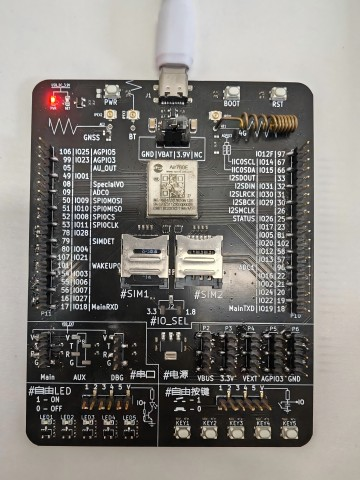

# 780EP模块AT开发文件系统应用指南

# 简介

> - 模块具有4Mb的flash空间，除了模块自身程序占用以外还剩余了一部分空间可供用户使用
> - 文档和工具
>   - AT指令手册：[Luat4G模块EC618&EC716&EC718系列AT命令手册](https://doc.openluat.com/article/4985)
>   - 780EP模块AT固件：[合宙780EP系列模组AT固件更新说明 ](https://doc.openluat.com/article/5055)
>   - 本示例所烧录的AT固件版本： **AirM2M_780EP_LTE_AT_V1007**
>   - 如果不会烧录，可参考 [烧录教程](https://doc.openluat.com/wiki/21?wiki_page_id=6072)
>   - 如果没有串口工具，推荐 [LLCOM | 能跑Lua代码的串口调试工具！](https://llcom.papapoi.com/index.html)

# 准备工作

1. 780EP全IO开发板一套，包括天线、数据线和SIM卡，并烧录AT固件

    

2. PC电脑，串口工具

# 文件操作示例

> 下面是AT命令序列，如果不理解AT命令含义，请自行参考AT手册。

```lua
[14:58:16.163]发→◇AT+FSMKDIR="/testdir"						//创建一级目录
□
[14:58:16.167]收←◆AT+FSMKDIR="/testdir"

[14:58:16.206]收←◆
OK

[14:58:23.600]发→◇AT+FSMKDIR="/testdir/testdir"				//创建二级目录
□
[14:58:23.603]收←◆AT+FSMKDIR="/testdir/testdir"

[14:58:23.632]收←◆
OK

[14:58:33.390]发→◇AT+FSCREATE="/testdir/test.txt"			//在一级目录下新建文件
□
[14:58:33.394]收←◆AT+FSCREATE="/testdir/test.txt"

OK

[14:58:44.529]发→◇AT+FSLS="/testdir"							//显示一级目录列表
□
[14:58:44.532]收←◆AT+FSLS="/testdir"

test.txt
testdir\

OK

[14:59:02.062]发→◇AT+FSWRITE="/testdir/test.txt",0,10,10		//写文件
□
[14:59:02.066]收←◆AT+FSWRITE="/testdir/test.txt",0,10,10

>
[14:59:04.820]发→◇1234567890									//当出现>时，输入数据
□
[14:59:04.824]收←◆
OK

[14:59:13.663]发→◇AT+FSREAD="/testdir/test.txt",0,10,10		//读取文件数据
□
[14:59:13.665]收←◆AT+FSREAD="/testdir/test.txt",0,10,10

1234567890
OK

[14:59:23.200]发→◇AT+FSMEM									//获取文件系统可用空间大小
□
[14:59:23.203]收←◆AT+FSMEM

+FSMEM: 64100 bytes


[14:59:44.162]发→◇AT+FSFLSIZE="/testdir/test.txt"			//获取文件大小
□
[14:59:44.164]收←◆AT+FSFLSIZE="/testdir/test.txt"

+FSFLSIZE: 10

OK

[14:59:52.583]发→◇AT+FSDEL="/testdir/test.txt"				//删除文件
□
[14:59:52.584]收←◆AT+FSDEL="/testdir/test.txt"

OK

[14:59:59.887]发→◇AT+FSRMDIR="/testdir/testdir"				//删除目录
□
[14:59:59.891]收←◆AT+FSRMDIR="/testdir/testdir"

OK
```

# 常见问题

1. 文件读写有长度限制吗？

   有限制，文件读写长度都不能超过 10240 字节， 如果超出此值， 则读写都应分次进行。

# 适用型号&选型手册

> 合宙支持AT功能的模组型号，除本文介绍的Air780EP外，
> 还有Air780EPA、Air780E、Air780EX、Air724UG、Air201、Air780EQ、Air700ECQ、Air700EAQ、Air780EPT、Air780EPS等型号，
> 本文介绍的是文件系统应用指南的AT流程，同样也适用于这些型号。


