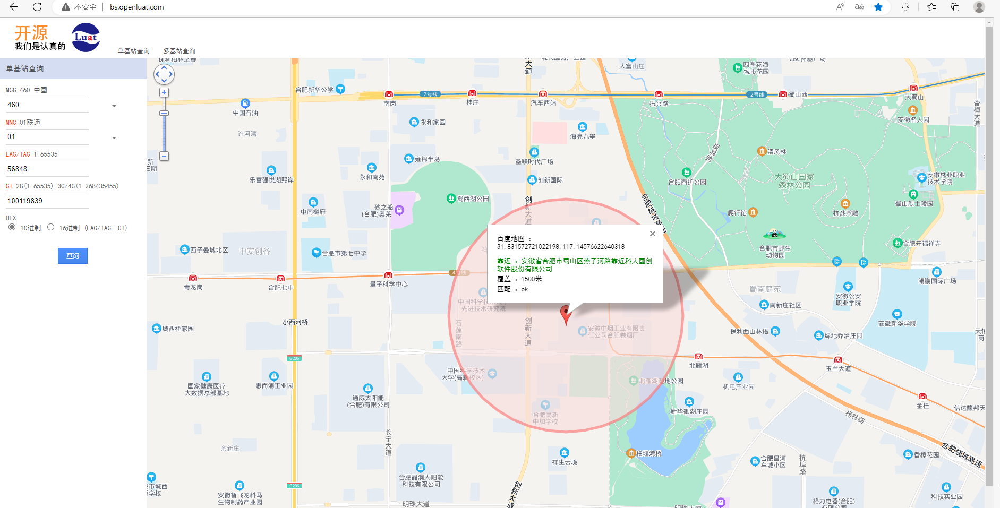

# 780EP模块AT开发基站定位与WIFI定位应用指南

# 简介

> - 文档和工具
>   - AT指令手册：[Luat4G模块EC618&EC716&EC718系列AT命令手册](https://doc.openluat.com/article/4985)
>   - 780EP模块AT固件：[合宙780EP系列模组AT固件更新说明 ](https://doc.openluat.com/article/5055)
>   - 本示例所烧录的AT固件版本： **AirM2M_780EP_LTE_AT_V1007**
>   - 如果不会烧录，可参考 [烧录教程](https://doc.openluat.com/wiki/21?wiki_page_id=6072)
>   - 如果没有串口工具，推荐 [LLCOM | 能跑Lua代码的串口调试工具！](https://llcom.papapoi.com/index.html)

# 应用概述

- 概述

  当手机在插入SIM卡后开机，便需要搜索周围的基站信息（俗称找信号），通常在有信号的地方，手机能搜到的基站不止一个。此时手机会主动从这些基站中选择信号最好的（假如是基站A）进行连接注册。那么，这时候其余基站就不使用了吗？其实不是的，手机仍然会继续搜索着它们，一旦离基站A远，离基站B近时，此时基站B的信号最好，手机会主动切换成基站B。由于手机在待机一天的情况下，需要不停的搜索基站、连接基站。这也就解释了手机在火车上要比在家时耗电要多的原因。

- 基站定位原理

  众所周知，当距离基站越远时信号便会越差，因此通过信号强度可以大致估计出距离基站的远近。由于基站都是中国移动、中国联通等运营商所建立的，所以他们可以确定每个基站准确的位置，当手机同时搜索到至少三个基站信号时，手机除了连接信号最好的一个之外，还会根据基站信号的强弱大致估计出距离基站的远近。由于基站位置已经确定，所以确定位置便容易的多了，只需以基站为圆心，距离为半径多次画圆即可。
  基站信号的多少决定着定位的准确，三个以上最为准确，若只搜索到一个或两个基站也可以定位，只不过没有那么准确而已。

- WIFI定位原理

  同基站定位原理类似，故不再描述。

# 准备工作

1. 780EP全IO开发板一套，包括天线、数据线和SIM卡，并烧录AT固件

   

2. PC电脑，串口工具

# 示例

> 下面是AT命令序列，如果不理解AT命令含义，请自行参考AT手册。

## 基站定位示例

```LUA
[11:11:30.600]发→◇AT						//训练波特率

□
[11:11:30.604]收←◆AT

OK

[11:11:38.752]发→◇AT+SAPBR=1,1			//激活PDP

□
[11:11:38.756]收←◆AT+SAPBR=1,1

OK

[11:11:47.997]发→◇AT+SAPBR=2,1			//查询是否激活成功，成功能查询到IP
□
[11:11:48.001]收←◆AT+SAPBR=2,1

+SAPBR: 1,1,"10.212.65.203"

OK

[11:11:55.288]发→◇AT+CIPGSMLOC=1,1		//查询基站定位
□
[11:11:55.292]收←◆AT+CIPGSMLOC=1,1

[11:11:55.526]收←◆
+CIPGSMLOC: 0,34.7980542,114.3204965,2024/08/20,11:11:58

OK
```

## WIFI定位示例

```LUA
[11:13:04.698]发→◇AT						//训练波特率
□
[11:13:04.701]收←◆AT

OK

[11:13:14.469]发→◇AT+SAPBR=1,1			//激活PDP
□
[11:13:14.472]收←◆AT+SAPBR=1,1

OK

[11:13:19.505]发→◇AT+SAPBR=2,1			//查询是否激活成功，成功能查询到IP
□
[11:13:19.512]收←◆AT+SAPBR=2,1

+SAPBR: 1,1,"10.118.31.190"

OK

[11:13:26.018]发→◇AT+WIFILOC=1,1			//查询WIFI定位
□
[11:13:26.022]收←◆AT+WIFILOC=1,1

[11:13:50.973]收←◆
+WIFILOC: 0,34.7989590,114.3210189,2024/08/20,11:14:16

OK
```

# 常见问题

1. 如何在网站上查询小区对应的位置信息？

   通过 **AT+CCED=0,1** 查询到小区信息如下：

   +CCED:LTE current cell: 460,01,460060086257105,0,3,5,1650,100119839,62,24,56848,34,86

   再通过合宙推出的 [在线根据小区查询位置](http://bs.openluat.com/) 输入对应参数后即可查到对应位置信息。

   

2. wifi定位失败的可能原因有哪些？

   - 如果没有搜索到wifi热点，用手机对比确认下是否可以搜索到附近wifi，如果手机可以搜到，确认下模块的板子上是否有接wifi天线
   - 如果可以搜索到wifi热点，但是wifi热点很少，用手机对比确认下搜索到附近wifi数量，如果数量差别太大，确认下模块的板子上是否有接wifi天线或者所接的天线是否支持2.4G频段

3. 基站定位获取的经纬度是什么格式的？

   - 基站定位获取的经纬度为WGS-84格式
   - 各种坐标系说明以及转换方法参考：[GPS定位纠偏](http://old.openluat.com/GPS-Offset.html) 

4. Wifi定位获取的经纬度是什么坐标系的？

   - Wifi定位获取的经纬度是WGS-84地心坐标系（ GPS 全球定位系统建立的坐标系统）

5. wifi定位精度

   - 根据设备获取的WiFi的信息进行定位，WIFI定位精度一般不受使用环境影响，主要和单一WIFI辐射半径、WIFI覆盖密度有关。一般来说，WIFI精度在3米－200米左右。

6. 基站定位精度

   - 搜索到的小区越多，定位的精度越高；一般来说，城市中心定位精度比郊区和农村定位精度高，城市中心的定位精度在几十米到几百米不等，郊区和农村的定位精度更低，可能会有几千米甚至更多的误差。
   - 基站定位的误差都比较大，如果需要准确定位，请使用支持GPS的模块。

7. WIFI定位支持国外定位吗？

   - 不支持，只支持国内定位。

# 适用型号&选型手册

> 合宙支持AT功能的模组型号，除本文介绍的Air780EP外，
> 还有Air780EPA、Air780E、Air780EX、Air724UG、Air201、Air780EQ、Air700ECQ、Air700EAQ、Air780EPT、Air780EPS等型号，
> 本文介绍的是基站定位与WIFI定位应用指南的AT流程，同样也适用于这些型号。


