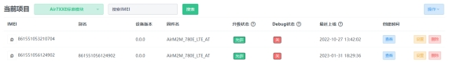
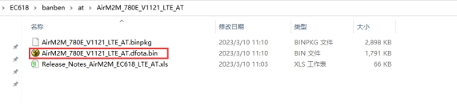
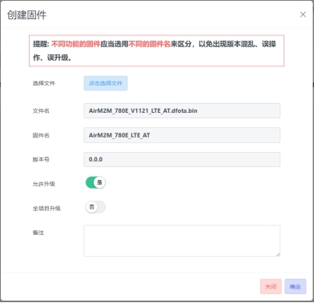
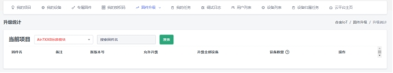

## FOTA空中升级：AT+UPGRADE

FOTA（Firmware Over The Air）是空中升级固件的功能。过程按顺序如下：

1 跟服务器固件版本比较版本号大小；

2 如果服务器固件版本号大，则启动下载固件的过程；

3 下载固件完毕，模块自动重启，烧录新版本；

4 模块再次自动重启，运行新固件

 

语法规则：

| 命令类型                                                     | 语法                                  | 返回                     | 说明              |
| ------------------------------------------------------------ | ------------------------------------- | ------------------------ | ----------------- |
| 设置命令                                                     | AT+UPGRADE=<tag>,<value>[,<savetoNV>] | OK                       | 设置<tag>值       |
| AT+UPGRADE=<tag>                                             | +UPGRADE:<tag>,<value>  OK         | 查询<tag>值              |                   |
| 查询命令                                                     | AT+UPGRADE?                           | +UPGRADE: <state>  OK | <state>=0时的返回 |
| +UPGRADE: <state>,<percent> OK                               | <state>=1时的返回                     |                          |                   |
| +UPGRADE: <state>, [<error code>, <http respone>, <fota error cause>] OK | <state>=2时的返回                     |                          |                   |
| 执行命令                                                     | AT+UPGRADE                            | OK                       | 手动触发升级      |

 

参数定义：

| 参数                | 定义                                                         | 取值  | 对取值的说明                                                 |
| ------------------- | ------------------------------------------------------------ | ----- | ------------------------------------------------------------ |
| <tag>               |                                                              | "KEY" | 使用"KEY"来设置服务器的ProductKEY                            |
| "AUTO"              | 使用"AUTO"设置是否自动升级                                   |       |                                                              |
| "PERIOD"            | 使用"PERIOD"设置自动升级的查询周期，单位：秒。当设置的周期到时，模块向服务器查询版本，服务器的模块版本号比自己大时，会发起自动升级。 |       |                                                              |
| "URL"               | 使用"URL"设置自己的升级服务器的URL地址                       |       |                                                              |
| <savetoNV>          | 是否把参数保存到NV                                           | 0     | 保存，缺省值                                                 |
| 1                   | 不保存                                                       |       |                                                              |
| <value>             | <tag>的取值，不同的<tag>有不同的取值                         |       | 字符串型，<tag> = "KEY"时，设定此值为合宙iot服务器某个产品的ProductKey即可在此产品下进行OTA升级 |
| 0                   | <tag> ="AUTO"时的取值，整数型。0：关闭自动FOTA（模块不再和服务器通讯）1：打开自动FOTA（模块定期向服务器查询）**注：缺省为1，即自动升级为打开！** |       |                                                              |
| 1                   |                                                              |       |                                                              |
| 60~2^32(4294967296) | <tag> ="PERIOD"时的取值，整数型，单位为秒。缺省值为86400，即24小时 |       |                                                              |
| "http://xxxx.bin"   | <tag> = "URL"时的取值，字符串型                              |       |                                                              |
| <state>             |                                                              | 0     | 未执行FOTA                                                   |
| 1                   | 正在从服务器下载固件                                         |       |                                                              |
| 2                   | 固件下载结果                                                 |       |                                                              |
| <percent>           | 升级百分比                                                   | 1~100 | 当模块处于<state>=1的状态时，下载固件的百分比                |
| <error code>        |                                                              | -1000 | 无效的URL                                                    |
| -1001               | 网络错误                                                     |       |                                                              |
| -1002               | 服务器链接错误                                               |       |                                                              |
| -1003               | 无效固件                                                     |       |                                                              |
| -1004               | http应答错误                                                 |       |                                                              |
| -1005               | 存储固件错误                                                 |       |                                                              |
| -1006               | 其他错误                                                     |       |                                                              |
| <http respone>      | http错误码                                                   |       | 详细取值请参考：[https://baike.baidu.com/item/HTTP%E7%8A%B6%E6%8](https://baike.baidu.com/item/HTTP状态码/5053660?fr=aladdin) |
| <fota error cause>  | FOTA错误原因                                                 | 3     | 无效的设备。找不到设备                                       |
| 17                  | 无权限                                                       |       |                                                              |
| 25                  | 无效的项目                                                   |       |                                                              |
| 26                  | 无效的固件                                                   |       |                                                              |
| 27                  | 已经是最新版本。通过了前面的检查，但版本号已是最新，或没打开升级开关、没指定imei等 |       |                                                              |

 

举例：

| 命令（→）/返回（←） | 实例                                                         | 解释和说明 |
| ------------------- | ------------------------------------------------------------ | ---------- |
|                     | **使用合宙提供的私人服务器进行升级：**                       |            |
|                     | **1** **将新版本固件上传服务器端** 在通过合宙ERP购买模块后，ERP会自动分配一个升级服务器管理账号，登陆地址为：http://iot.openluat.com/登录名是购买者手机号码，登录密码缺省是：888888登录后**新建项目**，项目名为"**Air7XXE标准模块**"如下所示：  点击设备列表将会看到已购买模块的IMEI列表，自动FOTA可以对这些设备进行固件升级。   点击进入**固件列表->创建固件->上传文件**，上传待更新的固件bin。固件升级用的bin文件在合宙官网发布的AT命令固件包内。以合宙AirM2M_780E_V1121_LTE_AT测试固件为例，该升级包解压后会有三个文件，其中bin文件需要上传到服务器端。 上传文件完成后，将下图中的两个选项选择：**是**  完成上述设置以后，模块就能实现自动空中固件升级FOTA了。缺省的查询服务器的时间间隔是24小时。注：用户同样可以通过AT+UPGRADE="AUTO",0关闭自动更新。 如果客户想再自动升级，有两种方法： 1）输入AT+UPGRADE手动触发升级 2)输入AT+UPGRADE="AUTO",1重新打开自动升级  **2 在服务器端可以查看FOTA升级情况**  点 固件升级->升级统计后，可以看到每个版本的升级成功数量   **3 模块在整个升级过程中的表现**  开始下载固件。此时自动上报： +UPGRADEIND: <percent> percent: 0-100 下载完固件后自动重启，开始烧录固件。烧录的时候主动上报： +UPGRADEDL: <percent> percent: 0-100 烧录成功后再次自动重启并主动上报软件已经更新： +UPGRADEVER: <new version> (new version： 新固件版本号，例如： "AirM2M_780E_V1121_LTE_AT ") +UPGRADEVER: <upload state> (upload state：新固件更新状态是否成功上报，1：上报成功，0：上报失败) **注意：从下载固件（打印+UPGRADEIND: <percent>），到模块自动重启后烧录新固件（打印+UPGRADDL: <percent>），再到再次重启后上报升级情况（打印+UPGRADEVER: <new version>)，整个过程模块自动完成，禁止用户在这个过程中重启模块或给模块断电！** |            |
|                     | **使用用户自己的服务器进行升级：**                           |            |
|                     | 用户在自己服务器放好bin文件，然后输入：AT+UPGRADE="URL","http://xxxx.bin"OK同样的，缺省也是自动升级，间隔周期也是24小时。模块从服务器下载固件，是用HTTP协议。 |            |
