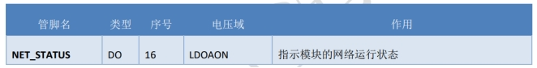
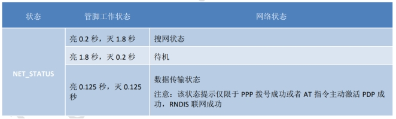

## 打开/关闭网络灯：AT+CNETLIGHT

本命令的设置命令是用来打开或关闭网络状态指示灯（NET_STATUS）。

本命令的查询命令是用来查询网络状态指示灯是否已经打开。

Air780EP系列模块用如下管脚信号来指示网络的状态。如下表描述了管脚定义。

网络指示管脚定义

 

 

 

语法规则：

| 命令类型 | 语法             | 返回                  |
| -------- | ---------------- | --------------------- |
| 设置命令 | AT+CNETLIGHT=<n> | OK                    |
| 读取命令 | AT+CNETLIGHT?    | +CNETLIGHT:<n>  OK |

 

参数定义：

| 参数 | 定义                     | 取值 | 对取值的说明 |
| ---- | ------------------------ | ---- | ------------ |
| <n>  | 网络状态指示灯的开关状态 | 0    | 关闭         |
|      |                          | 1    | 打开         |
