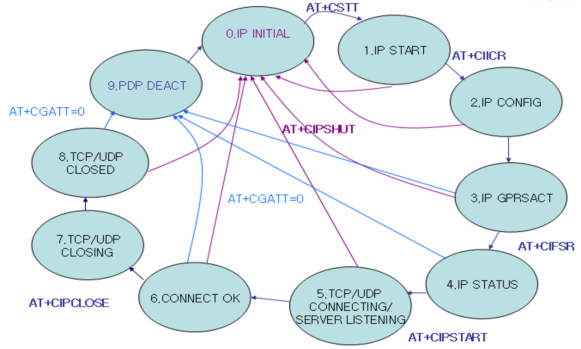
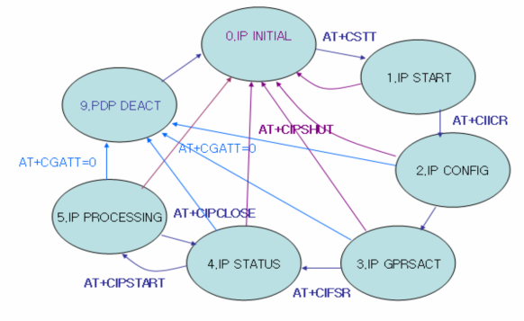

## 状态机

当输入TCPIP相关命令以后，模块的状态也会发生相应的迁移。查询状态的命令是AT+CIPSTATUS。 

 

​               									图1 ： 单链接时的状态机

 

关于单连接状态机的几点说明：

◆输入AT+CIICR，会马上进入IP CONFIG状态，当返回OK后，会进入到IP GPRSACT状态；

◆输入AT+CIPSTART后，会立马进入IP/UDP CONNECTING状态，如果后续模块上报CONNECT OK这个URC，表明连接服务器成功，此时进入CONNECT OK状态；

◆输入AT+CIPCLOSE后，立马进入TCP/UDP CLOSING状态，此时如果模块上报CLOSE OK，则表明关闭与服务器的连接成功，此时模块进入TCP/UDP CLOSED状态；

◆如果模块上报+PDP DEACT这个URC，则标志着模块释放PDP上下文，并进入了PDP DEACT状态；

◆在IP GPRSACT，IP STATUS，CONNECT OK以及TCP/UDP CLOSED状态下，输入AT+CGATT=0，则也可以使模块释放上下文，进入PDP DEACT状态；

◆模块进入PDP DEACT状态，仍需要输入AT+CIPSHUT，进入IP INITIAL状态；

◆模块在各个状态下均可以输入AT+CIPSHUT，进入IP INITIAL状态。

 

 

​               									

​												图2 ： 多链接时的状态机
