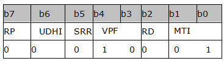

## 发送短信：AT+CMGS

使用设置指令，可将 SMS(SMS-SUBMIT)从TE发送到网络侧。发送成功后，消息参考值<mr>将返回给TE。

语法规则：

| 命令类型 | 语法                                                         | 返回和说明                                                   |
| -------- | ------------------------------------------------------------ | ------------------------------------------------------------ |
| 设置命令 | 文本模式 （AT+CMGF=1）情况下：AT+CMGS=<da>[,<toda>]<CR>text to send<CTRL-Z/ESC> | 发送成功则返回：+CMGS:<mr>  OK 说明：<CTRL-Z>即0x1A是发送，<ESC>即0x1B是终止发送。 |
|          |                                                              | 发送失败则返回： +CMS ERROR:<err>                         |
|          | PDU模式（AT+CMGF=0）情况下：AT+CMGS=<length><CR>>PDU to send<CTRL-Z/ESC> | 发送成功，返回： +CMGS:<mr>  OK 说明：<Ctrl+Z>即十六进制的1A，<ESC>即十六进制的1B |
|          |                                                              | 发送失败则返回： +CMS ERROR: <err>                        |
| 测试命令 | AT+CMGS=?                                                    | OK                                                           |

 

参数定义：

| 参数     | 定义                            | 取值  | 对取值的说明                                                 |
| -------- | ------------------------------- | ----- | ------------------------------------------------------------ |
| <da>     | 目的地址（Destination Address） | -     | GSM 03.40 TP-Destination-Address 中"地址－取值"字 段，字符型；将 BCD 数值(或缺省 GSM 字母格式的字符) 转换为当前选择的 TE 字符集中的字符(请参考 TS 07.07 中的+CSCS 指令)；地址类型由<toda>定义 |
| <toda>   | 目的地址类型（Type of <da>）    | -     | 整数型的 GSM 04.11 TP-Destination-Address 中的 8 位"类型－地址"字段(当<da>的首字符为+(IRA 43)时， 缺省值为 145；否则缺省值为 129) |
| <length> | TPDU短信长度                    | -     | 整数型。该长度不将短信中心号码的长度计算在内                 |
| <mr>     | 消息参考（MessageReference）    | 0~255 | 整数型的 GSM 03.40 TP-Message-Reference                      |

 

举例：

| 命令（→）/  返回（←） | 实例                                                         | 解释和说明                                                   |
| --------------------- | ------------------------------------------------------------ | ------------------------------------------------------------ |
|                       | **发送TEXT模式英文短信：**                                   |                                                              |
| →                     | AT+CMGF=1                                                    | 设置为TEXT模式                                               |
| ←                     | OK                                                           |                                                              |
| →                     | AT+CSMP?                                                     | 查询当前的TEXT模式短信参数                                   |
| ←                     | +CSMP: 17,11,0,0  OK                                      | 当前的<dcs>=0 （GSM）                                        |
|                       | AT+CSCS?                                                     |                                                              |
|                       | +CSCS: "IRA"  OK                                          |                                                              |
| →                     | AT+CMGS="139****6785"                                        | 发英文短信给测试手机。 注：139****6785是发送目的号码，请按照实际填写，不要照抄 |
| ←                     | >                                                            | 此时会返回>                                                  |
| →                     | hello,world！<Ctrl+Z>                                        | 返回>后，输入短信内容，例如：hello,world！然后输入    <Ctrl+Z>即0x1A就可以发送出去了 |
| ←                     | +CMGS: 108  OK                                            | 发送成功，<mr>=108                                           |
|                       | **发送TEXT模式中文短信：**                                   |                                                              |
| →                     | AT+CMGF=1                                                    | 设置为TEXT模式                                               |
| ←                     | OK                                                           |                                                              |
| →                     | AT+CSMP?                                                     |                                                              |
| ←                     | +CSMP: 17,167,0,0  OK                                     |                                                              |
| →                     | AT+CSMP=17,167,0,8                                           | 修改最后一个参数<dcs>=8                                      |
| ←                     | OK                                                           |                                                              |
| →                     | AT+CMGS="139****6785"                                        | 注：139****6785是发送目的号码，请按照实际填写，不要照抄      |
| ←                     | >                                                            | 此时会返回>                                                  |
| →                     | 611F8C22<Ctrl+Z>                                             | 返回>后，输入短信内容611F8C22，是16进制格式。即：0x610x1F0x8C0x22，<Ctrl+Z>发送，<Ctrl+Z>即十六进制的1A |
| ←                     | +CMGS: 73  OK                                             | 发送成功                                                     |
|                       | **发送PDU格式的中文短信：**                                  |                                                              |
| →                     | AT+CMGF=0                                                    | 设置成PDU模式                                                |
| ←                     | OK                                                           |                                                              |
| →                     | AT+CMGS=19>0011100D91683161450179F900080004611F8C22 [Ctrl+Z] | 19-是PDU字符串的长度(短信中心单元不应包括在内) 00- 表示短信中心的长度为0，这种情况下发送短信的时候直接从SIM卡中取SCA。该00是短信中心单元，不计入PDU长度中 11- PDU短信首字节   10- TP-MR，benchmark 0D- 目标地址（DA）长度 91683161450179F9- 目标地址（收信方号码） 00- Protocol Identifier (PID) 08- Data coding scheme (DCS)，8表示UCS2 00- Valid Period (VP) 04- User Data的长度 611F8C22- User Data，发送的短信内容（本例为中文"感谢") |
| ←                     | +CMGS: 110  OK                                            | 发送成功                                                     |
