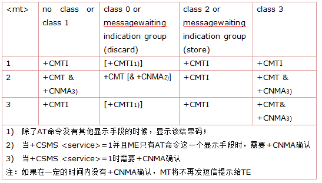

## 新消息指示：AT+CNMI

该指令用于PDU格式和TEXT格式，当TE处于在用状态时(如：DTR信号处于"ON"状态)，使用设置指令，可设置新消息如何从网络侧发送到TE。若 TE 处于待用状态（如：DTR信号处于"OFF"状态），消息接收流程应该按照GSM 03.38 的规定。

语法规则：

| 命令类型 | 语法                                            | 返回和说明                                                   |
| -------- | ----------------------------------------------- | ------------------------------------------------------------ |
| 设置命令 | `AT+CNMI=[<mode>[,<mt>[,<bm>[,<ds>[,<bfr>]]]]]` | OK                                                           |
| 查询命令 | AT+CNMI?                                        | `+CNMI:<mode>,<mt>,<bm>,<ds>,<bfr> ` OK                   |
| 测试命令 | AT+CNMI=?                                       | +CNMI: (`<mode>`取值列表),(`<mt>`取值列表),(`<bm>`取 值列表),(`<ds>`取值列表),(`<bfr>`取值列表)  OK |

 

参数定义：

| 参数     | 定义                     | 取值 | 对取值的说明                                                 |
| -------- | ------------------------ | ---- | ------------------------------------------------------------ |
| `<mode>` | TA给TE传送短信的模式     | 0    | 缓冲TA中的非请求结果码；若TA结果码缓冲器已满，结果码指示可以缓冲存储在其他存储空间或者把最旧的非请求结果码指示丢弃，替换为新接收到的指示。 |
|          |                          | 1    | 当TA-TE间的链路被占用(比如：在线数据模式下)，丢弃结果码指示，并拒绝新接收消息的非请求结果码。否则，直接转发给TE。 |
|          |                          | 2    | 当TA-TE间的链路被占用(比如：在线数据模式下)，缓冲TA中的非请求结果码；当链路释放后，把所有结果码发送给TE。否则，直接转发给TE。 |
|          |                          | 3    | 在TA 处于数据模式的情况下，使用特定的TA-TE 连接技术将结果码和数据同时传给TE。 |
| `<mt>`   | 新短信上报的方式         | 0    | 没有SMS-DELIVER的指示发送给TE                                |
|          |                          | 1    | 若SMS-DELIVER存储在ME/TA，存储位置靠非请求结果码`+CMTI: <mem>,<index>` 来提示给TE。 |
|          |                          | 2    | SMS-DELIVER消息(类别2的消息和位于消息等待指示组中的消息(存储消息))直接发送到TE。使用如下指令的非请求结果码：  `+CMT：[<alpha>],<length><CR><LF><pdu>` (启用PDU模式)或者`+CMT：<oa>,[<alpha>],<scts> ,<tooa>[*,<fo>,<pid>,<dcs>,<sca>,<tosca>,<length>*]<CR><LF><data>`(启用TEXT模式。斜体部分是否显示由+CSDH设置命令决定)  说明：若AT指令接口作为唯一的显示设备，ME必须支持类别0消息和位于消息等待指示组中的消息的存储(丢弃消息)。 |
|          |                          | 3    | 通过使用`<mt>`=2定义的非请求结果码，类别3的SMS-DELIVER消息直可接发送到TE。其他数据编码方案下的消息显示结果均遵循`<mt>`=1的定义。 |
|          |                          |      | SMS-DELIVER 结果码（+CMT, +CMTI）和确认(+CNMA)的关系总结：  |
| `<bm>`   | 小区广播短消息的上报方式 | 0    | 无 CBM 指示发送到 TE                                         |
|          |                          | 2    | 收到的CBM使用如下格式直接发送到TE： `+CBM：<length><CR><LF><pdu>`(启用PDU 模式)或者 `+CBM：<sn>,<mid>,<dcs>,<page>,<pages><CR><LF><data>`(启用TEXT模式) |
| `<ds>`   | 短信状态报告上报方式     | 0    | 无SMS-STATUS-REPORTS发送到TE。                               |
|          |                          | 1    | SMS-STATUS-REPORT消息使用如下格式直接发送到TE： `+CDS：<length><CR><LF><pdu>`(启用PDU模式)或者 `+CDS：<fo>,<mr>,[<ra>],[<tora>],<scts>, <dt>,<st>`(启用TEXT模式) 注：`<dt>,<st>`请参考+CMGR |
| `<bfr>`  |                          | 0    | 当`<mode>`为1～3时，这条指令所定义的TA缓存中的结果码被发送到TE(在发送之前，OK应该被接收到) |
|          |                          | 1    | 当`<mode>`为1～3时，将清除该指令中定义的TA对非请求结果码的缓冲 |

 

举例：

| 命令（→）/返回（←） | 实例                                                         | 解释和说明                                                   |
| ------------------- | ------------------------------------------------------------ | ------------------------------------------------------------ |
| →                   | AT+CNMI=?                                                    | 查询参数范围                                                 |
| ←                   | +CNMI: (0-3),(0-3),(0-3),(0-1),(0-1)  OK                  | 模块查询结果                                                 |
| →                   | AT+CNMI=2,1                                                  | 设置CNMI参数                                                 |
| ←                   | OK                                                           |                                                              |
| ←（URC）            | +CMTI: "SM",1                                                | 此时收到一个短信，缓存在`<mem1>`中，只用+CMTI上报新短信位置索引 |
| →                   | AT+CNMI=1,2                                                  | 设置`<mt>`=2，即新短信不缓存，直接上报                       |
| ←                   | OK                                                           |                                                              |
| →                   | AT+CSMS=1                                                    | 必须把+CSMS的第一个参数设置为1，才支持+CNMA命令              |
| ←                   | OK                                                           |                                                              |
| →                   | AT+CMGF?                                                     | 查询当前短信模式                                             |
| ←                   | +CMGF: 0  OK                                              | 是PDU模式                                                    |
| ←（URC）            | +CMT: ,240891683108200105F0040D91683129634152F600002180804184422304F7349B0D | 此时收到一个PDU短信，具体分析如下： +CMT: ,24 24-PUD长度，短信中心号码不算在PDU内 08- Length of SCA，短信中心地址长度（按字节数计算，包括91在内） 91- 短信中心地址的TON/NPI 683108200105F0-  短信中心地址，需要两两反转，反转后是8613800210500。 04- First Octet，PDU的首字节 0D-源地址长度（号码长度） 91683129634152F6-  源地址。需要两两反转，反转后是8613923614256 00- PID（Protocol Identifier） 00- DCS（Data Coding Scheme），0表示7BIT GSM DEFAULT 21808041844223-  SCTS（SM Center Time Stamp），短信中心时间戳，表示SC收到短信的时间为:12年8月8日14:48:24,+8GMT 04- 用户数据的长度 F7349B0D- 7BIT GSM DEFAULT编码的will |
| →                   | AT+CNMA                                                      | 收到短信消息后，立即发送AT+CNMA命令                          |
| ←                   | OK                                                           |                                                              |
| →                   | AT+CMGF=1                                                    | 设置为TEXT模式                                               |
| ←                   | OK                                                           |                                                              |
|                     | AT+CNMI=1,2                                                  |                                                              |
| ←（URC）            | +CMT: "+86131******56",,"12/08/08,11:05:45+32",145,17,0,0,"+8613800210500",145,7 Will-go | 收到一个新短信，是TEXT模式                                   |
| →                   | AT+CNMA                                                      | 收到短信消息后，立即发送AT+CNMA命令                          |
| ←                   | OK                                                           |                                                              |

 
