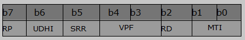

## 设置短信TEXT模式参数：AT+CSMP

文本模式下(即AT+CMGF=1)，当向网络侧**发送**短消息或将短消息**存放**在存储器中时，使用该设置命令可选择需要的附加参数取值。除此之外，设置命令还可用于设置从SMSC 接收到该短消息时算起的有效期（<vp>的取值范围为0... 255）或定义有效期终止的绝对时间(<vp>为字符串时)。

语法规则：

| 命令类型 | 语法                                  | 返回                                                         |
| -------- | ------------------------------------- | ------------------------------------------------------------ |
| 设置命令 | AT+CSMP=[<fo>[,<vp>[,<pid>[,<dcs>]]]] | OK                                                           |
| 查询命令 | AT+CSMP?                              | +CSMP:<fo>,<vp>,<pid>,<dcs>  OK                           |
| 测试命令 | AT+CSMP=?                             | +CSMP: (<fo>取值列表),(<vp>取值列表), (<pid>取值列表), (<dcs>取值列表)  OK |

 

参数定义：

| 参数  | 定义                       | 取值              | 对取值的说明                                                 |
| ----- | -------------------------- | ----------------- | ------------------------------------------------------------ |
| <fo>  | 短信首字节（First Octet）  | 17,21,33,37,49,53 | 对<fo>字节的具体描述如下（以SMS-SUBMIT为例）： MTI：消息类型 b1=0&b0=0  表示SMS-DELIVER b1=0&b0=1  表示SMS-SUBMIT  其他消息类型请参考GSM03.40 VPF：定义短信有效时间的格式 b4=1&b3=0：Relative format，此时<vp>是1个字节的整数型 b4=1&b3=1：Absolute format，此时<vp>是7个字节的整数型 SRR：Status Report Request，设置是否需要短信状态报告 UDHI：User Data Header Indicator，指示User Data单元是否有一个header RP：Reply Path，回复路径 RD：Reject Duplicate，拒绝重复短信 |
| <vp>  | 短信有效期（Valid Period） |                   | 取值由<fo>字段的VPF决定： 如果VPF=10(Binary)，则<vp>为相对模式，与短信有效时间的对应关系如下：  如果VPF=11(Binary)，则<vp>为绝对模式，是7个字节的字符型，表示短信有效期到期的时间点。 |
| <pid> | TP-协议-标识               | 0                 | 整数型，具体请参考GSM03.40                                   |
| <dcs> | 短信内容编码方案           |                   | 整数型，具体请参考GSM03.38。一般情况下：0- 7bit GSM Default4-  8bit Data8-  UCS2 |

 

举例：

| 命令（→）/  返回（←） | 实例              | 解释和说明                                                   |
| --------------------- | ----------------- | ------------------------------------------------------------ |
| →                     | AT+CSMP=17,11,0,0 | 设置TEXT模式短信发送的各参数： <fo>=17（缺省），表示MTI=01（binary）=SMS-SUBMIT，并且VPF=10（binary）= Relative format <vp>=11，表示有效时间为（11+1）x5分钟=1个小时 <dcs>=0，表示编码格式是7bit GSM Default |
| ←                     | OK                |                                                              |
