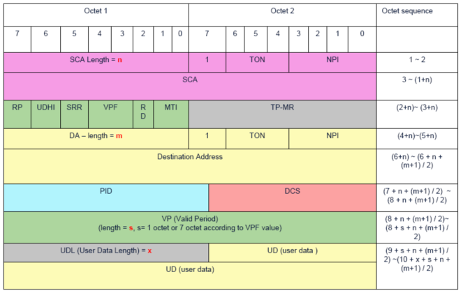
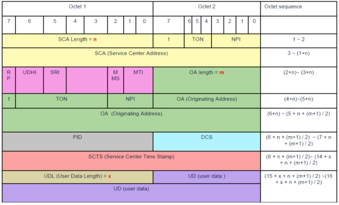

## PDU短信编码格式介绍

  

 

 图表 1 ：MO 短信 PDU格式

 

 

​       图表 2 ：MT 短信 PDU格式

 

参数定义：

| 参数       | 定义                         | 解释和说明                                                   |
| ---------- | ---------------------------- | ------------------------------------------------------------ |
| MO         | Mobile Originated            | 模块发送的                                                   |
| MT         | Mobile Terminated            | 模块接收的                                                   |
| SCA Length |                              | 短信中心地址的长度                                           |
| TON        | Type of Number               | 号码类型：000：未知 001：国际 010：国内 111：留作扩展        |
| NPI        | Numbering  Plan Identifier   | 号码鉴别：0000：未知 0001：ISDN/电话号码 1111：留作扩展      |
| SCA        | Short Message Center Address | 短信中心地址                                                 |
| MTI        | Message Type Identifier      | 信息类型：Bit 		Explanation11 		Reserved10 		SMS-STATUS REPORT (SC => MS)01 		SMS-SUBMIT (MS => SC)00 		SMS-DELIVER (SC => MS) |
| RD         | Reject Duplicate             | 拒绝重复短信                                                 |
| VPF        | Validity Period Format       | 有效期格式                                                   |
| SRR        | Status Report Request        | 状态报告请求，在MO短信中设定                                 |
| SRI        | Status Report Indication     | 状态报告指示，在MT短信中指示该MT短信是否为状态报告           |
| UDHI       | User Data Header Indicator   | 用户数据头指示                                               |
| RP         | Reply Path                   | 回复路径                                                     |

 
