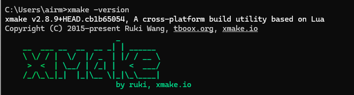

# 安装xmake

## 下载xmake

- linux和macos安装请自行参考，但并不建议，因为macos无法打包，并且Luatools只支持windows。
  - [xmake下载地址](https://xmake.io/#/guide/installation)

- windows可以直接访问：[xmake releases](https://github.com/xmake-io/xmake/releases) ，下载系统对应的**xmake-x.x.x-win32.exe**或者**xmake-x.x.x-win64.exe**即可，建议使用最新版。
  如果自行下载困难，可以直接点击以下链接，下载2.8.9版本：
  - [xmake-v2.8.9.win32.exe](https://cdn.openluat-luatcommunity.openluat.com/attachment/20240418153957494_xmake-v2.8.9.win32.exe)
  - [xmake-v2.8.9.win64.exe](https://cdn.openluat-luatcommunity.openluat.com/attachment/20240418154008282_xmake-v2.8.9.win64.exe)
- **Windows安装时注意选取加入PATH，且环境变量需重启电脑后生效**
- **如果网络无法下载GitHub等地址，可采用下方的本地地址下载，后续更新xmake也会同步更新至本地地址**
  - [本地下载地址](https://gitee.com/link?target=https%3A%2F%2Fpan.air32.cn%2Fs%2FDJTr%3Fpath%3D%252F%25E5%25B8%25B8%25E7%2594%25A8%25E5%25B7%25A5%25E5%2585%25B7)

## 安装xmake（Windows）

- 建议安装到C:\Program Files下，其他目录可能会出问题
- 勾选加入到系统环境变量选项

安装完成后，打开cmd命令行窗口，输入**xmake -version**，回车执行后，如下图所示，表示安装成功：



# 编译项目

## 编译项目（2022库）

**注意：**

- 本章所用到的代码库
  - **[luatos-soc-2022](https://gitee.com/openLuat/luatos-soc-2022)**

- 2022库适用于移芯618芯片平台模块

本章以2022库project目录下的**example_mobile**为例，讲解如何编译项目：

1. 打开2022库根目录下的cmd程序，输入**build example_mobile**或者**build example_mobile disable -v**命令，按回车键进行编译


2. 编译结束后，如下图所示，表示编译成功


3. 编译中间文件存放在build目录下


4. 编译成功后生成的可烧录binpkg文件、日志database文件、map文件、elf文件存放在out目录下


## 编译项目（2024库）

**注意：**

- 本章所用到的代码库

  - CSDK软件包：[luatos-soc-2024](https://gitee.com/openLuat/luatos-soc-2024)

  - LuatOS库：[LuatOS](https://gitee.com/openLuat/LuatOS)

  - CSDK开发需要上面两个代码仓库，放到同一目录下，目录组织见以下截图：

     

- 2024库适用于移芯7xx系列模块，例如716/716e/718p等

- 默认编译**EC718P**，如需编译其他芯片平台需要执行**xmake f --menu**后，选择**Project Configuration** 根据自己实际使用配置即可

本章以2024库project目录下的**example**为例，讲解如何编译项目：

1. 在项目下打开终端，比如**example**，就在**luatos-soc-2024\project\example**下打开终端，即


2. 执行配置，执行 **xmake f --menu**，选择 **Project Configuration** 根据自己实际使用配置即可


默认配置如下：


可以根据需要选择对应的芯片平台


配置完成后选择Exit退出，询问是否保存选择Yes


**注意：**上述配置只需配置一次，之后会一直生效，只有修改配置时才需要重新执行配置操作

3. 执行**xmake**进行编译


4. 编程结束后，如下图所示表示编译成功


5. 编译成功后生成的可烧录binpkg文件、日志database文件、map文件、elf文件都存放在对应项目的out目录下


# 新增项目

## 新增项目（2022库）

- **建议将project/example拷贝一份，作为验证项目**

1. 在**luatos-soc-2022\project**下新建目录，目录名称任意，但要与项目名称保持一致，我们就命名为example_test


2. 在example_test下新建一个xmake.lua，内容格式仿照example项目编写，核心是TARGET_NAME必须和项目名称一致


## 新增项目（2024库）

- **建议将project/example拷贝一份，作为验证项目**

1. 在**luatos-soc-2024\project**下新建目录，目录名称任意，但要与项目名称保持一致，我们就命名为example_test


2. 在example_test下新建一个xmake.lua，内容格式仿照example项目编写


# 项目中新增入口函数

本CSDK中没有main函数，需要通过宏注册入口函数

- 加入头文件common_api.h
- 类似于void main(void)，但是可以任意名字，不能有入口参数和返回参数，同时允许多个入口
- 通过INIT_HW_EXPORT、INIT_DRV_EXPORT、INIT_TASK_EXPORT这3个宏修饰后，系统初始化的时候会调用function，不同的宏涉及到调用顺序不同
- 大优先级上INIT_HW_EXPORT > INIT_DRV_EXPORT > INIT_TASK_EXPORT
- 这3个宏有统一用法INIT_HW_EXPORT(function, level)，其中function就是入口函数，level是小优先级，填"0","1","2"...(引号要写的)，引号里数字越小，优先级越高。
- INIT_HW_EXPORT一般用于硬件初始化，GPIO之类的，可以没有
- INIT_DRV_EXPORT一般用于外设驱动初始化，初始化外部器件之类的，打开电源，提供时钟之类的，可以没有
- INIT_TASK_EXPORT一般用于初始化任务，用户代码基本上都是跑在任务里，原则上必须有

# 任意路径下新建和编译项目

## 任意路径新建和编译项目（2022库）

### 新建项目

- 参考[新增项目（2022库）](# 新增项目（2022库）)

### 编译项目

假设新建项目路径为**D:\github\ABCDEGF-webabc**，目录结构如下：

```text
D:\github
    - ABCDEGF-webabc
        - code
            - xmake.lua
            - src
                app_main.c
                task_mqtt.c
            - inc
                app_main.h
                RTE_Device.h
        - doc
            - README.md
```

编译方式：

```text
set PROJECT_DIR=D:\github\ABCDEGF-webabc\code
build webabc
```

**注意：** **code\xmake.lua**里面的**TARGET_NAME**对应命令行的项目名**webabc**

恢复到默认项目查找逻辑, 之后就能恢复到 **project/xxx** 查找**xmake.lua**

```text
set PROJECT_DIR=
build luatos
```

## 任意路径新建和编译项目（2024库）

### 新建项目

- 参考[新增项目（2024库）](# 新增项目（2024库）)

### 编译项目

1. 将新建项目下的xmake.lua中的csdk_root路径配置为2024库下载后的根目录路径
   例如根目录路径为**D:\Luatos_demo\demo_csdk\luatos-soc-2024**，则配置**csdk_root = "D:\\Luatos_demo\\demo_csdk\\luatos-soc-2024/"**，因为`\`会被吞掉，因此要将`\`替换为`\\`。


2. 参考[编译项目（2024库）](# 编译项目（2024库）)

# 烧录

- 烧录的软件为Luatools，烧录教程参考[Luatools烧录教程](https://gitee.com/openLuat/luatos-doc-pool/blob/master/doc/开发工具及使用说明/Luatools下载调试工具.md)
- 烧录的文件为**out目录下生成的soc文件或binpkg文件**

# 清理编译

执行**xmake clean -a**可以清除编译产生的中间文件(通常执行此命令即可)
执行**xmake f -c**可以清除自己的配置(清除后需要重新执行上述配置)

#  在不联网环境下初次编译的补充说明

在有网的环境下, xmake会自行下载gcc工具链。但如果无法联网，或者网络受限的情况，通常会有这种提示：

```text
error: fatal: not a git repository
```

或者git/http连接失败的提示。故这里提供离线gcc工具链下载和编译的方法

1. 下载gcc for arm工具链[windows版](https://gitee.com/link?target=http%3A%2F%2Fcdndownload.openluat.com%2Fxmake%2Ftoolchains%2Fgcc-arm%2Fgcc-arm-none-eabi-10.3-2021.10-win32.zip)/[linux版](https://gitee.com/link?target=http%3A%2F%2Fcdndownload.openluat.com%2Fxmake%2Ftoolchains%2Fgcc-arm%2Fgcc-arm-none-eabi-10.3-2021.10-x86_64-linux.tar.bz2)
2. 解压，不要选太深的目录，不要包含中文字符和特殊符号，建议解压到**D盘根目录**，压缩包内自带一层目录`gcc-arm-none-eabi-10.3-2021.10`
3. 假设解压后的路径是 `D:\gcc-arm-none-eabi-10.3-2021.10`，检查 `D:\gcc-arm-none-eabi-10.3-2021.10\bin\arm-none-eabi-g++.exe`是否存在，如果不存在，那肯定是多一层目录。**务必检查!!!**
4. 用文本编辑器(例如vscode)打开**本代码库**的 `build.bat`，修改内容如下

```text
原本的内容:
rem set GCC_PATH=E:\gcc_mcu
修改成set开头的语句,注意是去掉rem并修改值.
set GCC_PATH=D:\gcc-arm-none-eabi-10.3-2021.10
```

`重新打开`一个**命令行cmd**，进入**本代码库**，执行 `build.bat` 即可正常编译。

5. 测试ok后，可以考虑将上述环境变量GCC_PATH放入系统的环境变量设置中，然后还原`build.bat`

#  Linux下编译的额外的说明

安装xmake可以使用官方提供的一键脚本

```text
curl -fsSL https://xmake.io/shget.text | bash #使用curl进行安装
wget https://xmake.io/shget.text -O - | bash #使用wget进行安装
```

当前仅测试了 Ubuntu 16.04 和 Ubuntu 20.04 amd64版本

需要安装额外的32位支持, 否则执行fcelf时报文件不存. 后续可能会有64bit fcelf提供

```text
dpkg --add-architecture i386 && apt update
apt-get install -y lib32z1 binutils:i386 libc6:i386 libgcc1:i386 libstdc++5:i386 libstdc++6:i386 p7zip-full
```

#  macos 下编译的额外的说明

编译 wine 环境的 docker

```text
./build-wine-docker.sh
```
