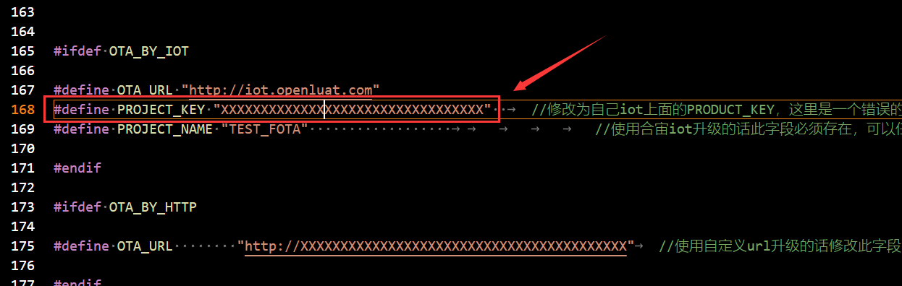
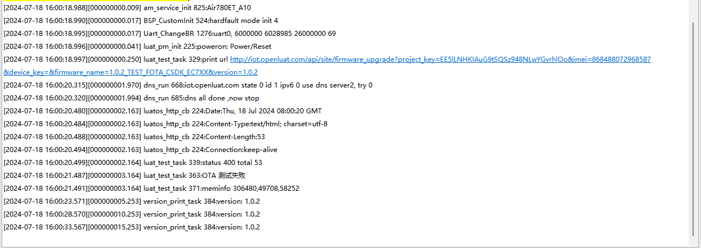

# FOTA CSDK样例使用说明

FOTA（Firmware Over-The-Air）移动终端的空中下载软件升级，指通过云端升级技术，为具有连网功能的设备提供固件升级服务，用户使用网络获取终端系统升级包，并通过 FOTA 进行云端升级，完成系统修复和优化。

# 概述

CSDK版本的远程升级主要是对CSDK固件的内容升级，升级方式可以可以使用自己的服务器来搭建升级服务，CSDK由于仓库提供给客户自己编译，版本自由度较高，支持IOT升级，但需用户自己做好版本管理。

# FOTA指南（差分升级-合宙IOT服务器-2022库）

>此教程仅适用于移芯618芯片平台模块

## 测试准备

在**[luatos-soc-2022](https://gitee.com/openLuat/luatos-soc-2022)**代码库内找到**/project/example_full_ota**，本教程将以此example为例。

1. 首先需要先将代码中的 **PROJECT_KEY**更改成自己合宙IOT上的**PROJECT_KEY**。

​	保存编译，生成1.0.0版本的binpkg文件（可以手动修改文件名作为区分）。

2. 对代码进行修改，修改完成后build生成 1.0.1 binpkg 然后保存编译，生成1.0.1版本的binpkg文件（可以手动修改文件名作为区分）。

## 升级包生成

打开Luatools，选择**SOC差分/整包升级包制作工具**

这里选择只需要选择新版本的固件，如下所示：点击开始执行，会生成对应的升级包。

这里用户标识这里输入的是新版本号，会生成对象的升级文件，如下所示：

## 上传升级包

点击我的项目-固件列表-创建固件

把上文中生成的.sota升级包，改成后缀为.bin升级包，点击创建固件上传到OTA服务器。

然后点击确定，固件就上传成功了

因为升级全部设备一栏选择的是否，所以需要指定设备imei，将待升级设备的imei添加即可

然后只需要使用烧录工具烧录**基础版本(1.0.0)**的binpkg文件即可

通过IOT平台可直观看出当前模块版本，还可以通过升级日志查看升级情况

# FOTA指南（差分升级-合宙IOT服务器-2024库）

>此教程仅适用于移芯7xx系列模块

## 准备工作

- 工具下载：[Luatools下载调试工具](https://gitee.com/openLuat/luatos-doc-pool/blob/master/doc/开发工具及使用说明/Luatools下载调试工具.md)，版本要求在2.1.17及以上
- 测试样例：在下载的**[luatos-soc-2024](https://gitee.com/openLuat/luatos-soc-2024)**代码库内找到**/project/example_diff_ota**

## 设备基础固件制作并烧录

1. 将代码中**OTA_BY_IOT**宏打开，将代码中**OTA_BY_USB**宏和**OTA_BY_HTTP**宏关闭

2. 记录demo默认版本号是1.0.1

3. 将**PROJECT_KEY**修改为测试模块imei归属的IOT项目**PRODUCT_KEY**，这里是一个错误KEY

4. 保存并编译代码，生成软件
   **注意：**如果是第一次编译，需要在终端上先输入**xmake f --menu**选择对应的芯片平台，然后再输入**xmake**进行编译

5. 新建一个文件夹，命名为**V1_0_1**，将上一步生成的软件复制进去

6. 将**V1_0_1**中的软件烧录进模块，观察IOT平台是否更新了模块版本信息，如果如下图显示正常显示信息，则往下继续，如果没有正常显示信息，检查操作是否有错误

## 升级包制作

1. 将**PROJECT_VERSION**从**1.0.1**改为**1.0.2**

2. 保存并编译代码，生成软件
3. 新建一个**V1_0_2**的文件夹，将刚刚生成的软件复制进去

4. 打开Luatools，选择**SOC差分/整包升级包制作工具**

5. 旧版固件选择V1.0.1中，soc后缀的文件，新版固件选择V1.0.2中，soc后缀的文件**（一定要选择soc结尾的文件！！！）**

6. 配置好输出路径后，点击开始执行，正常情况下，等待一小段时间，升级包会制作成功

7. 成功后输出路径会生成一个.sota后缀的升级文件

8. 手动将文件改为bin结尾文件，如下图所示

9. 上传升级文件到合宙IOT平台

文件选择第8步中，制作并改好名的升级文件，此时平台会提示升级失败，点击“知道了”即可

手动输入固件名为**1.0.1_TEST_FOTA_CSDK_EC7XX**，版本号填入**1.0.2**，确定即可

10. 配置设备升级

上一步上传文件的时候，我们选择的是允许升级，但没有选择全项目升级，所以这里要单独指定一下设备升级，添加IMEI进固件升级列表即可

## 重启模块

重启模块后，demo会主动请求一次升级包，如果配置一切正常，可以看到如下图所示的打印，并且模块重新启动

待模块重新启动后，模块会再次请求一次升级，但此时IOT平台已经没有更高版本的固件了，所以必定升级失败

接下来去合宙IOT平台查看设备状态，可以看到，版本号已经变成了1.0.2，设备此时已经升级成功

查看设备的升级日志，设备从1.0.1升级到1.0.2，升级测试完毕

# FOTA指南（差分升级-自建服务器-2024库）

## 准备工作

- 工具下载：[Luatools下载调试工具](https://gitee.com/openLuat/luatos-doc-pool/blob/master/doc/开发工具及使用说明/Luatools下载调试工具.md)，版本要求在2.1.17及以上
- 测试样例：在下载的**[luatos-soc-2024](https://gitee.com/openLuat/luatos-soc-2024)**代码库内找到**/project/example_diff_ota**

## 设备基础固件制作并烧录

1. 将代码中**OTA_BY_HTTP**宏打开，将代码中**OTA_BY_USB**宏和**OTA_BY_IOT**宏关闭

2. 记录demo此时版本号是1.0.3

3. 将**OTA_URL**修改为自建服务器的URL地址，并在地址路径后面添加上差分包文件名，文件名根据自身要求修改，只需与生成后的差分包文件名一致即可，默认是一个错误URL

4. 保存并编译代码，生成软件
   **注意：**如果是第一次编译，需要在终端上先输入**xmake f --menu**选择对应的芯片平台，然后再输入**xmake**进行编译

5. 新建一个文件夹，命名为**V1_0_3**，将上一步生成的软件复制进去

6. 将**V1_0_3**中的软件烧录进模块，demo中默认有打印版本的代码，通过Luatools软件可以直接看到版本信息。

## 升级包制作

1. 将**PROJECT_VERSION**从**1.0.3**改为**1.0.4**

2. 保存并编译代码，生成软件
3. 新建一个**V1_0_4**的文件夹，将刚刚生成的软件复制进去

4. 打开Luatools，选择**SOC差分/整包升级包制作工具**

5. 旧版固件选择V1.0.3中，soc后缀的文件，新版固件选择V1.0.4中，soc后缀的文件**（一定要选择soc结尾的文件！！！）**

6. 配置好输出路径后，点击开始执行，正常情况下，等待一小段时间，升级包会制作成功

7. 成功后输出路径会生成一个.sota后缀的升级文件

8. 手动将文件改为bin结尾文件，文件名改为test，如下图所示

9. 上传升级文件到自建服务器

10. 将旧版本固件烧录到模块中

## 重启模块

重启模块后，demo会主动请求一次升级包，如果配置一切正常，可以看到如下图所示的打印，并且模块重新启动

待模块重新启动后，模块会再次请求一次升级，但此时已经是升级固件了，所以必定升级失败

通过Luatools软件查看日志，设备已经是1.0.4版本，测试完毕

# FOTA指南（全量升级-合宙IOT服务器-2024库）

>此流程只适用于Air780EP模块

## 准备工作

- 工具下载：[Luatools下载调试工具](https://gitee.com/openLuat/luatos-doc-pool/blob/master/doc/开发工具及使用说明/Luatools下载调试工具.md)，版本要求在2.1.17及以上
- 测试样例：在下载的**[luatos-soc-2024](https://gitee.com/openLuat/luatos-soc-2024)**代码库内找到**/project/example_full_ota**

## 设备基础固件制作并烧录

- 参考[FOTA指南（差分升级-合宙IOT服务器-2024库）](# FOTA指南（差分升级-合宙IOT服务器-2024库）)中的**设备基础固件制作并烧录**

## 升级包制作

1. 将**PROJECT_VERSION**从**1.0.1**改为**1.0.2**

2. 保存并编译代码，生成软件
3. 打开Luatools，选择**SOC差分/整包升级包制作工具**

4. 整包升级不需要旧版固件，仅选择新版固件即可

5. 一定要选择编译出的.soc后缀文件，否则制作出的升级包无法升级！

6. 配置输出路径，配置用户标识，用户标识填入新修改的版本号**1.0.2**，然后点击开始执行

7. 成功后输出路径会生成一个.bin后缀的升级文件

8. 上传升级文件到合宙IOT平台

文件选择第七步中，制作好的升级文件，点击确定即可

9. 配置设备升级

上一步上传文件的时候，我们选择的是允许升级，但没有选择全项目升级，所以这里要单独指定一下设备升级，添加IMEI进固件升级列表即可

