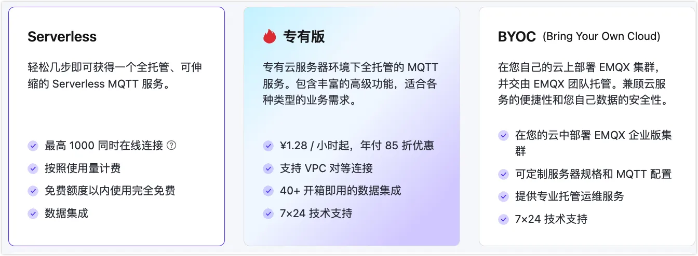
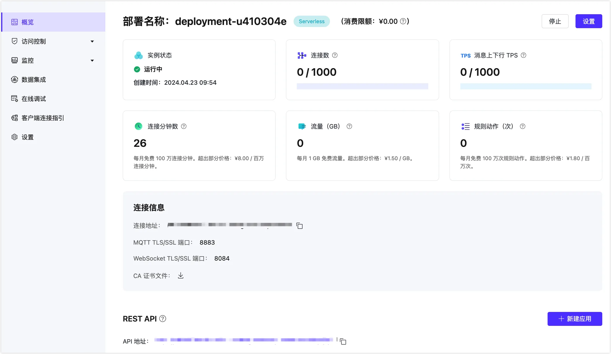
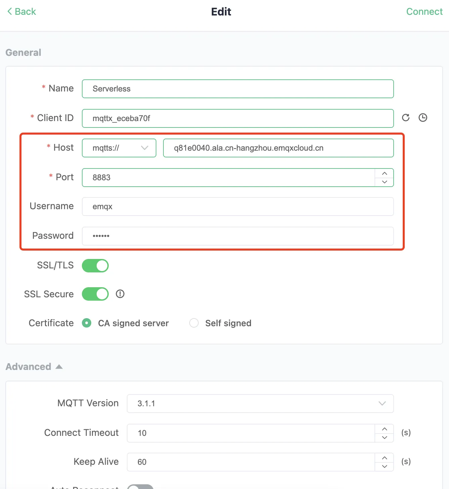
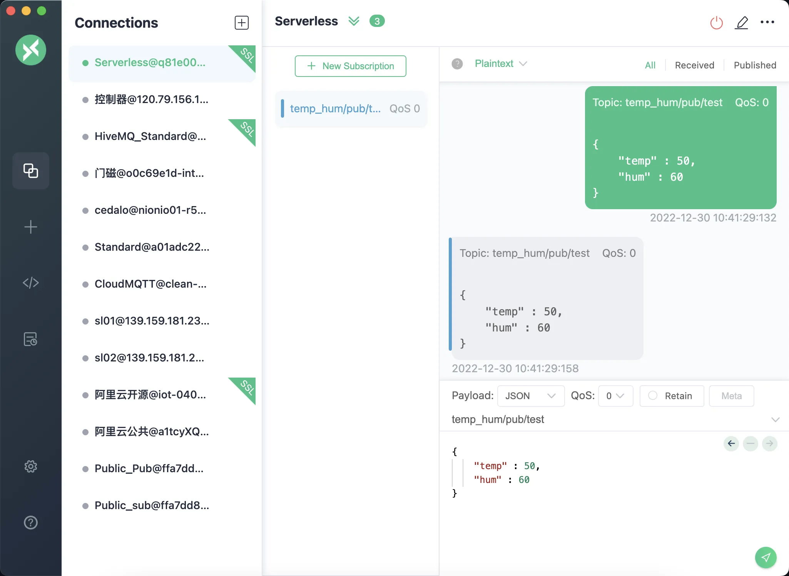
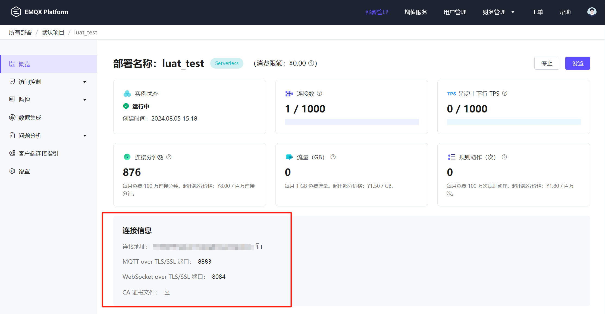
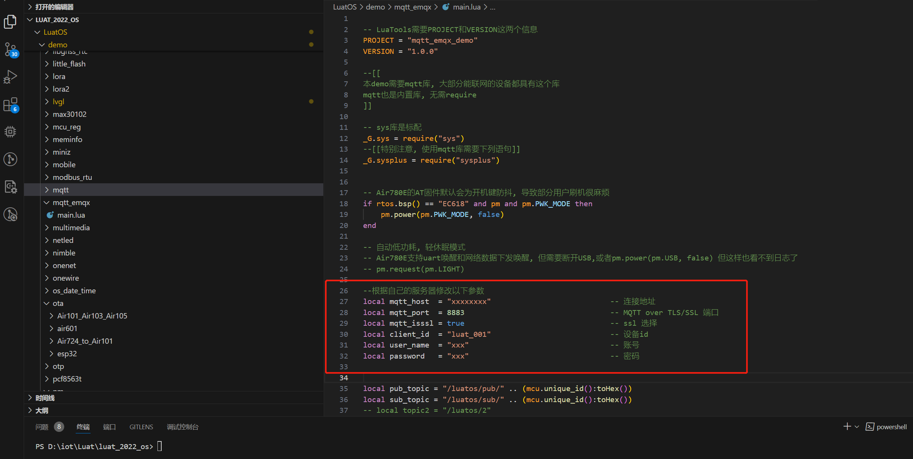

# MQTT-EMQX

**此demo适用于合宙基于移芯平台所开发的 Air780E、700E、Air780EP、Air780EPV**

## EMQX

```text
作为物联网领域的统一 MQTT 平台，以及全球首个支持 MQTT 5.0 消息服务的平台，EMQX Platform 为 MQTT 服务提供全面托管的环境以及 MQTT 服务的本地部署方案。借助 EMQX Platform，您可以快速构建面向物联网领域的行业应用，轻松实现物联网数据的采集、传输、计算和持久化。
```

## 简介

```text
本文简单的讲述了使用EMQX创建Serverless，以及使用LuatOS-Air进行二次开发过程。
```

## 创建 Serverless 部署

EMQX Platform 已经推出了安全可扩展的 MQTT 服务 —— EMQX Serverless，赋予开发者或微小企业更低成本且高效测试开发物联网应用的能力。简单几步就创建一个 Serverless 部署。

Serverless 部署最大的优势在于连接场景只按照实际的使用量进行计费，Serverless 详细的计费方式请查看[定价计费](https://docs.emqx.com/zh/cloud/latest/price/pricing.html)部分。

---

### 1.创建部署 

1. 登录 [EMQX Platform 控制台](https://cloud.emqx.com/console/)。

2. 在控制台首页或者部署管理页面都可以在指定项目下创建，点击**新建部署**进入创建步骤。

3. 在**选择版本**中选中 **Serverless**。

   

4. 在配置步骤，您可以设置 Serverless 部署的本月最大[消费限额](https://docs.emqx.com/zh/cloud/latest/deployments/spend_limit.html)，默认值为 0，即为只使用免费额度。消费限额在部署创建之后也可以进行修改。

5. 设置部署名称和项目。

6. 点击**立即部署**，并同意 EMQX Platform 标准服务条款和 Serverless 服务使用条款。

7. 部署将进入创建，当状态显示为**运行中**后，部署创建完成并可使用。

---

### 2.查看部署信息 

部署概览页面可获取到部署实时状态和连接信息：



---

### 3.基本信息 

- **实例状态**：部署实例运行状态和创建时间。
- **连接数**：当前的连接数和最大连接数。
- **消息上下行 TPS**：部署当前每秒钟消息发送和接收条数，以及 TPS 上限。
- **连接分钟数**：本月已经使用的总连接分钟数。此数值的统计有 1 小时的延时。
- **流量**：本月已经产生入网和出网的流量。此数值的统计有 1 小时的延时。
- **规则动作**：本月已经执行的规则动作数。此数值的统计有 1 小时的延时。
- **消费限额**：部署当月最高消费限制设置，具体可查看[消费限额设置](https://docs.emqx.com/zh/cloud/latest/deployments/spend_limit.html)。

---

### 4.连接信息 

**连接地址**：客户端/终端设备的连接地址。

**连接端口**：默认开启 8883 (MQTT TLS/SSL 端口) 和 8084 (WebSocket TLS/SSL) 端口。查看[端口连接指引](https://docs.emqx.com/zh/cloud/latest/deployments/port_guide_serverless.html)了解如何使用协议和端口。

**CA 证书文件**：如客户端需要验证服务端 CA，请下载此证书

----

### 5.使用 MQTTX 连接 Serverless 部署 

除了使用 MQTTX 客户端，您也可以使用 [SDK 或其他工具](https://docs.emqx.com/zh/cloud/latest/connect_to_deployments/overview.html)连接到部署。在使用 MQTTX 连接到部署之前您需要先获取到部署的连接地址 (Host) 和端口 (Port) 以及认证信息。

1. 获取连接信息。在概览页找到连接地址以及连接端口。Serverless 默认支持 8883(mqtts), 8084(wss) 端口。
2. 添加客户端认证信息。点击左侧菜单中的**访问控制**->**客户端认证**，点击**添加**按钮，输入客户端或设备用户名和密码并点击**确认**。
3. 设置 [MQTTX](https://mqttx.app/zh/) 连接信息并连接到部署。
4. 连接成功之后即可以发布和订阅消息。


___

### 6.部署停止和删除 

**系统停止**：若部署持续 30 天没有活跃客户端连接，部署将会被系统停止。如需继续使用，请在控制台手动启用。

**系统删除**：如果部署停止之后 30 天未开启，部署可能会被删除。

---


## **LuatOS 使用案例说明**

### API说明

| API接口                                              | 功能描述                                 |
| ---------------------------------------------------- | ---------------------------------------- |
| mqttc:subscribe(topic, qos)                          | 订阅主题                                 |
| mqttc:unsubscribe(topic)                             | 取消订阅主题                             |
| mqttc:debug(onoff)                                   | 配置是否打开debug信息                    |
| mqtt.create(adapter,host,port,ssl,isipv6)            | mqtt客户端创建                           |
| mqttc:auth(client_id,username,password,cleanSession) | mqtt三元组配置及cleanSession             |
| mqttc:keepalive(time)                                | mqtt心跳设置                             |
| mqttc:on(cb)                                         | 注册mqtt回调                             |
| mqttc:connect()                                      | 连接服务器                               |
| mqttc:disconnect()                                   | 断开服务器连接(不会释放资源)             |
| mqttc:autoreconn(reconnect, reconnect_time)          | 自动重连                                 |
| mqttc:publish(topic, data, qos, retain)              | 发布消息                                 |
| mqttc:close()                                        | mqtt客户端关闭(关闭后资源释放无法再使用) |
| mqttc:ready()                                        | mqtt客户端是否就绪                       |
| mqttc:state()                                        | mqtt客户端状态                           |
| mqttc:will(topic, payload, qos, retain)              | 设置遗嘱消息                             |

详细的API介绍请参见[mqtt章节](https://wiki.luatos.com/api/mqtt.html)

---

### LuatOS-Air ssl方式连接

1.需要提前按照文档中[创建 Serverless 部署](#2.查看部署信息 )章节进行查询，获取连接地址。



---

2.然后找到所使用的脚本版本进入demo目录找到**mqtt_emqx**文件夹打开**main.lua**，按照注释修改部分参数进行链接。



---

3.保存代码，通过**Luatools**软件将固件+脚本烧录进设备后，便能连接上emqx创建的服务器了。这是[烧录教程](https://wiki.luatos.com/boardGuide/flash.html)。


---

4.查看效果

注：发布消息和订阅消息是由以下方式构建的

```text
    device_id = mobile.imei() -- 获取设备imei
    -- 默认都等到联网成功
    sys.waitUntil("IP_READY")
    sys.publish("net_ready", device_id)
    
    -- 等待联网
    local ret, device_id = sys.waitUntil("net_ready")
    -- 下面的是mqtt的参数均可自行修改
    client_id = device_id
    pub_topic = "/luatos/pub/" .. device_id
    sub_topic = "/luatos/sub/" .. device_id
```

---


---
