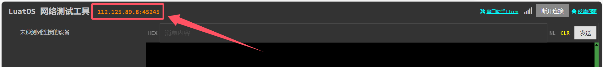

# 780EP模块LuatOS开发TCP/UDP系列应用指南

# 简介

> - 套接字（socket）是通信的基石，是支持TCP/IP协议的路，是通信的基本操作单元。可以将套接字看作不同主机间的进程进行双间通信的端点，它构成了单个主机内及整个网络间的编程界面。套接字存在于通信域中，通信域是为了处理一般的线程通过套接字通信而引进的一种抽象概念。套接字通常和同一个域中的套接字交换数据(数据交换也可能穿越域的界限，但这时一定要执行某种解释程序)，各种进程使用这个相同的域互相之间用Internet协议簇来进行通信
> - 关联文档和使用工具：
>   - [socket/client 库](https://gitee.com/openLuat/LuatOS/tree/master/demo/socket/client)
>   - 不会烧录请参考[烧录教程](https://wiki.luatos.com/boardGuide/flash.html)中的脚本烧录
>   - 测试网站可以使用 https://netlab.luatos.com/ 进行测试

# 准备工作

1. Air780EP_全IO开发板一套，包括天线SIM卡，USB线

    .jpg)

# 接口说明

| 接口                 | 描述                                                         |
| -------------------- | ------------------------------------------------------------ |
| libnet.connect()     | 阻塞等待IP或者域名连接上，如果加密连接还要等握手完成，只能用于sysplus.taskInitEx创建的任务函数中 |
| libnet.tx()          | 阻塞等待数据发送完成，只能用于sysplus.taskInitEx创建的任务函数中 |
| sysplus.taskInitEx() | 创建一个任务线程,在模块最末行调用该函数并注册模块中的任务函数,main.lua导入该模块即可 |
| sysplus.cleanMsg()   | 清除指定task的消息队列                                       |
| socket.create()      | 在某个适配的网卡上申请一个socket_ctrl                        |
| socket.config()      | 配置network一些信息                                          |
| socket.rx()          | 接收对端发出的数据，注意数据已经缓存在底层，使用本函数只是提取出来，UDP模式下一次只会取出一个数据包 |
| sys.publish()        | 往特定topic通道发布一个消息                                  |

> 详细接口介绍可参考[libnet库](https://wiki.luatos.com/api/libs/libnet.html?highlight=libnet#)、[sysplus库](https://wiki.luatos.com/api/sysplus.html?highlight=libnet)、[socket库](https://wiki.luatos.com/api/socket.html)、[sys库](https://wiki.luatos.com/api/sys.html#) .

# 示例

## TCP连接示例

1. 打开测试网站 https://netlab.luatos.com/ ，选择`打开TCP`，左边显示其地址和端口

   

   

2. 复制地址和端口，粘贴至代码中对应位置
   注：**is_udp**和**is_tls**的值默认为false，此示例不需要修改

   ```lua
   local host = "112.125.89.8" -- 服务器ip或者域名, 都可以的
   local port = 47637          -- 服务器端口号
   local is_udp = false        -- 如果是UDP, 要改成true, false就是TCP
   local is_tls = false        -- 加密与否, 要看服务器的实际情况
   ```

3. TCP连接操作已完成，后面可进行一些其他操作，如定时发送数据、设置心跳包等。

## TCP SSL连接示例

1. 打开测试网站 https://netlab.luatos.com/ ，选择`打开TCP SSL`，左边显示其地址和端口

   

   

2. 复制地址和端口，粘贴至代码中对应位置
   注：**is_udp**和**is_tls**的值默认为false，此示例需要修改**is_tls**的值为true，表示打开（TLS / SSL）加密连接

   ```lua
   local host = "112.125.89.8" -- 服务器ip或者域名, 都可以的
   local port = 45245          -- 服务器端口号
   local is_udp = false        -- 如果是UDP, 要改成true, false就是TCP
   local is_tls = true         -- 加密与否, 要看服务器的实际情况
   ```
   
4. TCP SSL连接操作已完成，后面可进行一些其他操作，如定时发送数据、设置心跳包等。

## UDP连接示例

1. 打开测试网站 https://netlab.luatos.com/ ，选择`打开UDP`，左边显示其地址和端口

   

   

2. 复制地址和端口，粘贴至代码中对应位置
   注：**is_udp**和**is_tls**的值默认为false，此示例需要修改**is_udp**的值为true，即选择使用UDP连接

   ```lua
   local host = "112.125.89.8" -- 服务器ip或者域名, 都可以的
   local port = 45933          -- 服务器端口号
   local is_udp = true         -- 如果是UDP, 要改成true, false就是TCP
   local is_tls = false        -- 加密与否, 要看服务器的实际情况
   ```
   
4. UDP连接操作已完成，后面可进行一些其他操作，如定时发送数据、设置心跳包等。

## 演示示例

### 演示定时发送数据

1. 设置一个定时向服务器发送数据的task，时间间隔为3秒

      ```lua
      -- 演示定时上报数据, 不需要就注释掉
      sys.taskInit(function()
          sys.wait(5000)
          while 1 do
              sys.publish("sc_txrx", "uplink", os.date())
              sys.wait(3000)
          end
      end)
      ```

2. 逻辑判断
   注意：由于代码逻辑中发送数据的前提条件为，先识别到topic的值，即“sc_txrx”，然后判断tp的值是否为“uplink”，若tp的值为“uplink”则将data的值通过接口发送给服务器。因此发送数据的格式为 **sys.publish("sc_txrx", "uplink", data)**，然后利用**table.insert(txqueue, data)**将data的值发送到对应服务器上。

   ```lua
   -- 演示task
   local function sockettest()
       -- 等待联网
       sys.waitUntil("net_ready")
   
       socket.sntp()
   
       -- 开始正在的逻辑, 发起socket链接,等待数据/上报心跳
       local taskName = "sc"
       local topic = taskName .. "_txrx"
       log.info("topic", topic)
       local txqueue = {}
       sysplus.taskInitEx(sockettask, taskName, netCB, taskName, txqueue, topic)
       while 1 do
           local result, tp, data = sys.waitUntil(topic, 30000)
           log.info("event", result, tp, data)
           if not result then
               -- 等很久了,没数据上传/下发, 发个日期心跳包吧
               table.insert(txqueue, os.date())
               sys_send(taskName, socket.EVENT, 0)
           elseif tp == "uplink" then
               -- 上行数据, 主动上报的数据,那就发送呀
               table.insert(txqueue, data)
               sys_send(taskName, socket.EVENT, 0)
           elseif tp == "downlink" then
               -- 下行数据,接收的数据, 从ipv6task来的
               -- 其他代码可以通过 sys.publish()
               log.info("socket", "收到下发的数据了", #data)
           end
       end
   end
   ```

3. 在网站上的显示结果如下

   

### 演示uart数据上报

1. 本教程使用模块为780EP，属于EC718P系列，因此将代码中`EC618`改成`EC718P`，注意此修改仅供本次测试使用

   ```lua
   -- 演示uart数据上报, 不需要就注释掉
   if rtos.bsp() == "EC718P" then
       uart.setup(1, 115200) -- 注意, 是UART1, 不是虚拟串口, 演示目的
       uart.on(1, "receive", function(id, len)
           while 1 do
               local s = uart.read(1, 1024)
               if #s == 0 then
                   break
               end
               sys.publish("sc_txrx", "uplink", s)
               if #s == len then
                   break
               end
           end
       end)
   end
   ```

2. 逻辑判断

   发送数据的逻辑判断与前面的逻辑判断一样，在此处不作重复介绍。

3. 显示结果如下

   

## 设置心跳包

1. 若长时间没有数据上传或下发，则自动发送日期心跳包。

   注意：**sys.waitUntil(topic, 30000)**用于等待topic，超时时间为30s，若30s后仍没等到topic，则result的值为flase，否则为true。此时根据逻辑判断，通过**table.insert(txqueue, os.date())**向服务器发送一个日期心跳包，**os.date()**为日期数据。

   ```lua
   -- 演示task
   local function sockettest()
       -- 等待联网
       sys.waitUntil("net_ready")
   
       socket.sntp()
   
       -- 开始正在的逻辑, 发起socket链接,等待数据/上报心跳
       local taskName = "sc"
       local topic = taskName .. "_txrx"
       log.info("topic", topic)
       local txqueue = {}
       sysplus.taskInitEx(sockettask, taskName, netCB, taskName, txqueue, topic)
       while 1 do
           local result, tp, data = sys.waitUntil(topic, 30000)
           log.info("event", result, tp, data)
           if not result then
               -- 等很久了,没数据上传/下发, 发个日期心跳包吧
               table.insert(txqueue, os.date())
               sys_send(taskName, socket.EVENT, 0)
           elseif tp == "uplink" then
               -- 上行数据, 主动上报的数据,那就发送呀
               table.insert(txqueue, data)
               sys_send(taskName, socket.EVENT, 0)
           elseif tp == "downlink" then
               -- 下行数据,接收的数据, 从ipv6task来的
               -- 其他代码可以通过 sys.publish()
               log.info("socket", "收到下发的数据了", #data)
           end
       end
   end
   ```

2. 在网站上的显示结果如下

   

## 接收数据


# 常见问题解答

## 连接服务器失败

1. 服务器必须是公网地址
2. 使用PC上的TCP UDP测试工具客户端、或者mqtt.fx，连接服务器确认一下是否可以连接成功，排除服务器故障
3. 检查下模块信号、网络注册、网络附着、PDP激活状态
4. 检查下SIM卡是否欠费

## 最多支持同时多少个连接

LuatOS最多支持同时7个连接

# 适用型号&选型手册

> 合宙支持LuatOS开发的模组型号，除本文介绍的Air780EP外，
> 还有Air780EPA、Air780E、Air780EX、Air201、Air780EPT、Air780EPS等型号，
> 本文介绍的TCP应用指南，同样也适用于这些型号。


