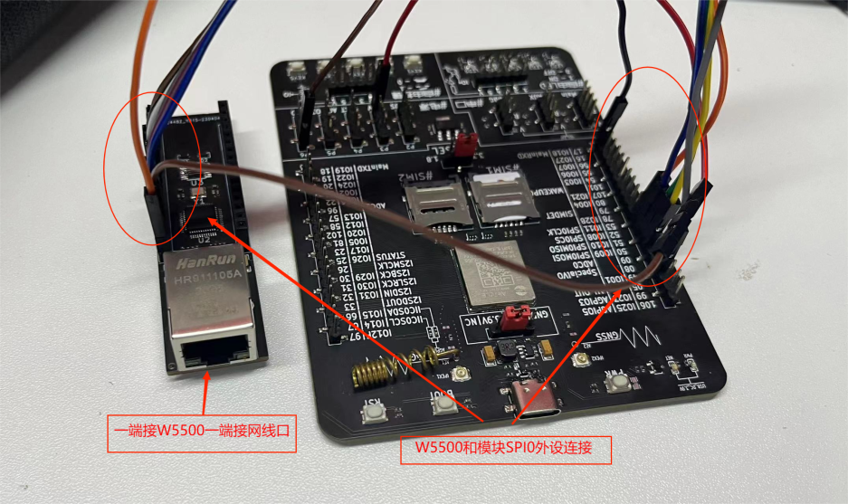
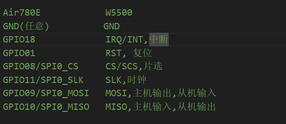
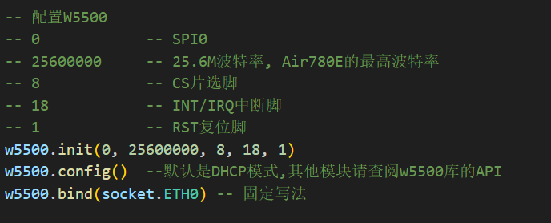
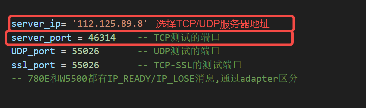
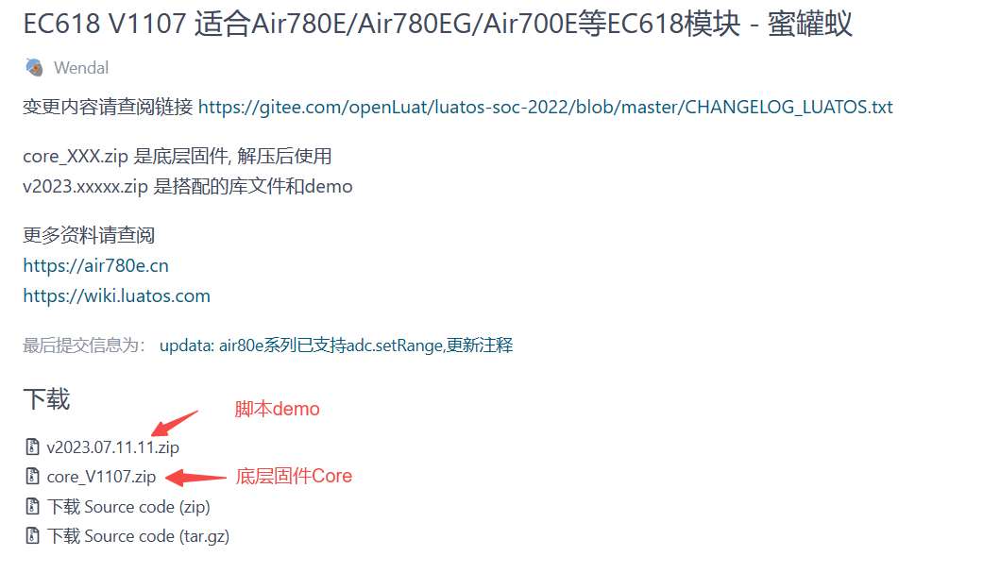
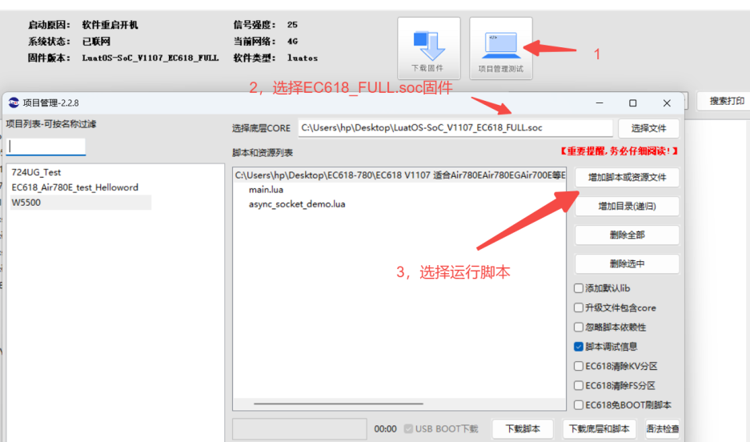
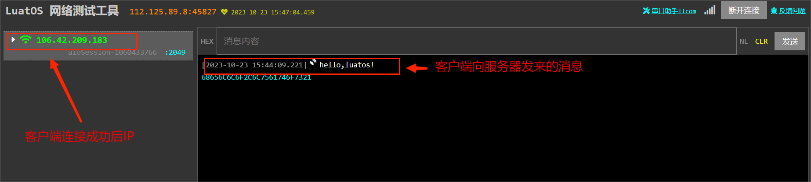

# W5500应用指南

@[TOC](目录名称)

### 简介：

W5500 是一款全硬件 TCP/IP 嵌入式以太网控制器，为嵌入式系统提供了更加简易的互联网连接方 案。W5500 集成了 TCP/IP 协议栈，10/100M 以太网数据链路层（MAC） 及物理层（PHY），使得 用户使用单芯片就能够在他们的应用中拓展网络连接。
### API说明
**socket接口函数说明**
https://wiki.luatos.com/api/socket.html
**W5500接口函数说明**
https://wiki.luatos.com/api/w5500.html

### W5500硬件接线、配置

**接线说明**
可以修改INT/IRQ引脚，这里默认设置GPIO18

**修改端口以及默认地址**

### 固件、脚本下载

https://gitee.com/openLuat/LuatOS/releases

### 版本下载

### 效果演示
下载成功后W5500会连接TCP服务器，发送一个并消息

