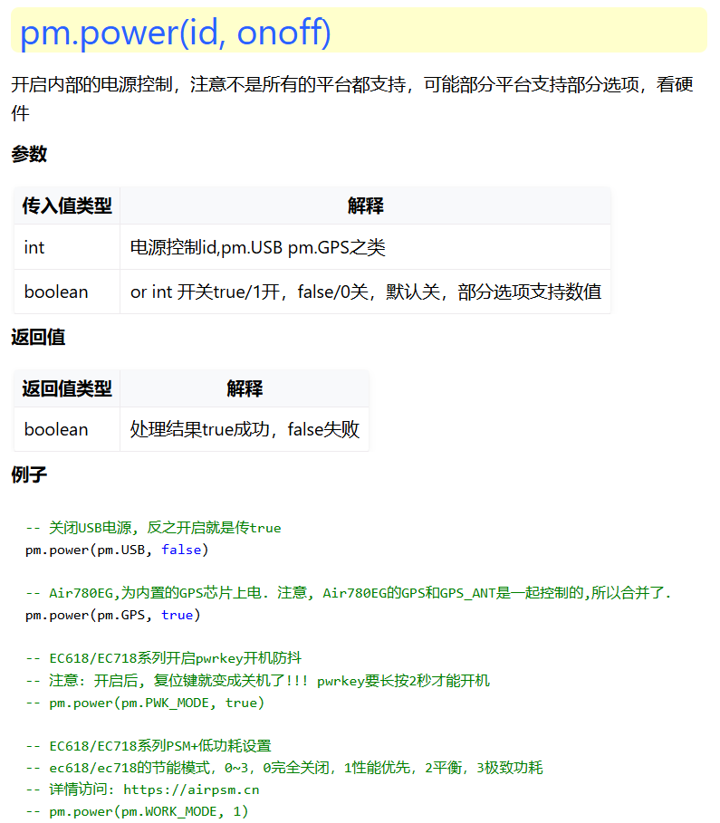
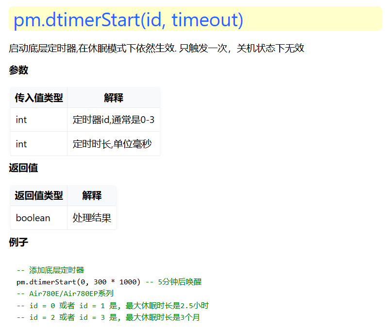
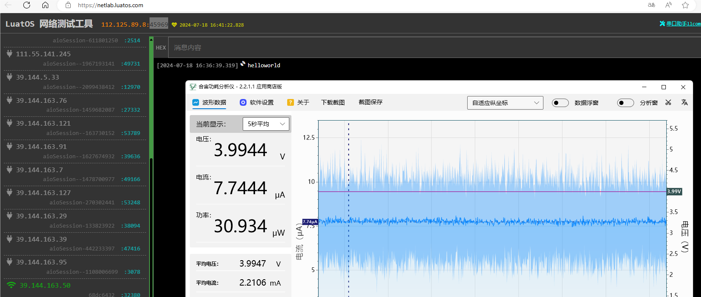
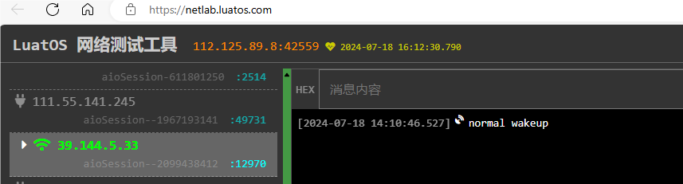
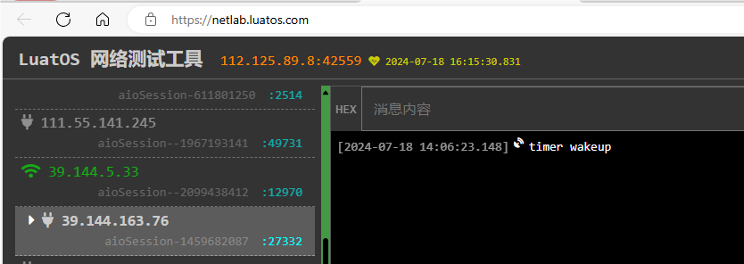
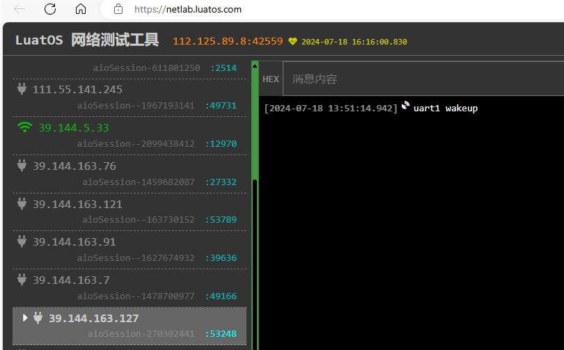
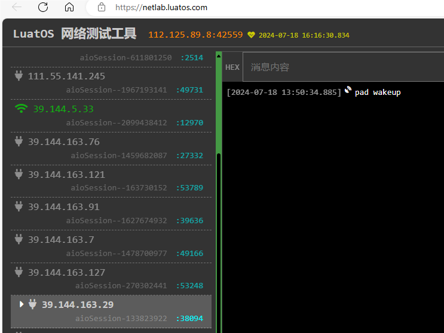
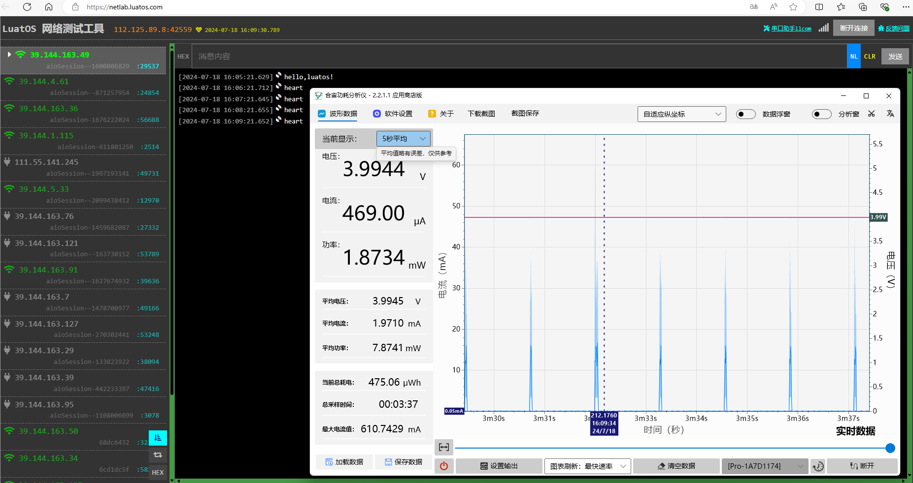

# 超低功耗应用指南

## 固件获取方式（下载EC718P版本）

EC718平台：[[LuatOS 发行版 - Gitee.com](https://gitee.com/openLuat/LuatOS/releases)](https://doc.openluat.com/article/5055)

### 脚本DEMO获取方式

对应DEMO: [demo/pm/EC618_Lowpower · 合宙Luat/LuatOS - 码云 - 开源中国 (gitee.com)](https://gitee.com/openLuat/LuatOS/tree/master/demo/pm/EC618_Lowpower)

## 对应接口说明

```
EC618/EC718系列PSM+低功耗设置接口
```



```
pm.dtimerStart(id, timeout) 
--启动底层定时器,在休眠模式下依然生效. 只触发一次，关机状态下无效
```



## 模式介绍

### 500ua（性能优先）模式介绍
1. 远程唤醒速度快(2秒内)
2. 信号好的情况下能达到474uA 的平均待机电流
3. 支持UART和带WAKEUP功能的GPIO中断唤醒
### 200ua（平衡）模式使用方法

1. 远程唤醒速度快(**2分钟**内)
2. 信号好的情况下能达到220uA 的平均待机电流
3. 支持UART和带WAKEUP功能的GPIO中断唤醒 

### 2ua（PSM+）模式使用方法

1. 远程**无法**唤醒
2. 待机功耗2.89uA
3. 支持UART和带WAKEUP功能的GPIO中断以及定时器唤醒

### 模式设置
```
pm.power(pm.WORK_MODE,1) --设置性能优先模式
pm.power(pm.WORK_MODE,2) --设置平衡优先模式
pm.power(pm.WORK_MODE,3) --设置（psm+）模式
```

```
pm.power(pm.WORK_MODE,0) --关闭节能模式
```

## DMEO说明

main.lua 

主要require不同的测试脚本

```
require "functionTest"   --循环测试不同的模式功耗
-- require "psm_plus"    --唤醒测试（wakeup中断，定时唤醒，串口唤醒）
-- require "remote_net_wakeup"  --心跳唤醒测试
```

functionTest.lua 脚本测试效果



psm_plus.lua 脚本测试效果，根据不同唤醒方式，发送对应数据到服务器

开机正常唤醒



定时唤醒



串口唤醒



wakeup中断中断唤醒



remote_net_wakeup.lua 脚本测试效果



## 注意事项

1. 不同的信号会导致功耗不一致，最好和最差相差40%
2. [您的电池可以用多久](https://wiki.luatos.com/_static/tools/psmplus/index.html "您的电池可以用多久") 评估电池用多久，以及需要多大的电池，建议您保持15% 以上的余量J
