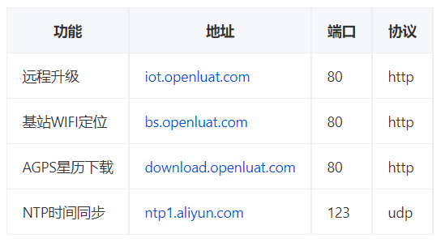

## 1.模块如何设置APN
>1、如果是公网SIM卡，不需要用户主动设置APN，软件自动去网络端查询APN进行设置。 
>2、如果是专网SIM卡，首先咨询SIM卡提供商APN参数，（8910平台）然后在main.lua尽可能靠前的位置调用link.setAuthApn(prot,apn,user,pwd)进行设置。（EC618平台）获取或设置APN，设置APN必须在入网前就设置好，比如在SIM卡识别完成前就设置好mobile.apn(index, cid, new_apn_name, user_name, password, ip_type, protocol)。

## 2. 为什么4G模块专网卡连接服务器失败
>1、有的专网卡没设置APN的情况下也能激活PDP，但是不能连专网卡指定的服务器，或者开机后模块没自动激活PDP，这个时候参考1，检查APN参数是否设置正确。 
>2、如果有其他厂家的模块，对比测试下是否连接正常。 
>3、如果无法百分百保证服务器配置没问题，最好在服务器端用wireshark抓包，或者在服务器上安装一个第三方工具，开启一个服务器端口来对比测试。 
>4、用定向Ip的物联网卡，需要把域名或IP加入白名单才能使用。

## 3.LuatOS-Air版本专网卡访问白名单
>用定向Ip的物联网卡，需要把域名或IP加入白名单才能使用，下面列出模块会访问的域名或IP服务器。
>DNS服务器，可以通过AT+CDNSCFG?查询默认的服务器，如果需要修改，可以通过AT+CDNSCFG=ip1,ip2进行修改。（Air724模块V3035后续版本支持）
>NTP时间同步，会在下面列出的服务器中随机选一下，可以根据需要修改。
>| 功能         | 地址                  | 端口  | 协议 |
>| ------------ | --------------------- | ----- | ---- |
>| 远程升级     | iot.openluat.com      | 80    | http |
>| 日志服务     | dev_msg1.openluat.com | 12425 | udp  |
>| 基站WIFI定位 | bs.openluat.com       | 12411 | udp  |
>| AGPS星历下载 | download.openluat.com | 80    | http |
>| NTP时间同步  | cn.pool.ntp.org       | 123   | udp  |
>| NTP时间同步  | edu.ntp.org.cn        | 123   | udp  |
>| NTP时间同步  | cn.ntp.org.cn         | 123   | udp  |
>| NTP时间同步  | s2c.time.edu.cn       | 123   | udp  |
>| NTP时间同步  | time1.aliyun.com      | 123   | udp  |
>| NTP时间同步  | tw.pool.ntp.org       | 123   | udp  |
>| NTP时间同步  | 0.cn.pool.ntp.org     | 123   | udp  |
>| NTP时间同步  | 0.tw.pool.ntp.org     | 123   | udp  |
>| NTP时间同步  | 1.cn.pool.ntp.org     | 123   | udp  |
>| NTP时间同步  | 1.tw.pool.ntp.org     | 123   | udp  |
>| NTP时间同步  | 3.cn.pool.ntp.org     | 123   | udp  |
>| NTP时间同步  | 3.tw.pool.ntp.org     | 123   | udp  |

## 4.LuatOS版本专网卡访问白名单

用定向Ip的物联网卡，需要把域名或IP加入白名单才能使用，下面列出模块会访问的域名或IP服务器。

| 功能         | 地址                  | 端口  | 协议 |
| ------------ | --------------------- | ----- | ---- |
| 远程升级     | iot.openluat.com      | 80    | http |
| 日志服务     | dev_msg1.openluat.com | 12425 | udp  |
| 基站WIFI定位 | bs.openluat.com       | 12411 | udp  |
| AGPS星历下载 | download.openluat.com | 80    | http |
| NTP时间同步  | ntp.aliyun.com        | 123   | udp  |

## 5. AT版本如何设置APN

>1、如果是公网SIM卡，不需要用户主动设置APN，软件自动去网络端查询APN进行设置。 
>2、如果是专网SIM卡，首先咨询SIM卡提供商APN参数，然后通过AT+CPNETAPN=mode,“apnname”,“user”,“pwd”,authmoded进行专网卡的参数设置。

## 6.AT版本专网卡访问白名单
>用定向Ip的物联网卡，需要把域名或IP加入白名单才能使用，下面列出模块会访问的域名或IP服务器。
>DNS服务器，可以通过AT+CDNSCFG?查询默认的服务器，如果需要修改，可以通过AT+CDNSCFG=ip1,ip2进行修改。    
>
