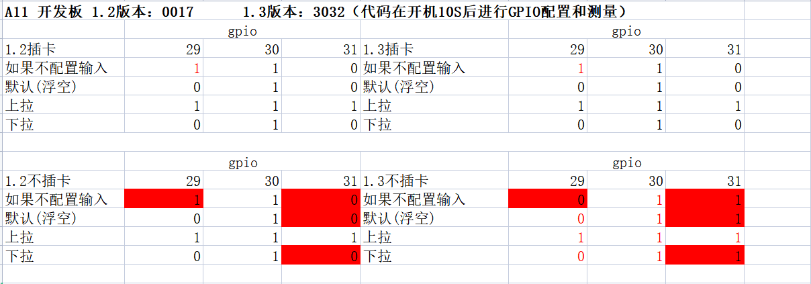

## 1. Air724模块为什么GPIO配置后，功能不正常
>1、模块的某些gpio，需要打开对应的电压域，这些gpio才能工作正常，详情参考demo/gpio/gpioSingle/testGpioSingle.lua中的注释，电压域与控制的gpio对应关系如下：
>pmd.ldoset(x,pmd.LDO_VSIM1) -- GPIO 29、30、31
>pmd.ldoset(x,pmd.LDO_VLCD) -- GPIO 0、1、2、3、4
>pmd.ldoset(x,pmd.LDO_VMMC) -- GPIO 24、25、26、27、28
>x=0时：关闭LDO
>x=1时：LDO输出1.716V
>x=2时：LDO输出1.828V
>x=3时：LDO输出1.939V
>x=4时：LDO输出2.051V
>x=5时：LDO输出2.162V
>x=6时：LDO输出2.271V
>x=7时：LDO输出2.375V
>x=8时：LDO输出2.493V
>x=9时：LDO输出2.607V
>x=10时：LDO输出2.719V
>x=11时：LDO输出2.831V
>x=12时：LDO输出2.942V
>x=13时：LDO输出3.054V
>x=14时：LDO输出3.165V
>x=15时：LDO输出3.177V  
>2、代码中表示gpio id的参数有误：
>GPIO 0到GPIO 31表示为pio.P0_0到pio.P0_31。 
>3、混淆了pin脚id和gpio id：模块的pin脚id是按照某个方向顺序排列的，gpio id和pin id不同，参考模块硬件手册，一定找到pin脚对应的gpio id，代码中要使用gpio id，不能使用pin脚id。 
>4、是否正在使用其他复用功能；如果是，把其他功能关掉，再配置为gpio使用。

## 2. 哪些管脚可以用做GPIO
>参考模块硬件手册“管脚描述”章节的表格，表格中表明可以用做gpio的都可以使用。

## 3. Air724 的gpio配置成io输出放在循环定时里配置，为啥会有脉冲出来？
>建议如果要配置成输出要在外面用函数方式配置调用。

## 4. Air724如果不关闭自动切换sim卡情况下用gpio29,30,31注意以下几点：
>1、gpio_30，配置为输入模式时，默认电平改不了，一直是高？
>模块内部有强上拉，改不了。 
>2、如果不插sim0，gpio31会一直置高，配置输出低也无效，插入sim0,配置输出正常。
>
> 
>3、如果要用到gpio29,30,31建议关闭自动切换功能，ril.request("AT*SIMAUTO=0")。

## 5. Air724的GPIO7和usb休眠唤醒功能冲突说明
>1、默认底层占用了GPIO7用于USB睡眠和唤醒模块，所以GPIO7不再给客户使用。 
>2、如果客户已经用了GPIO7，解决方案如下：
>A：如果不需要USB控制模块睡眠和唤醒功能，可以通过AT+GPIO7ENABLE=0 关闭底层对GPIO7的占用。
>B：如果需要使用USB控制模块睡眠和唤醒功能，可以通过AT+GPIO7ENABLE=1,gpionum 指令，将底层对GPIO7的占用改成其他没有使用的管脚。

## 6. 3V引脚和3.3V引脚之间通讯要串联多大电阻？
>1K的电阻。

## 7. 防拆监测工作原理？
>防拆就是有两个管脚在模块内部是连在一起的，这两个管脚可以连接到单片机的两个GPIO上，如果模块被拆掉了，这两个GPIO之间的连接会断开。

## 8. io能检测脉冲个数吗？
>8910 1.3固件3102 以上版本支持定时检测脉冲，增加一种配置，返回高低脉冲的个数。
>详细使用说明请参考：https://doc.openluat.com/share_article/h6t5VpZq4PjUr

## 9. Air724为什么脉冲检测功能没作用？
>先关闭按键防抖功能：pio.pin.setdebounce(0xffffffff)。

## 10. Air724的gpio最大负载电流和灌电流是多少？能直接驱动led灯吗？
>输出负载2ma，灌电流低于5ma，建议接三级管驱动led灯。

## 11. Air724的gpio用作输入监测，1.8为高，0.8为低，可以吗？电气规定多少伏才为低？
>不行 ， 要低于0.6V 。

## 12.Air780E（EC618系列）LuatOS固件下的IO复用配置

[LuatOS固件下的IO复用配置 - LuatOS 文档](https://wiki.luatos.com/chips/air780e/iomux.html)

## 13.Air780EP（EC718P系列）LuatOS固件下的IO复用配置

[LuatOS固件下的IO复用配置 - LuatOS 文档](https://wiki.luatos.com/chips/air780ep/iomux.html)
