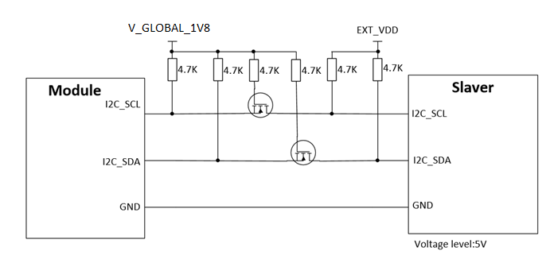

## 1.i2c每次读写数据前都需要setup一次吗？
>不需要。
>setup之后，只要没有close，就可以反复读写数据;
>一旦执行了close，下次读写数据前，必须再次setup;
> 
>i2c.setup
>......此处可以多次读写数据
>i2c.close

## 2.Air724模块i2c通信时模块可以做从设备吗？
>模块I2C只能做主设备，外部需要上拉，在配置FAST速率时，上拉电阻阻值不要大于4.7K。

## 3.i2c通信时主从机电平不一样，要做电平转换吗？
>如果主从设备的参考电平不一致，请注意做电平转换。如下图：
>

## 4.i2c设备7位的地址为0x38 ，需要我手动转换到8位地址吗？
>这里i2c_addr地址是7bit地址;
>如果i2c外设手册中给的是8bit地址，需要把8bit地址右移1位，赋值给i2c_addr变量;
>如果i2c外设手册中给的是7bit地址，直接把7bit地址赋值给i2c_addr变量即可;
