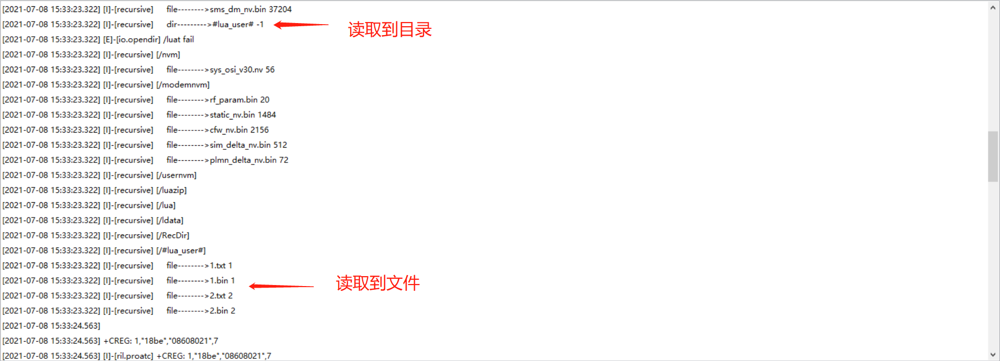
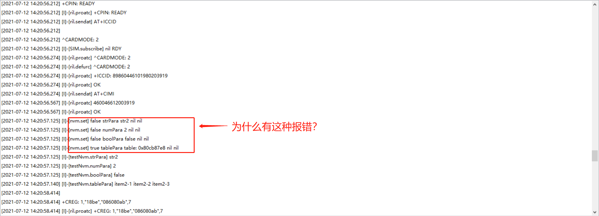
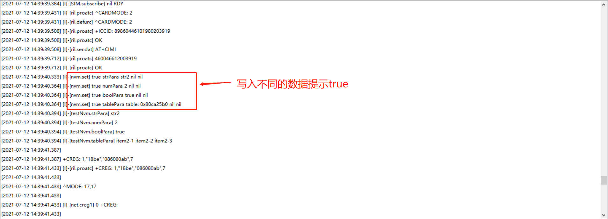
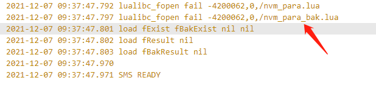

## 1.nvm适用于什么场景？
>nvm每次更新参数，保存到参数文件中时，会把所有参数拼接在一起，然后执行一次全量写文件的动作；此拼接操作消耗内存较多，如果数据量很大，需要的内存就很大，在系统可用内存紧张的情况下，很容易出现内存不足，从而导致参数更新失败，严重情况下还会造成系统重启。
>因此，nvm仅适用于小数据量的简单键值对参数；不适用于大容量数据的存储管理，如果数据量超过10KB【仅仅为经验值，实际能够存储的数据量和系统运行过程中的动态可用内存有关：可用内存越小，允许存储的数据量就越少；可用内存越大，允许存储的数据量就越多，但是也不建议超过10KB】，建议参考fs的demo直接使用io接口操作文件来管理。
##  2.本地烧录时会清除原有的para.lua吗？

原有的para.lua是在nvm.init(“config.lua”,true)时创建的，则不会清除；
 原有的para.lua是在nvm.init(“config.lua”)时创建的，则会清除；

## 3.fota远程升级时，会清除原有的para.lua吗？

> 默认不会；
>   如果需要清除，根据产品的业务逻辑，在合适的时间点，调用nvm.restore()恢复出厂设置即可

##  4.软件版本升级时，可以在config.lua中增加新的参数吗？

可以，参考初始化流程图
  需要执行一次初始化动作才会生效，一般是直接重启执行初始化

##  5.软件版本升级时，可以在config.lua中删除旧的参数吗？

可以，但是操作起来比较复杂，不建议这样做
  如果旧的参数没用了，可以在config.lua中一直保留；脚本代码不要再读写这些参数就行了

##  6.程序运行过程中，可以使用nvm.set接口增加新的参数吗？

可以，参考写操作流程图
   新增的参数，在恢复出厂设置后会被清除，因为config.lua中没有此参数

##   7.程序运行过程中，可以使用nvm.set接口删除已有的参数吗？

可以，参考写操作流程图，将某个参数设置为nil就相当于删除
   删除的参数，在恢复出厂设置后会还原为config.lua中的默认值，因为config.lua中存在此参数

##   8.读写操作过程中，掉电会丢失数据吗？

nvm有备份机制，如果掉电时正在写参数，可能会造成正在写入的参数数据不生效，下次开机会恢复为上次正常写入的数据，不会导致数据内容出错
    如果掉电时正在读参数，不会对参数数据造成任何影响；因为读取的是内存中的数据

##   9.nvm.set接口可以写多少次？

nvm通过文件接口写flash，具有擦写均衡机制； 
    flash可以完全擦写至少10万次； 
    假设通过rtos.get_fs_free_size()获取到的文件系统剩余空间为512K字节，nvm参数文件总大小为1K字节，因为nvm参数文件还存在一个备份文件，所以写256次可以完全擦写一次文件系统剩余空间。允许擦写的总次数理论值就是256*10万次;

##   10.config文件不加换行符为什么会报错？

因为每个lua文件每个文件末尾必须加上换行符，不然程序程序会报错。不加换行符报错如下：

## 11. /#lua_user# 目录为什么重刷固件还存在，它是特殊目录吗？

>#lua_user#目录就是一个普通目录，在/目录下，与其他目录共用一个空间，操作方式与其他目录一致，唯一的区别是这个目录模块会保护它，当重新烧录固件时它还存在。
>操作方法：
>首先现需要创建这个目录，然后进行io文件文件操作
>测试demo：[testfs.zip](https://cdn.openluat-luatcommunity.openluat.com/attachment/20210708154524982_testfs.zip)
>运行后注释掉创建文件部分再次烧录固件和脚本，还是能够读取到创建文件
>

## 12. 使用nvm.set()接口参数设置正确为什么会报错？
>如图所示：
>
>
>
>以demo/nvm这个demo为例，这个日志不是报错，当写入相同参数会有这个提示，写入不同参数就会提示写入正确
>
>在写入数据前可以先加个判断，判断想写入数据与目前存储的数据是否一致，不一致再写入到模块

## 13. 出现lualibc_fopen fail -4200062,0,/nvm_para.lua是什么问题?
>
>这个不是问题，烧录后，第一次开机，没有文件正常
