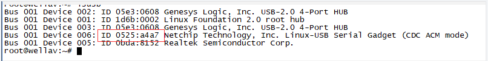
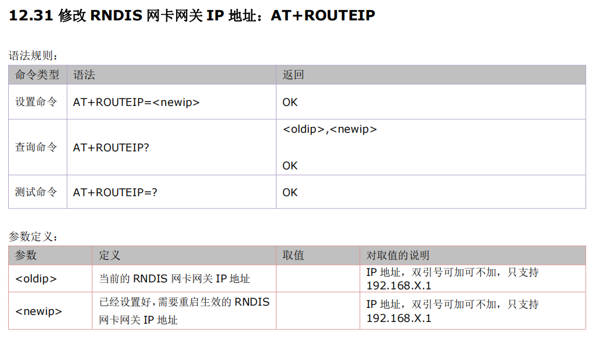
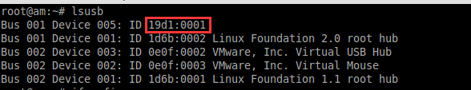

## 1. 不能上网
>一般情况下，不是特别精简的linux 已经支持rndis 功能，如果插上合宙的4G 模块，但是不能上网的话，需要注意以下几点。
>1、能否检测到rndis 设备：
>A：在命令行中输入 dmesg ,如此出现  rndis_host 1-1:1.0 eth1 这样的打印，则证明已经识别到了，(如果没有，可能是硬件问题，也可能是linux 真的不支持rndis，参考[LINUX下USB驱动加载](https://doc.openluat.com/wiki/21?wiki_page_id=2501 "LINUX下USB驱动加载")。
>B：此时查看ifconfig ,如果没有出现    rndis_host 1-1:1.0 eth1 中的 eth1 ，则发送ifconfig -a ,此时发现有eth1 但是 没有ip 地址，发送 udhcpc -i eth1  出现地址后，即可使用此网卡进行上网。 
>2、出现设备网卡，但是无法上网
>这可能是由于模块没有注册上网络，请看通过tcp 和模块进行通信。
>如果还不可以上网可以通过模块串口发送AT指令查询。
>常用 AT :
>AT+CPIN? 查看卡是否在位；
>AT+CEREG? 查看是否注册上网络；
>AT+CESQ 查看信号值。

## 2. 在LINUX下使用RNDIS上网 获得IP非公网，如何才能知道公网IP
> 1、模块激活pdp后，模块端显示的ip地址是运营商分配的内网ip。 
> 2、模块与服务器连接成功后，在服务器端显示的ip地址是运营商分配的公网ip地址。 
> 3、 对于同一个模块来说，这两个ip地址都是会变化的，对模块来说没有多大意义，不要用他们来标识模块，如果要标识模块，请使用模块imei。

## 3. 为什么同一型号的合宙模块读出来的设备id号不同?
>显示下图所示的id，说明724模块处于下载模式：
>
>

## 4. RNDIS方式下，openwrt系统下会虚拟出一个USB0的网口，默认这个网口地址是192.168.0.100，上游网关地址是192.168.0.1。由于现场要接的PLC刚好地址是192.168.0.1。造成地址冲突无法访问。请问有没有方法可以修改这个默认地址段
>

## 5. RNDIS 上网，获取时时流量，下行下行数据是哪个指令
>Linux下可以通过ifconfig获取。

## 6. RNDIS抓取日志教程
>[RNDIS抓取日志教程](https://doc.openluat.com/wiki/21?wiki_page_id=2016 "RNDIS抓取日志教程")

## 7. EC618平台（Air780E模块）驱动配置

目前linux大部分发行版本都已经默认支持RNDIS驱动了，只要通过USB连接Air780E模块就可以直接用了，模块开机后就会在linux设备端看到新的网卡。

通过lsusb查看模块的vid与pid，分别是**19d1**和**0001**

详细驱动配置，请见：https://e3zt58hesn.feishu.cn/docx/MGHWdYIg5oWpTox0qaecg483nKn

## 8. linux 常见问题解决方法

[linux 常见问题解决方法 (openluat.com)](https://doc.openluat.com/article/1850/0)
