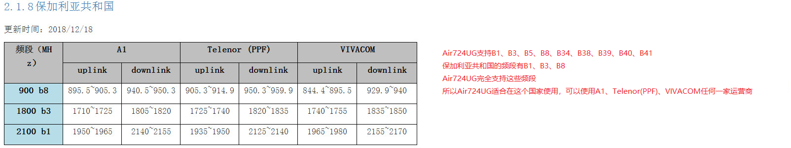

## 支持中国大陆哪些运营商
>是4G全网通模块，可适应不同的运营商和产品，确保产品设计的最大灵活性。

## 是否支持中国港澳台、外国运营商
>根据模块型号支持的频段，参考[网络频段](https://e3zt58hesn.feishu.cn/base/JBNOb0gMJa15GVsZzd5cKfBwnWf?table=tblBwnv8g9PKbMac&view=vew9jkvery "网络频段")各个国家和地区的网络频段，自行判断是否可以使用。 
>例如，要判断Air724UG是否在其他国家可以使用，首先打开Air724UG的产品规格书，找到Air724UG支持的频段，如下图所示 ：
>
>可以得知：Air724UG支持B1、B3、B5、B8、B34、B38、B39、B40、B41 ；
>那么Air724UG可以在哪些国家使用呢？分如下几种情况讨论 ：
>
>
>注意：此数据仅供参考，因不同国家地区的运营商和支持的频段信息会不断发生变化，所以在模块选型时，一定要在当地确认实时信息

## 支持SIM卡热插拔吗
>8910平台
>
>>1、支持硬件检测SIM卡热插拔功能。 
>>2、客户使用合宙LTE模块开发的产品如果需要具备热插拔功能，需要在硬件和软件上都具备相应的条件：
>>**1）在硬件上：** 需要USIM_CD（USIM Card Detect）这个引脚与SIM卡座的SW（即SWITCH）连接来实现。下图是参考电路： 
>>
>>当SIM卡插上，则USIM_CD变为1.8V高电平；当SIM卡拔去，则USIM_CD变为低电平（接地）。
>>**2）AT版本在软件上：** 需要开机输入AT+CSDT=1打开SIM卡热插拔功能。**（注：此命令即时生效，如需关机自动保存请输入AT+CSDT=1;&W)** 
>>当SIM卡插上时，USIM_CD变高产生中断，触发模块的判断流程，USIM_CD为高会被判断为插卡，此时会重新初始化SIM卡并上报相应的URC：+CPIN: READY； 
>> 当SIM卡拔去时，USIM_CD变低产生中断，触发模块的判断流程，USIM_CD为低会被判断为拔卡，并上报相应的URC：+CPIN: SIM REMOVED。
>>
>>**Lua版本在软件上：**
>>
>>Lua版本执行rtos.notify_sim_detect()接口，同时硬件电路上要接USIM_CD脚。
>>[rtos.notify_sim_detect()接口说明](https://doc.openluat.com/wiki/31?wiki_page_id=3923#rtosnotify_sim_detectnsimconnect_719)
>>[（以gpio7为例）demo](https://cdn.openluat-luatcommunity.openluat.com/attachment/20210308200711388_main.lua)
>>注意事项：
>>1.sim卡座的cd检测管脚接到gpio口，可以指定任意没被复用的gpio做sim卡检测，
>>2.gpio配置为中断模式，可以在demo中改为上升沿检测拔出，或下降沿拔出都可以。

## 如何在合宙8910平台的Cat.1开发板上验证SIM热插拔功能？

>合宙8910平台的Cat.1开发板上已经将USIM_CD引出，这个脚在开发板上的引出点叫SIM0_DET/GPIO_23; 
>Cat.1系列开发板的SIM卡座没有SWITCH检测，SIM_CD不会自动跳变，所以我们需要在SIM卡热插拔的时候将SIM_CD手动拉高接地来模拟这个动作进行测试; 
>SIM_CD手动拉高接地的具体方法就是拿一根下图中的线，一端焊到SIM_CD，另外一端需要接地的时候插到开发板的GND，需要拉高的时候就从GND拔掉（SIM_CD已经有内部拉高）; 
> 
>操作步骤：
>1）SIM_DET接GND，模块不插卡开机
>2）AT+CSDT=1    （不需要重启模块，这个命令是即时生效的）
>3）SIM卡热插上，然后SIM_DET从GND拔掉，此时应该上报”+CPIN: READY”这个URC
>4)SIM热拔除，SIM_DET接到GND，此时应该上报”+CPIN: SIM REMOVED”这个URC

## 找不到SIM卡

>1、发送AT指令at+cpin?返回ready,代表读到卡，如果返回error,按以下几点排查： 
>2、sim卡是不是Ok？sim卡方向有没反，注意直插的卡座缺口是朝外。 
>3、每个脚对地用万用表，打到二级管档位量下，红接地，黑接每个管脚，值是400-500之间正常。 
>4、看模块与卡座之间连线有没有问题，引脚对地阻值是不是正常，引脚间有没短路，
>原理图和Pcb网络名与sim卡座实物对不对，卡座是否接触良好，如果sim卡一插入，vdd和clk就对地短路，一般是卡座问题。 
>5、示波器测试下sim_vdd波形，有个1.8-3.3v的高电平跳变，如果波形正常，一般是卡座和模块引脚之间问题，要识别到卡，才会有电压输出。 
>6、如果以上都排除了，重新烧下at固件看下,（8910平台）1.2基线不支持自动切换sim卡，默认sim0,1.3基线可以支持自动切换。 
>7、如果是贴片卡，可以先拆下贴片卡，飞线到一个可以识别到卡的卡座到模块管脚，看下是否贴片卡问题。 

## 卡才用2天，也没有用流量，查询卡流量用完了
>**8910平台**
>
>通过AT+RNDISCALL?确认RNDIS是否关闭，0关闭，1打开
>如果不需要RNDIS可以通发送AT+RNDISCALL=0,0或者AT+RNDISCALL=0,1，第二个参数0表示关机不保存此项配置，1表示关闭保存此项配置；如果项目中需要关闭RNDIS功能，则建议第二个参数设置为1闭。
>
>**EC618平台**
>
>通过AT+RNDISCALL?确认RNDIS是否关闭，0关闭，1打开
>
>如果不需要RNDIS可以通发送AT+RNDISCALL=0关闭RNDIS功能，重启生效。
