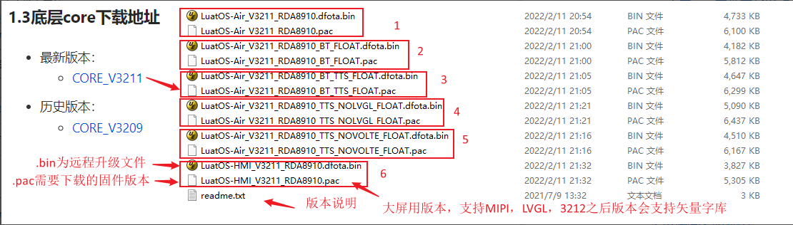
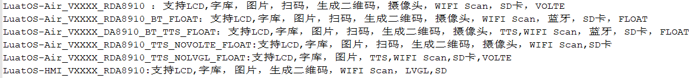
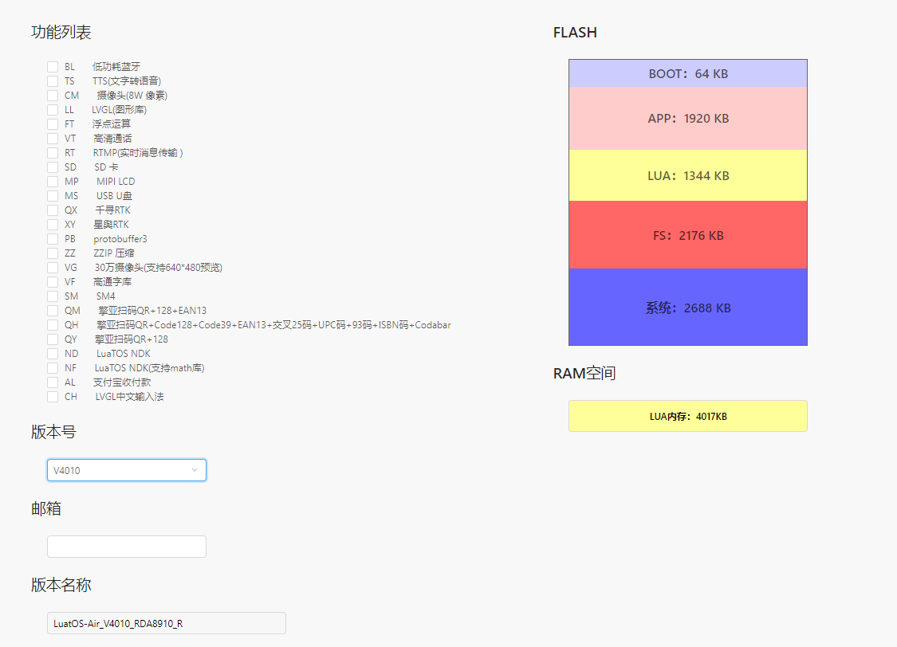

## 1. Air724如何获取底层core固件?
>可以通过官方doc社区或者在线定制固件两种方式获取底层core固件。
>1、官方doc社区获取core固件：[合宙Air720U&724U&722U Lua 固件更新说明](https://doc.openluat.com/article/1334 "合宙Air720U&724U&722U Lua 固件更新说明")。 
>2、在线定制固件：[Luat固件定制系统](https://doc.openluat.com/shareArticle/Vf34iUQh9em7c "Luat固件定制系统")。
>
>3、LuaTools/resource下获取
>
>

## 2. Air724固件说明
>1、官方每一个内测通过的底层core固件版本都会更新到官方doc社区，并同时发布版本releasenote。 
>2、每次发布版本，底层固件core压缩包中有6个不同功能组合的固件，解压后会发现有6个【.bin】文件+6个【.pac】文件 + 1个readme.txt文件，【.bin】为远程升级文件，【.pac】为需要下载的固件版本。【readme.txt】为各固件的功能说明文件。
>
> 

3、如果我们发的常规固件版本不能满足您的产品需求，合宙又提供了在线定制固件的功能，定制自己需要的功能组合的版本。在满足功能的同时也能最大化保留Lua运行和存储空间。

