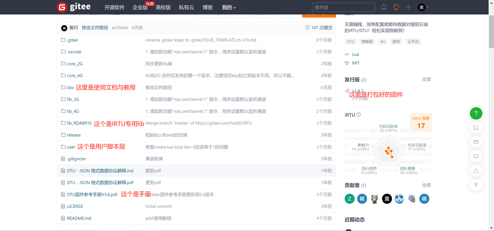
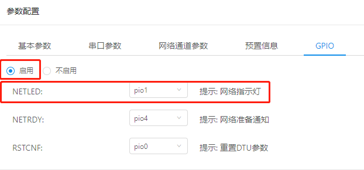
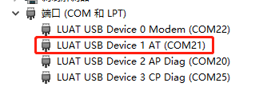
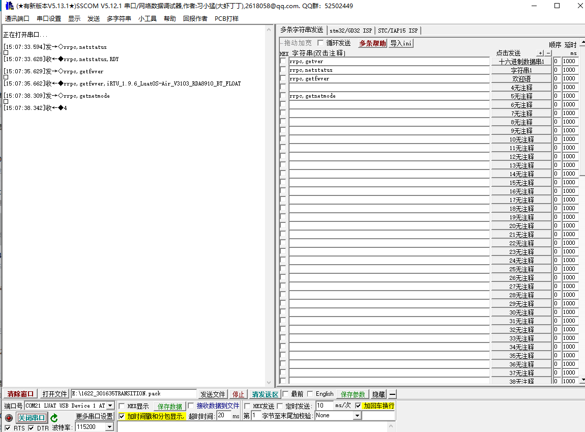
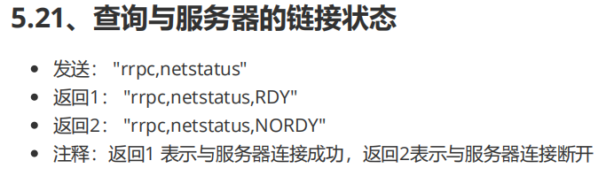
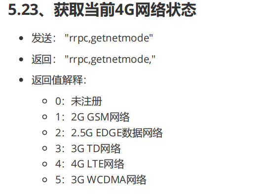
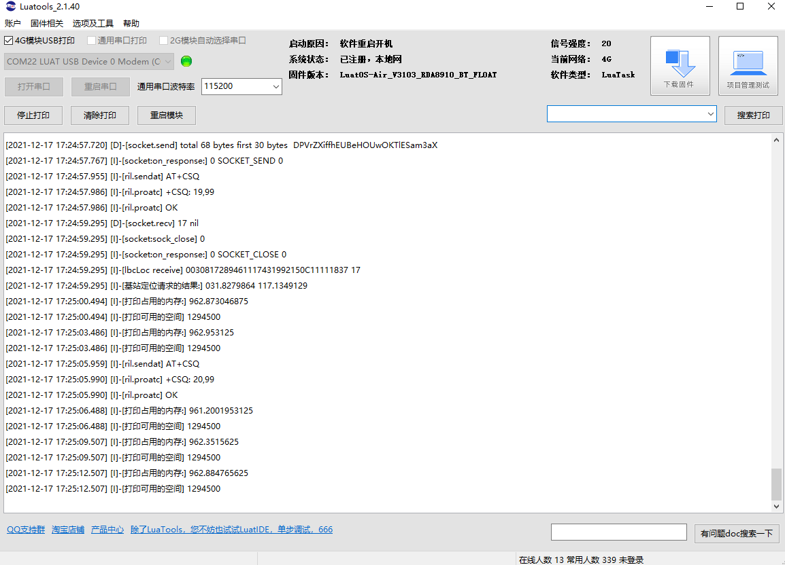

## 1. iRTU的开源代码在哪找？
>8910平台（Air724模块）：https://gitee.com/hotdll/iRTU
>
>
>EC618平台（Air780E模块）：https://gitee.com/openLuat/luatos-irtu

## 2. iRTU的发行版固件

>8910平台（Air724模块）：[iRTU 发行版 - Gitee.com](https://gitee.com/hotdll/iRTU/releases)
>
>EC618平台（Air780E模块）：[LuatOS-IRTU 发行版 - Gitee.com](https://gitee.com/openLuat/luatos-irtu/releases)

## 3.DTU后台是否能看到用户设备实时情况

>DTU后台只是个HTTP服务器，无法下发指令，DTU设备只有在每次上电开机时才会去访问一次DTU配置服务器，如果配置没有更新就会断开连接，如果配置有更新就会去下载最新的配置文件，下载完成后自动重启更新参数配置。

## 4. AIR724模块，我用USB 烧写了DTU固件，然后开机 那个网络灯就不亮了，没烧写之前是会亮的。
>单独模块，我自己供电的，灯用的58脚，看看58脚对应的哪个GPIO，去DTU平台上配置下GPIO就好。
>
>这里58对应的是GPIO_1,如下配置为GPIO1即可：
>

## 5. 怎么确认模块联网状态
>以通过AT口发rrpc,netstatus和rrpc,getnetmode指令查询模块状态：
> 
> 
>对应指令说明如下：
>
>
>[DTU固件参考手册V3.6.pdf](https://cdn.openluat-luatcommunity.openluat.com/attachment/20211217154117439_DTU固件参考手册V3.6.pdf)
>[串口助手LLcom](https://llcom.papapoi.com/index.html)

## 6. 怎么判断模块有没有开机
>1、开启打印
>2、下载驱动
>3、安装驱动
>4、安装luatools
>5、勾选4G模块USB打印
>[Cat.1模块通用工具](https://doc.openluat.com/wiki/21?wiki_page_id=2070 "Cat.1模块通用工具")
>有如下打印，说明正常。
>
>也可以通过上面的AT口发指令的方式判断。

## 7. 无法正常连接服务器
>1、检查卡是否为专网卡/定向卡/大流量卡，检查卡是否欠费/停机/机卡锁定。 
>2、最直接的办法为，将流量卡更换成用户正常使用的手机sim卡。 
>3、如确定不是卡的问题，可以检测自动服务器的ip和端口号设置是否有异常，可以使用合宙的[测试服务器](https://netlab.luatos.com/ "测试服务器")进行测试。 
>4、如果还是连不上服务器，可以进入luatools根目录，根目录下有个log文件夹，先删除该文件夹，然后将模块断电，usb口接入PC,打开luatools，将模块开机，等待10分钟，等待问题复现完成，将log文件夹打包，联系FAE并详细说明问题，以便更快的获取到客户支持。
>5、web界面基础设置，参数版本号改大一号试试。

## 8. 模块重启
>1、如果用户打开了自动更新功能，模块每隔24小时就会去合宙自己的IOT平台检查有无最新固件，如果有，会下载该固件，并进行重启完成升级过程。 
>2、检查“任务”或者“数据流”，有无语法不合规的地方，如果有，模块确实会反复重启，且无法进行空中升级（还没有跑到执行空中升级的地方，就模块内部被看门狗重启了）。 
>3、检查供电，如果供电不足，模块也可能会出现反复重启现象。 
>4、在无网络的情况下，模块5分钟会自动重启一次。 

## 9. 在线配置账号
>1、[点我进入 - IRTU 在线配置平台](http://dtu.openluat.com/login/ "点我进入 - IRTU 在线配置平台")  ，在线配置平台账号和密码与IOT平台一致。 
>2、[点我进入IOT平台介绍](https://doc.openluat.com/wiki/21?wiki_page_id=2432 "点我进入- IOT平台介绍")。
