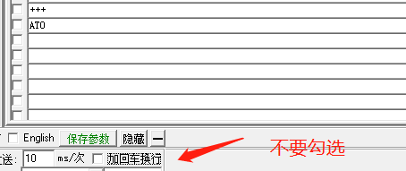
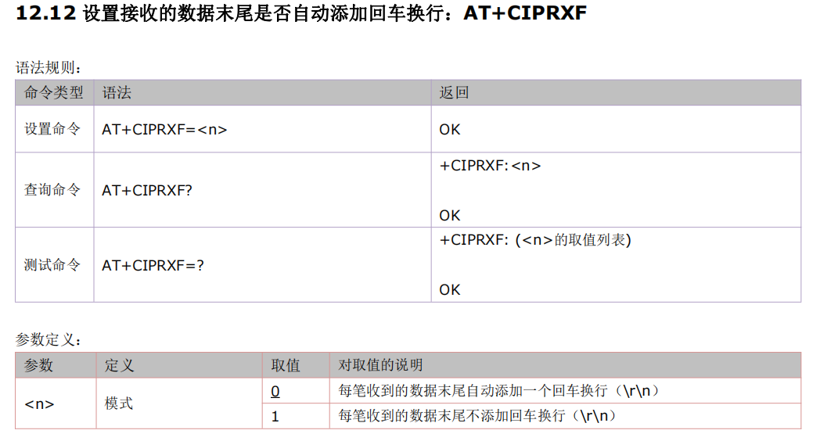

## 1. 测试服务器
>[LuatOS 网络测试工具](https://netlab.luatos.com/ "LuatOS 网络测试工具")

## 2. 连接服务器失败
>1、服务器必须是公网地址。 
>2、使用PC上的TCP UDP测试工具客户端、或者mqtt.fx，连接服务器确认一下是否可以连接成功，排除服务器故障。 
>3、检查下模块信号、网络注册、网络附着、PDP激活状态。 
>4、检查下SIM卡是否欠费【4G模块有一种欠费表现：无法注册4G网络，可以注册2G网络】。 
>5、日志分析网络连接失败：先检查SIM卡是否被识别（+CPIN: READY）。识卡后检查观察“^MODE”的值，^MODE 17,17为4G，其他如下：3,1（2G） , 3,2(2.5G) ， 3,3（3G） , 5,7（5G）。最后观察PDP是否激活（AT+CGDCONT?）（+CGDCONT: 5,“IP”,“cmiot”,“10.39.132.191”,0,0）。正常如果都满足，网络是可以正常使用的。如果出现网络随机断开连接，注意看网络信号值（AT+CESQ）（AT+CSQ）。

## 3. 最多同时支持多少个连接
>最多8个连接。

## 4. tcp连接，心跳包建议多长时间一次
>因为基站资源有限，如果不发心跳包保活，基站会主动断掉链路，回收资源，模块和服务器无感，并不知道链路已经断开。建议心跳包的频率不要超过4分钟，一般都是建议使用2分钟。

## 5. 数据收发延迟大、速度慢、经常失败、掉线断开
>1、检查下是否存在代码逻辑错误，导致异常。 
>2、检查下是否不断重启，导致异常。 
>3、检查下服务器网络是否稳定，不要用内网穿透方式搭建服务器。 
>4、检查下使用环境是否网络覆盖不好，例如车库、地下、电梯、山区等。 
>5、检查下模块信号、网络注册、网络附着、PDP激活状态。 
>6、排查是否为设备天线问题：发出来设备的天线调试指标参数给合宙技术支持人员。 
>7、如果经常出现连接被动断开：
  1) 如果直接使用的是tcp udp socket连接，检查下心跳包的频率，基站策略会关闭长时间没有数据传输的连接，建议心跳包的频率不要超过4分钟，一般都是建议使用2分钟。
  2) 如果使用的是mqtt连接，检查下mqtt keep alive的时间，基站策略会关闭长时间没有数据传输的连接，建议心跳包的频率不要超过4分钟，一般都是建议使用2分钟。
  3) 如果使用的是mqtt连接，检查下是否在1.5倍的mqtt keep alive的时间，没有成功发送数据到服务器，就会被被服务器主动断开，这种情况一般都是发送数据超时引起的。 
8、排查是否为网络问题：如果同一地点的所有设备都有问题，可能和网络环境有关系；使用手机设置为同样的网络模式，对比测试确认下；或者把设备移动到其他距离此地点比较远的地方对比测试。 
9、排查是否设备单体问题：如果同一地点，某些设备正常，某些设备异常，按照如下几种情况分析
  1) 分析正常设备和异常设备的使用环境是否相同：
  A. 如果不同，例如异常设备固定在钢制墙壁上，正常设备放置在桌子上，钢制墙壁可能对天线射频有干扰，将异常设备和正常设备放置在同样的使用环境中，再对比测试。
    B. 如果相同，参考第2)步
  2) 分析正常和异常的设备，驻留的小区是否相同：
  A. 如果相同，重点排查异常设备的天线射频部分，分析不出结果的话，异常设备寄给合宙分析。
    B. 如同不同，多测试几次，确认下，是不是在异常小区内很容易出问题，如果异常小区很容易出问题，可能就是小区拥堵造成的。 
  10、提供日志给合宙技术支持人员。

## 6. 如何统计流量
>运营商按照ip包来统计流量，ip包包含：ip包头+tcp包头+用户数据，以IPv4为例：
>ip包头包含固定的20字节+可选的4字节，至少20字节。
>tcp包头包含固定的20字节+可选的4字节，至少20字节。 
>用户数据就是用户能够感知到的数据内容了，如果直接使用socket，就是用户感知的数据；如果使用http、mqtt、ssl，这部分数据就不是用户能够感知的原始数据了，http会加上http包头，mqtt会加入mqtt的包裹部分，ssl会加密数据。 
>tcp数据收发时，有ack确认机制，例如设备发数据给服务器后，还会收到服务器返回的tcp ack包，这个tcp ack包（至少40字节）也是计算在流量之内的。接收到服务器下发的数据时，设备也会回复一个tcp ack包，同样这个ack包仍然计算在流量之内。 
>另外，socket连接以及断开连接，都有多次数据收发，这部分也会消耗流量。 
>例如有一个tcp socket连接，连接成功后，每分钟设备发送2字节的心跳数据到服务器，服务器收到数据后，再回复2字节的心跳应答数据。这个过程中，每分钟消耗的流量至少有42（设备发送）+40（服务器回复ack）+42（服务器发送）+40（设备回复ack）=164字节，实际处理中，服务器回复ack和服务器发送可能合并成一个IP包42字节，这样的话，至少也要42+42+40 = 124字节。这是最简单的算法，实际应用中，还要考虑到重传、包头中的可选字节，应该会比这里计算的流量多一些。如果要准确计算，建议在服务器端用wireshark抓包分析。 
>另外一个常见的例子是，为什么通过http下载一个文件，实际消耗的流量比文件本身要多呢？跟上个例子类似，文件本身大小仅仅是用户数据，除了用户数据外，还有如下几部分的流量消耗：
>1、连接服务器消耗流量。
>2、http请求时有http头，服务器下发数据时也有http头。
>3、每包数据都有tcp头和ip头。
>4、重传也会消耗流量。
>5、与服务器断开连接也需要消耗流量。

## 7. Air724模块可以同时作为服务器和客户端使用吗？
>不能作为服务器使用。

## 8. 为什么频繁收发数据时，会导致整个模块系统响应变慢
>模块的主频是有限的，如果一直频繁收发数据，CPU频繁的处理数据收发，肯定会导致对其他任务的处理有延时。

## 9. TCP链接发送数据成功,服务器却没收到数据
>关于"TCP单/多链接时，刚开始发送数据成功，服务器能收到,间隔十几分钟，模块端AT+CIPSTATUS查询链接存在，AT+CIPSEND数据发送成功，但服务器却没收到数据"问题。 
>1.用保活探针(CIPTKA)的方法来解决。
>2.用心跳包(HEARTCONFIG)来解决。
>详细解释和AT示例，可参考链接 http://doc.openluat.com/shareArticle/9gI328ebaVFSr

## 10. 780E 模块tcp联网成功 每次开机都需要重新下发AT指令连接吗？
>是的，模块不保存已输入AT指令。

## 11. 模块上报PDP: DEACT ， 这个要怎么处理
>4G模块会产生一个+PDP: DEACT的URC提示，出现此提示说明已经激活的PDP承载被网络端去激活了，此时仍然需要向4G模块发送AT+CIPSHUT命令主动关闭PDP，然后再重新激活，再重新连接TCP服务器。

## 12. 重试多次PDP一直激活失败
>如果重试多次，PDP一直激活失败，则尝试使用如下手段恢复：
>1、使用RESET引脚复位模块
>2、极端情况下，直接给模块断电，再上电，POWER KEY引脚拉低开机

## 13. 如何发送心跳包
>cat1模块如何发送心跳包[cat1模块如何发送心跳包](https://doc.openluat.com/article/1396 "cat1模块如何发送心跳包")

## 14. 由数据透传状态转向命令状态，发+++切换不了
>发送+++时不要勾选回车换行
>
>测试效果
>
>

## 15. 当我连续发送几百个字节的数据的时候，在里面会夹杂0x0a0x0d这种，如何避免这个呢
>通过AT+CIPRXF设置接收的数据末尾是否自动添加回车换行（网络连接前设置）
>

## 16. 数据透传时，会丢失前面的一部分数据
>确认下收发数据前是否唤醒了模块。
