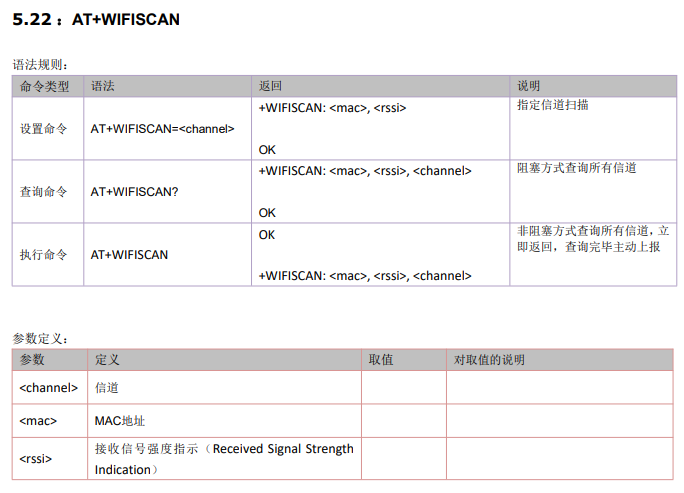
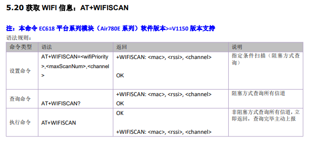
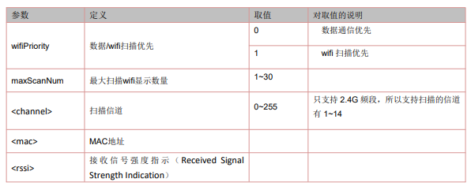

## 1. wifi定位失败的可能原因有哪些？
>1、首先确认模块硬件是否支持wifi
>如果模块型号带有NFM或者NAM后缀（例如Air724UG-NFM、Air720UG-NAM），则支持wifi
>其余后缀不支持wifi。 
>2、烧录wifi demo
>开机测试，luatools抓日志分析：
>A、如果没有搜索到wifi热点，用手机对比确认下是否可以搜索到附件wifi，如果手机可以搜到，确认下模块的板子上是否有接wifi天线。
>B、如果可以搜索到wifi热点，但是wifi热点很少，用手机对比确认下搜索到附件wifi数量，如果数量差别太大，确认下模块的板子上是否有接wifi天线或者所接的天线是否支持2.4G频段。

## 2. 当同时使用基站定位和wifi定位怎么判断是基站定位成功了还是wifi定位成功了？
>服务器返回的第一个字节为0x00表示基站定位成功返回0xFF表示WIFI定位成功，相关lib和demo已更新。

## 3. 724模块wifi定位和基站定位的区别
>1、wifi定位和基站定位都是通过调通lbsLoc.request接口来实现定位。 
>2、主要区别是，wifi定位要先通过wifiScan.request接口先搜索WIFI热点信息(MAC地址和信号强度)，然后把搜索到的WIFI热点信息传入lbsLoc.request接口的最后一个参数，后台会查询WIFI热点对应的经纬度。

## 4. wifi定位精度
>根据设备获取的WiFi的信息进行定位，WIFI定位精度一般不受使用环境影响，主要和单一WIFI辐射半径、WIFI覆盖密度有关。一般来说，WIFI精度在3米－200米左右。

## 5. WIFI定位支持国外定位吗？
>不支持，只支持国内定位。

## 6. Wifi定位获取的经纬度是什么坐标系的？
>Wifi定位获取的经纬度是WGS-84地心坐标系（ GPS 全球定位系统建立的坐标系统）。

## 7. 能否限制WIFI扫描的结果，我们串口的缓存不大，如果打印的结果太多会导致溢出
>可以选择信道进行扫描，结果会少很多，有13个信道可供选择。
>
>8910平台（Air724系列模块）对应AT指令如下所示：
>
>
>
>EC618平台（Air780E系列模块）对应AT指令如下所示：
>
>
>
>

## 8. WIFISCAN 支持异步扫描”什么意思？
>这个是说你发送完扫面指令后，在没有收到结果之前同样可以发送别的指令，得到别的结果，如果你必须等着扫描结果出来之后才能进行后面的指令操作的话，那就是同步扫描模式。

## 9. WIFI扫描超时时间是多少？
>共有13个信道，一个信道阻塞800毫秒，预计会阻塞7-8秒的时间。
