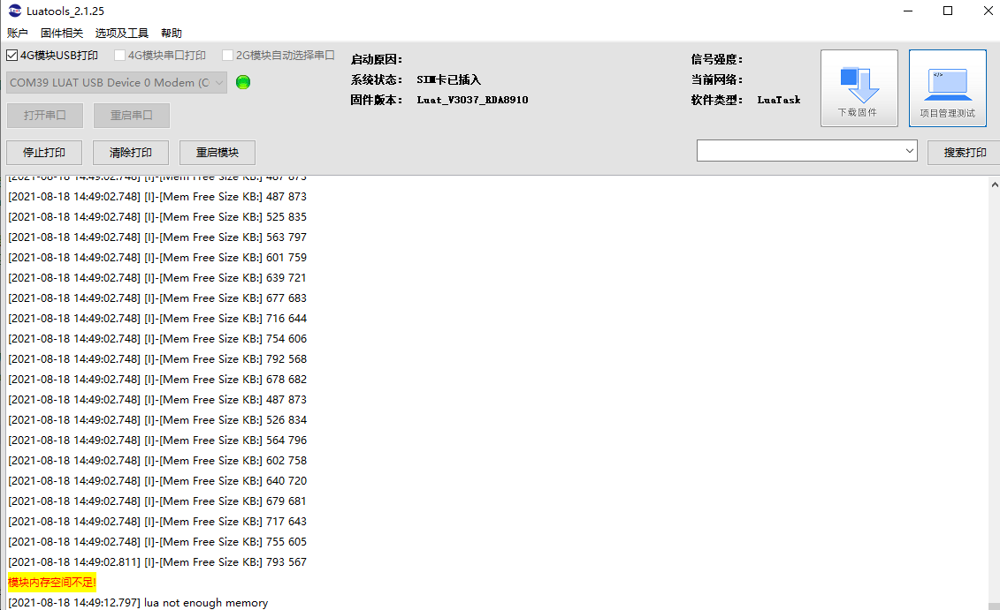
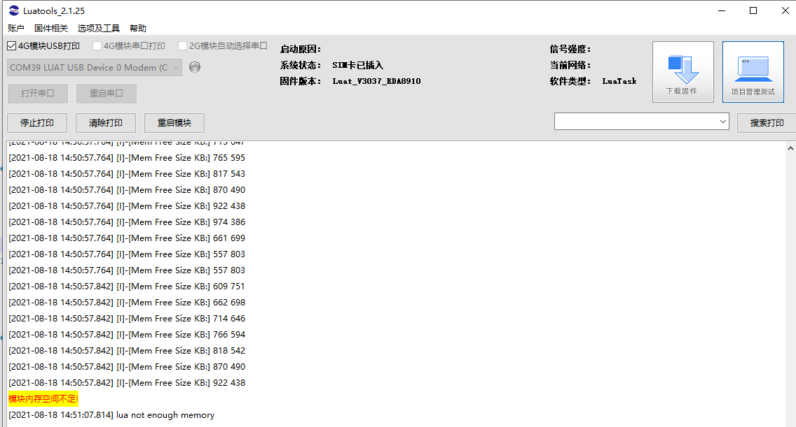
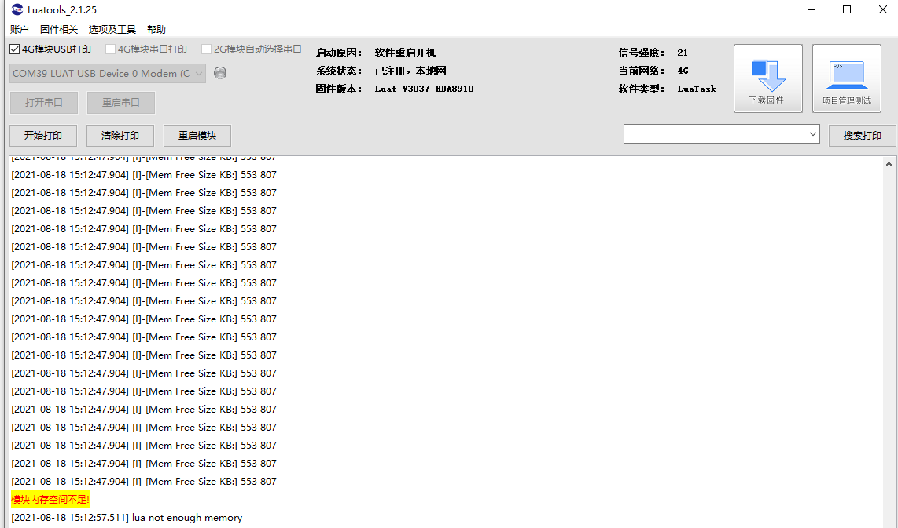
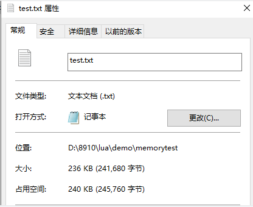
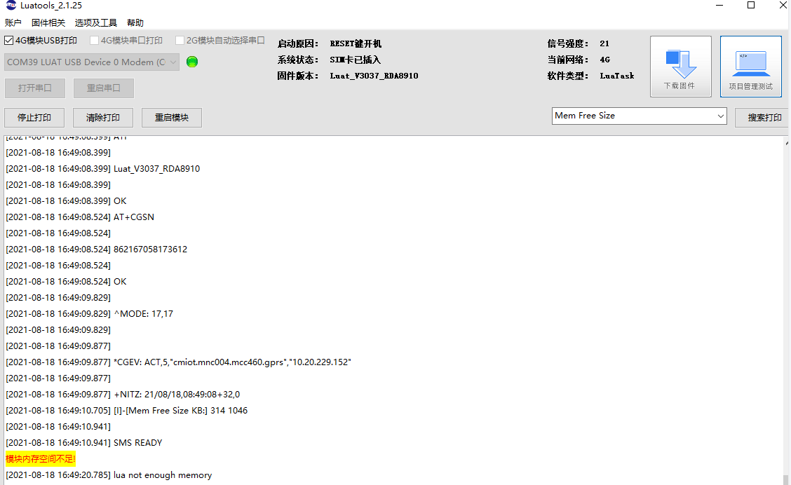
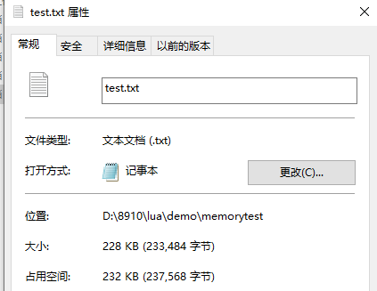
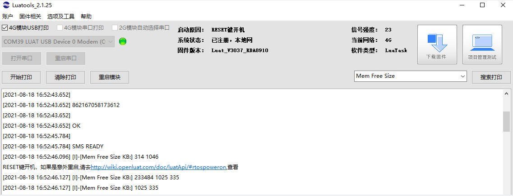
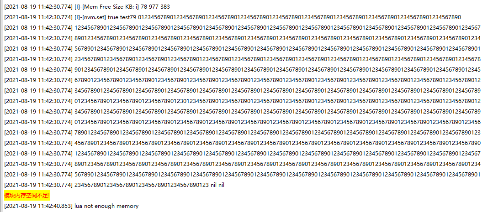
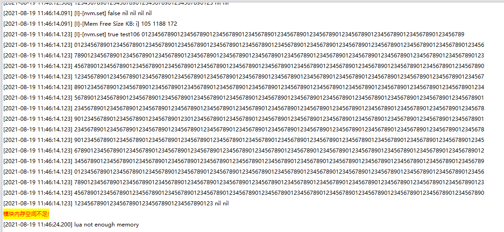

## 1.当前可用内存
>Air724模块Luat二次开发可用的ram空间，通用底层固件和定制固件有所不同，详细说明如下： 
>通用底层固件，分为虚拟机空间和底层空间。
>虚拟机空间：可用的ram空间有1.36MB可通过collectgarbage(“count”)查询已经使用的内存空间（返回值单位为KB）,总的1.36MB减去使用的内存，就是当前剩余的Lua运行可用内存。
>底层可用空间：AT^HEAPINFO查询结果的第3个值。 
>定制固件可用内存空间以定制系统说明为准，剩余可用空间为：AT^HEAPINFO查询结果的第3个值。
>注意：
>1、collectgarbage(“count”)是无法返回Lua虚拟机中的垃圾内存空间的，所以剩余空间并不是简单的“总空间-collectgarbage(“count”)空间”，如果要计算准确的剩余空间，在计算之前调用3次collectgarbage(collect)强制回收垃圾内存。
>2、存在内存碎片的问题，并不是剩余多少内存空间就能用多少空间
## 2.怎样提高内存的使用率
>1、main.lua中collectgarbage(“setpause”, 90)，以保证垃圾自动回收；
>2、定期的调用collectgarbage(“collect”)，又或者collectgarbage(“step”)进行显式回收；
>3、collectgarbage(“collect”)被调用，并不保证一次成功, 所以, 大可以调用多次；
## 3.RAM不太够用
>可以根据需求，自已定制版本
>8901平台（Air724模块）定制系统：https://doc.openluat.com/shareArticle/Vf34iUQh9em7c
>
>EC618平台（Air780E模块）云编译：[☁️ 云编译 - LuatOS 文档](https://wiki.luatos.com/develop/compile/Cloud_compilation.html)
## 4.字符串拼接对内存的影响
>Lua处理字符串的方式：
>a=”” -----–申请内存
>a=a…”abc”------–申请新内存，保存拼接后的字符串，然后a的指针指向新地址
>如此往复，当拼接大量字符串的时候，所占用的内存将远远大于实际使用： 
>**测试代码1:**
>local a = ''
>for i=0,9999 do
>a = a..'012346789'
>log.info("Mem Free Size KB:", collectgarbage("count"),1360- collectgarbage("count"))
>end 
>**实测结果1**
> 
>**测试代码2:**
>local a = ''
>for i=0,9999 do
>a = a..'012345'
>log.info("Mem Free Size KB:", collectgarbage("count"),1360- collectgarbage("count"))
>end 
>**实测结果2:**
> 
>测试1每次在原字符串的基础上拼接10个字符，内存剩余567就已经报内存不足，测试2每次在原字符串的基础上拼接6个字符，内存剩余438才报内存不足，从上面的测试结果来看，拼接的字符串越大，内存利用率会越低。

## 5.过长的table对内存的影响
>很多开发者可能对table的长度没有概念，所以觉得既然没有什么限制，就往里边随便insert呗。殊不知这样做会拖慢效率，消耗大量内存： 
>**测试代码:**
>local a = {}
>for i=0,99999 do
>table.insert(a,'0123456789')
>log.info("Mem Free Size KB:", collectgarbage("count"),1360- collectgarbage("count"))
>end 
>**测试结果:**
> 
>测试结果看，过长的table的内存利率很低。内存剩余807就报内存不足。

## 读取大文件对内存的影响
>测试代码：
>local a = ''
>a = io.readFile("/lua/test.txt")
>log.info("Mem Free Size KB:", string.len(a),collectgarbage("count"),1360- collectgarbage("count"))  
>**测试结果:**
>读取文件大小为236KB，会报内存不足：
>
> 
>读取文件大小为228KB，模块可以正常运行：
>
> 
>测试结果可以看出，模块默认剩余空间为1046KB，可以加载大概230KB左右大小的文件。

## collectgarbage(“collect”)对内存的影响
>config.lua的实现内部有个table缓冲所有的数据，key不同，table会越来越大，所以到一定程度内存不足是肯定的，nvm库的应用场景是小数据量的简单键值对参数。如果存储大数据，参考fs的demo直接操作文件。
>**测试代码1：**
>local i = nvm.get(num)
>for i=0,99999 do
>nvm.set("test"..i,io.readFile("/lua/2048.txt"))
>nvm.set(num)
>log.info("Mem Free Size KB: i", i,collectgarbage("count"),1360- collectgarbage("count"))
>end  
>**测试结果1：**
>  
>**测试代码2：**
>local i = nvm.get(num)
>for i=0,99999 do
>collectgarbage("collect")
>nvm.set("test"..i,io.readFile("/lua/2048.txt"))
>nvm.set(num)
>log.info("Mem Free Size KB: i", i,collectgarbage("count"),1360- collectgarbage("count"))
>end   
>**测试结果2：**
> 
>测试1代码每次保存2K的数据，循环了78次，占用内存977KB，在内存还剩余383KB的时候报内存不足。
>测试2加入了collectgarbage("collect")，同样的操作循环了105次，占用内存1188KB，在内存还剩余172KB的时候报内存不足。
>可见通过collectgarbage("collect")进行内存回收，能提高内存的使用率。
