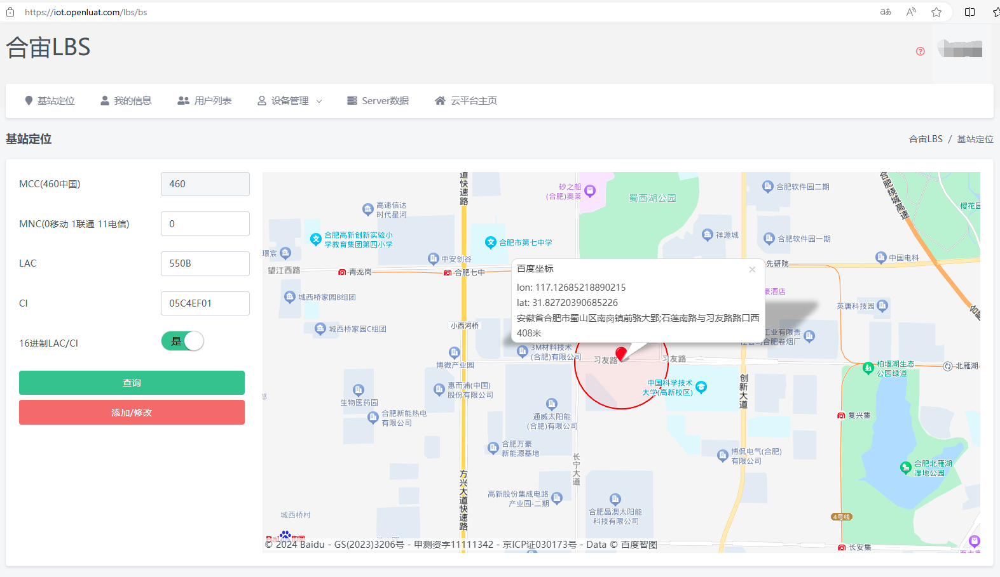

## 1. 提供哪些云平台服务
>1、商用平台（与模块终端通信）
>远程升级：tcp协议 域名：iot.openluat.com 端口：80
>日志服务：udp协议 域名：dev_msg1.openluat.com 端口：12425
>基站定位：udp协议 域名：bs.openluat.com 端口：12411和12412
>AGPS星历下载：tcp协议 域名：download.openluat.com 端口：80  
>2、业务操作平台（直接在PC浏览器上访问）
>流量卡管理查询：sim.openluat.com
>物联网云平台，用于支持模块终端的远程升级、日志服务、基站定位功能：iot.openluat.com
>商务信息查询：erp.openluat.com 
>3、开发调试平台（不保证平台系统的稳定性，仅方便开发者开发调试使用）
>TCP测试平台：https://netlab.luatos.com

## 2. 物联网云平台（iot.openluat.com）问题
### 2.1 如何添加设备到设备列表中
>不需要手动添加设备到产品的设备列表中，使用LuatOS-Air版本二次开始时，update、lbsLoc都要用到产品的productKey，当设备第一次成功使用update或者lbsLoc功能时【注意：此处的成功使用，update成功指的是从云平台上成功下载了升级包、lbsLoc成功指的是获取到了基站对应的经纬度】，会自动将设备模块的imei添加到productKey对应产品的设备列表中。

### 2.2 如何查询设备在哪个产品下
>1、把模块IMEI发给合宙技术支持人员查询。 
>2、如果查询不到，说明设备还没有成功上报过，参考2.1处理后才能查询到归属产品，此情况不影响设备正常使用update和lbsLoc功能，设备成功使用过一次update或者lbsLoc功能后，就可以在云平台查到归属产品了。

### 2.3 为什么公司采购的4G模块不在我自己创建的产品项目下
>1、客户向合宙采购4G模块时，如果采购人员没有告知合宙这批模块放在iot.openluat.com上的哪个产品下，则合宙会以采购人的手机号为账号，默认密码**888888**，8901平台：创建一个“**Air720X标准模块**”的产品，EC618平台：创建一个“**Air7XXE标准模块**”的产品，此次采购的所有模块都会放在这个产品下。 
>2、通常采购人员和开发人员并不是同一个人，开发人员拿到模块，如果使用Lua版本开发，用到了合宙服务器提供的基站定位、远程升级功能，就会在iot.openluat.com上开发人员自己的账号下，创建一个新产品【假设产品名为“模块Lua开发”】，此时就会出现main.lua中的PRODUCT_KEY和模块归属的产品ProductKey不一致的问题，导致基站定位和远程升级功能无法正常使用。 
>3、遇到这种问题，需要把“Air720X标准模块或者Air7XXE标准模块”产品下的所有设备转移到“模块Lua开发”产品下，操作步骤如下：
>登录采购人手机号码账号，默认密码888888【如果不知道采购人员是谁，告知合宙技术支持人员一个模块的IMEI来查询】，进入“Air720X标准模块或者Air7XXE标准模块”产品
>点击设备列表->转移全部设备->其他账号，填入实际的账号和项目名之后，点击确定，开始转移，如果设备过多，转移耗费时间会稍长一点儿，请耐心等待；转移完成后，会提示“操作成功”。 
>4、以后采购模块时，如果所有的模块都需要放在开发人员账户下的“模块Lua开发”产品下，则告知采购人员，让合宙发货时默认全放在这个产品下，可以省去“开发人员转移全部设备”的操作。 
>5、如果不方便指定产品，所有模块都用做LuatOS-Air二次开发，则可以进入“Air720X标准模块或者Air7XXE标准模块”产品，打开设备列表，点击“重置所有设备”，这样所有模块都没有归属项目了，以后模块使用LuatOS-Air版本第一次成功使用基站定位或者远程升级功能后，就自动加入“脚本中PRODUCT_KEY对应的项目”下。 
>6、如果查询不到，说明设备还没有成功上报过，参考2.1处理后才能查询到归属产品，此情况不影响设备正常使用update和lbsLoc功能，设备成功使用过一次update或者lbsLoc功能后，就可以在云平台查到归属产品了。

### 2.4 为什么转移设备会失败
>要转移的设备必须属于源产品，如果批量转移的设备中有些设备不属于源产品，网站不会报错，会忽略这些不属于源产品的设备，仅仅转移属于源产品的设备。

## 3. 云平台上能查看位置信息吗？
>可以通过基站信息查询，[合宙云平台 (openluat.com)](https://iot.openluat.com/lbs/bs)
>
>通过发送下面AT命令查询相关信息，如下所示：
> 
>输入基站信息，查看显示位置如下：
>
>

## 4. 云平台使用是免费的吗？
>是的，我们的云平台现在是免费的。

## 5. 最后上线时间怎样更新？
>升级请求的时候更新。

## 6. 设备在首次升级成功之后，设备列表里面设备版本仍然显示老版本号
>要重新在升级一次，升级日志里面显示了已经是最新版本号之后，设备列表里面的版本号才改过来。首次只是下载升级包成功，下次请求才知道实际有没有成功。
