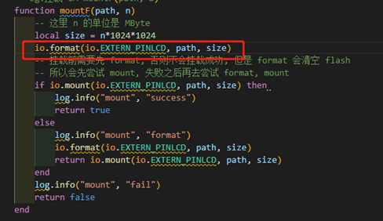

## 1.文件系统写入的文件数据 升级会清掉吗？
>Air724模块：USB 线刷，会清掉。远程升级不会。

## 2.用户可用的文件系统区域有多大？
> LuatOS-Air开发方式（Air724模块）：同的core固件分配的文件系统空间不尽相同，可通过rtos.get_fs_free_size()返回文件系统的剩余空间，单位为字节。注意：
>   A. 此处返回的剩余空间为理论值，除了存储文件中的实际数据之外，还要存储文件索引信息，所以文件系统存在一个利用率的问题，一般来说85%是比较保险的一个经验值。
>   B.  下载的差分升级包也存放在文件系统区，为保证差分升级可以用，建议预留900KB给差分升级使用  。
>
> LuatOS开发方式（Air780E模块）：fs.fsstat(path)获取文件系统信息
## 3.为什么读文件失败？
>如果读取的是本地烧录的文件，检查下文件有没有烧录以及完整路径是否正确; 
>如果读取的是程序运行过程中动态创建的文件，检查下文件是否创建成功【文件系统空间不足可能会导致文件创建失败】以及完整路径是否正确
## 4.为什么用os.remove()删除不了文件？
>检查文件是否关闭，已经打开的文件不能删除，必须要先关闭才能删除。
## 5.使用NVM跟用文件系统存储参数有什么区别？
>Air724模块：lib中基于文件系统实现了一个nvm功能模块，可用于存储小数据量的简单键值对数据; 
>如果存储大数据量数据，参考fs的demo直接操作文件;
## 6.可以在/lua下创建文件吗？
>Air724模块：/lua 用来访问“Luatools烧录的Lua脚本以及图片、音频等文件”的一个特殊目录，并不是文件系统中真实存在的目录；在文件系统中创建文件时，不要放在/lua这个目录下，可能会出现意想不到的错误。
## 7.luatools烧录本地的文件可以读写吗?
>可以读，但是不可写
## 8.luatools烧录本地的文件在那个目录？
>luatools烧录本地的文件8910平台（Air724模块）LuatOS-Air开发方式在/lua这个目录下
>例子:在luatools烧录1.txt文件后读取文件路径如：io.readFile("/lua/1.txt")
>
>luatools烧录本地的文件EC618平台（Air780E模块）LuatOS开发方式在/luadb这个目录下
>例子:在luatools烧录qianzw.txt文件后打开文件路径如：io.open("/luadb/qianzw.txt")

## 9.Air724模块用demo测试qspi挂载成功，操作文件失败
>
>先格式化一下，第一次需要格式化一下，之后就不用了。
>
