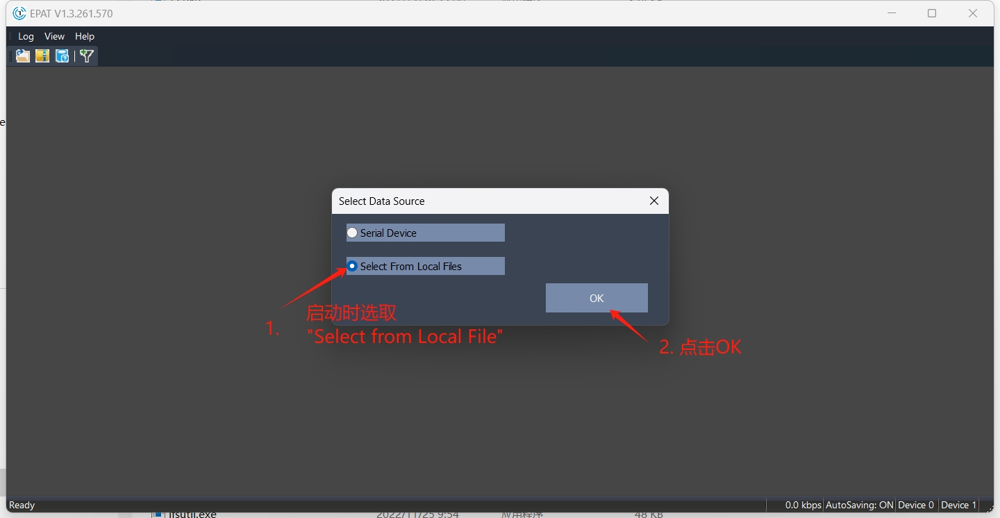
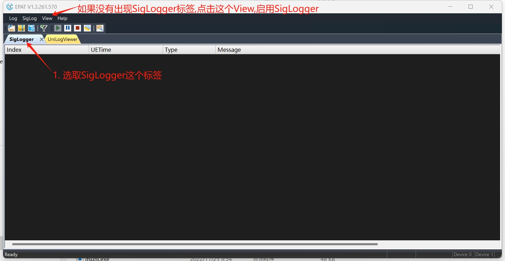
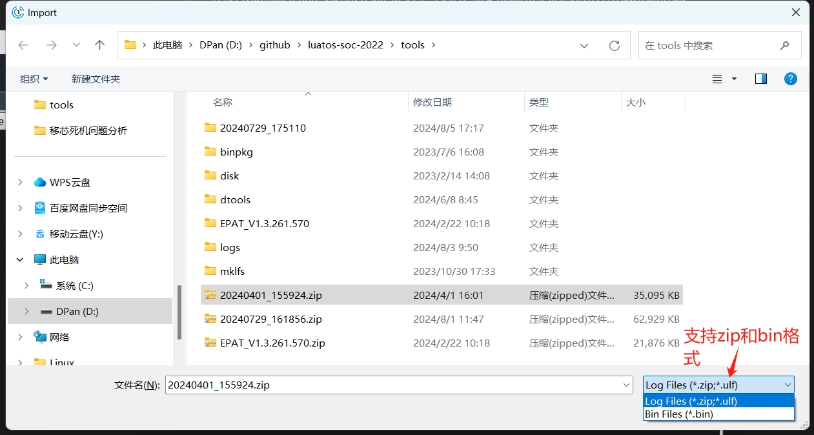
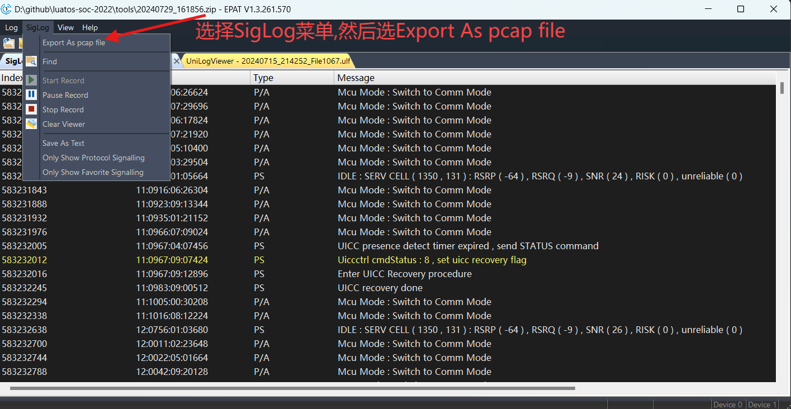
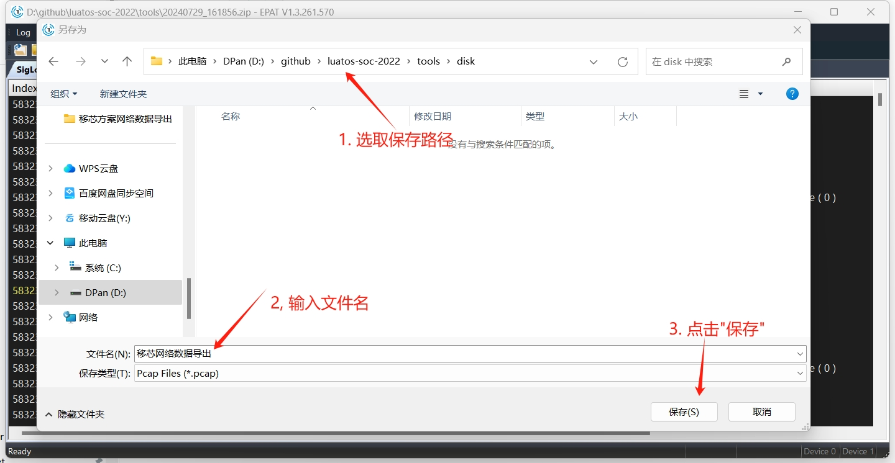
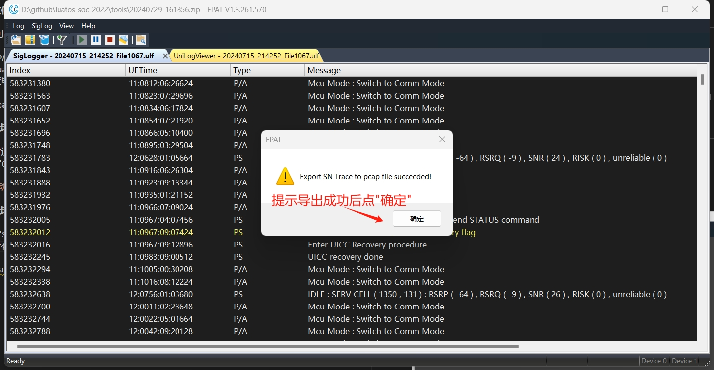

# 移芯日志导出pcap数据的指南

在排查模组的网络通信方面，网络层IP抓包是必不可少的

在服务器端可以使用tcpdump等工具,而移芯方案的模组,只有串口,无法使用tcpdump等工具

且移芯日志文件是二进制格式,具体格式未公开，无法直接使用wireshark等工具打开,需要使用EPAT工具进行转换

所以本文的作用就是介绍如何使用EPAT工具将移芯的日志文件转换为wireshark可以打开的pcap格式

## 名词解释

1. pcap: 一种行业标准的网络数据包捕获格式
2. wireshark: 最常用的协议包分析工具
3. EPAT: 移芯的日志分析工具

## 日志文件准备

日志文件可以有多种来源:

1. 通过EPAT采集的日志文件, 另存为.zip压缩包
2. 通过LuaTools获取到的串口数据, 以.bin文件格式保存
3. 直接读取UART0的数据, 存为.bin文件格式即可, 但一定要确保波特率正确

## 导出pcap文件的流程

### 第一步,下载并启动EPAT工具

1. 启动时选取 "Select from Local File"
2. 点击 "OK" 按钮

### 第二步,确保SigLogger标签已启用

1. 点击 "SigLogger" 标签
2. 如果没有"SigLogger"标签, 点击 "View" 菜单,然后选"SigLog"

### 第三步,选取日志文件

1. 点击 "Log" 菜单, 然后选择 "Open Log File"
2. 支持zip和bin后缀, 右下角可以切换

### 第四步,导出pcap文件

1. 点击 "SigLog" 菜单
2. 选择 "Export As pcap file"

### 第五步,选择导出pcap文件的目录和文件名

1. 确定要存放pcap文件的目录
2. 输入文件名
3. 点击 "OK"

### 第六步,确认导出成功

1. 点击 "OK"

### 第七步,查看导出结果

1. 需要使用到wireshark
2. 安装wireshark后, 双击.pcap文件, 即可打开pcap文件
3. 完整的wireshark教程,请查阅wireshark的官方文档

[wireshark官网](https://www.wireshark.org/)

[wireshark中文教程](https://cloud.tencent.com/developer/article/2326786)
