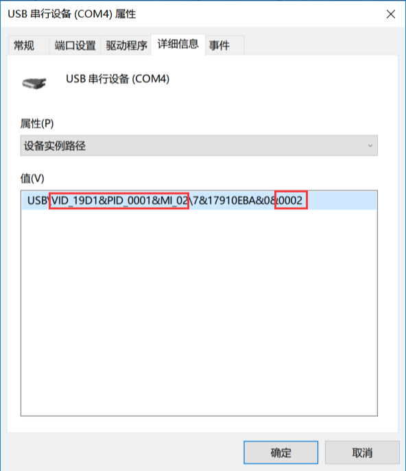
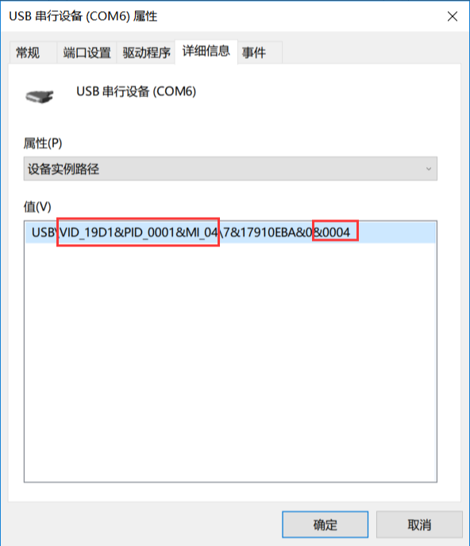
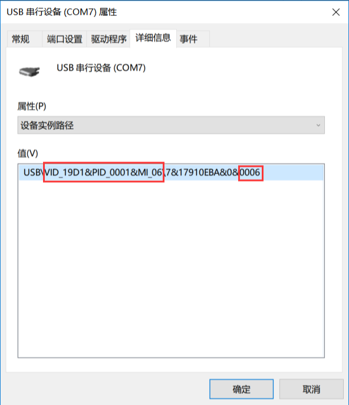
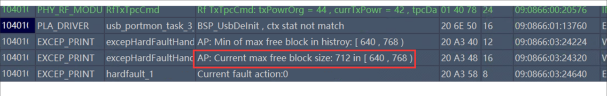
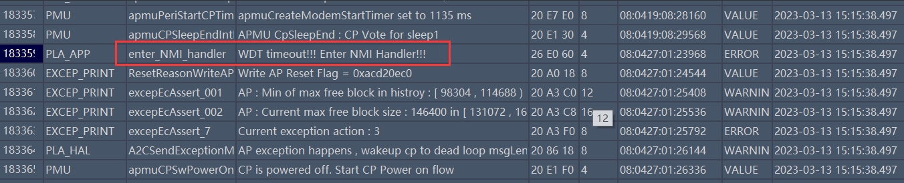

# 简介

> - 本文档扩展到目前移芯所有CAT1芯片，EC618 和 EC7XX（指716s、718p、716e等）
>
> - 关联文档和使用工具：
>
>   - [从Ramdump里分析内存泄漏问题](ramDump.md)
>
>   - [无法抓底层log的情况下如何导出死机dump](../../%E5%BC%80%E5%8F%91%E5%B7%A5%E5%85%B7%E5%8F%8A%E4%BD%BF%E7%94%A8%E8%AF%B4%E6%98%8E/FlashTools_%E6%97%A0%E6%B3%95%E6%8A%93log%E7%9A%84%E6%83%85%E5%86%B5%E4%B8%8B%E5%A6%82%E4%BD%95%E5%AF%BC%E5%87%BA%E6%AD%BB%E6%9C%BADUMP.md)
>
>   - [Luatools下载调试工具](../../%E5%BC%80%E5%8F%91%E5%B7%A5%E5%85%B7%E5%8F%8A%E4%BD%BF%E7%94%A8%E8%AF%B4%E6%98%8E/Luatools%E4%B8%8B%E8%BD%BD%E8%B0%83%E8%AF%95%E5%B7%A5%E5%85%B7.md)
>
>   - [EPAT抓取底层日志](../../%E5%BC%80%E5%8F%91%E5%B7%A5%E5%85%B7%E5%8F%8A%E4%BD%BF%E7%94%A8%E8%AF%B4%E6%98%8E/%E5%BA%95%E5%B1%82%E6%97%A5%E5%BF%97%E6%8A%93%E5%8F%96%E8%B0%83%E8%AF%95%E5%B7%A5%E5%85%B7%EF%BC%88%E7%A7%BB%E8%8A%AF%E5%B9%B3%E5%8F%B0%EF%BC%89.md)
>   
>   - [Flashtools_v4.1.9下载](https://cdn.openluat-luatcommunity.openluat.com/attachment/20240515135114385_FlashTools_V4.1.9_20231106.rar)

luatools和EPAT这2个工具，具体使用方法要了解，本文不做深入讲解，EPAT内有详细使用说明

FlashTools这个工具，至少要掌握怎么连接模块，及读取模块内数据的方法

luatools用于捕获从USB口的用户log，即luat_debug_print输出的log，仅用于csdk和luatos。AT版本没有用户log和用户串口通道，需要使用EPAT工具抓取。

**EPAT用于捕获USB口，UART0（DBG_UART串口） 的底层log，在luatools没有开启的时候，EPAT同样捕获用户log的大部分内容，这个时候用户log会从底层log输出，标识为luatos，等级为error，所以不要把用户log当做error!**

luatools捕获用户log时，自动识别GB2312还是UTF8编码，也能正确打印64bit数据和浮点数据

EPAT只能识别GB2312编码，不能正确打印64bit和浮点数据，在用UART0捕获数据时会丢失部分log，尤其是优先级低的，所以用户log的等级是error，优先级高

双方都是USB口对接的情况下，USB虚拟串口没有波特率限制，任意选择，实际传输速率都是一样的

为啥要区分用户log通道和底层log通道，因为移芯不开放底层log解析方法

csdk固件默认死机后存储死机信息到flash后重启，luatos固件死机后会存储死机信息到flash，然后等EPAT或者luatools抓取死机信息，等待大约40秒左右会重启

# 移芯平台模块出现死机问题分析

# A 怎么抓LOG

抓日志需要使用EPAT工具，说明请看 [EPAT抓取底层日志文档](../%E5%BC%80%E5%8F%91%E5%B7%A5%E5%85%B7%E5%8F%8A%E4%BD%BF%E7%94%A8%E8%AF%B4%E6%98%8E/%E5%BA%95%E5%B1%82%E6%97%A5%E5%BF%97%E6%8A%93%E5%8F%96%E8%B0%83%E8%AF%95%E5%B7%A5%E5%85%B7%EF%BC%88%E7%A7%BB%E8%8A%AF%E5%B9%B3%E5%8F%B0%EF%BC%89.md)

## A1 认识USB虚拟串口

由于电脑识别出来串口名字都是一样的，因此需要从串口属性上来区分对应功能，具体看下面截图红框

### A1.1 用户log通道

### A1.2 底层log通道

### A1.3 用户串口通道

## A2 抓log

### A2.1 USB可用

建议方案1，只用luatools勾选USB打印模式即可，没有配置上的要求，luatools会自动识别log通道，需低层log的，工具配置--》log--》**勾选ap log**，luatools会自动识别log通道，底层log保存在log/4gdiag。luatools版本必须在2.2.1及以上

建议方案2，直接用EPAT，按照EPAT手册操作即可，如果luatools开着，工具配置--》log--》**不要勾选ap log**

### A2.2 USB不可用

只能用EPAT通过UART抓LOG了

---

# B 遇到死机怎么办

设置死机不重启方法

- AT固件：发送 **AT+ECPCFG="faultAction",0** 或者 **AT*EXASSERT=1 ** 指令开启死机不重启。
- LuatOS开发：调用 mcu.hardfault(0) 接口开启死机不重启。
- CSDK开发：在task中执行 luat_debug_set_fault_mode(LUAT_DEBUG_FAULT_HANG); 开启死机不重启。

## B1 EPAT抓底层log，固件设置成死机不重启

EPAT会自动抓，并且自动弹出ramdump处理界面，按照手册操作即可。

## B2 luatools抓底层log，固件设置成死机不重启

luatools也会自动抓ramdump，但是只能保存成文件，仍然需要用EPAT来手动进入处理ramdump界面，后续处理见B1

## B3 固件设置成死机重启，或者没有工具抓底层log

帮助文档：[无法抓底层log的情况下如何导出死机dump](../../%E5%BC%80%E5%8F%91%E5%B7%A5%E5%85%B7%E5%8F%8A%E4%BD%BF%E7%94%A8%E8%AF%B4%E6%98%8E/FlashTools_%E6%97%A0%E6%B3%95%E6%8A%93log%E7%9A%84%E6%83%85%E5%86%B5%E4%B8%8B%E5%A6%82%E4%BD%95%E5%AF%BC%E5%87%BA%E6%AD%BB%E6%9C%BADUMP.md)

---

# C 死机重启原因常见情况分析

**死机需要底层log和ramdump处理结果综合判断，luatos固件还要看用户log，这里讨论如何定位出错代码位置或者出错原因**

## C1 luavm抛出的异常

这个看用户log就行，如果开启了errdump，还能在iot平台上看到

## C2 断言死机

看底层log就可以，搜索EcAssert字样，可以看到断言的位置，如果有源码，就看源码，没有原厂没给源码的，直接问原厂

如果没有底层log，ramdump里需要看list source的代码上下是不是调用了ec_assert_regs，然后在stackframe with local里看看调用顺序，大概率能看到断言的位置。

断言死机如果是malloc失败，那么就是ram不足了。

## C3 内存不足

这是最常见的死机原因，而且9成9可以判断是内存泄露，剩下也有可能malloc时的参数不对，申请了不可能申请到的空间大小。内存不足直接表现，C2中已有部分描述，如果有底层log，还可以从死机时打印的信息来判断

这里表示动态分配ram时，最大的block只有712字节了，这是非常典型的内存不足引起的死机，正常来说，至少要有个70KB左右的空间来满足LTE协议栈的需求

如果ramdump信息完整，则可以从ramdump里找到查找方向[EC618从Ramdump里分析内存泄露问题](ramDump.md)

## C4 看门狗死机

在底层log和ramdump里都能看到，

ramdump里能看到最后停在NMI Handler里。

看门狗死机，要么死循环，要么操作时间太长，消除死循环，或者主动喂一下狗。压力测试和RSA运算时特别注意一下。

## C5 疑难杂症

真正遇到hardfault时，需要先从底层日志里看死机的直接原因，也就是arm内核遇到的致命错误，当然多种多样，常见的地址错误（常见data access）有数据存取时的总线错误（常见precise data access，imprecise data access等等），指令错误（常见switch to an invalid state (e.g., ARM)）等等。

以下个人经验:

先要排除一下栈溢出的可能，一旦栈溢出，什么奇怪的现象都有可能发生，运气好的，触发断言，运气不好的，就什么错误都可能发生，任务链表都可能被破坏，导致ramdump里的信息都会缺失。

如果ramdump信息完整，则可以从ramdump大致分析出有没有栈溢出现象[EC618从ramdump里看栈溢出](ramDump.md)

如果ramdump的信息看起来完整，stackframe with local里调用顺序也比较合理，那么就能定位发生问题的函数和语句，后续就看代码调试吧，这是比较理想的情况。

地址错误的，大概率是读写了一个不可读写的地址，但是注意，有时候非ram和flash地址，直接读取并不一定会出错。

总线错误，大概率是数据对齐的问题，比如uint32_t *指针，去读取一个uint8_t *指针指向的内容，一旦uint8_t *指针存放的地址不是32位对齐的，编译器又没有对应优化处理，死机是很正常的

指令错误，这种常见的函数指针用出问题，导致函数退出时，PC指针已经不能指向正确的代码指令，从而执行了非arm的指令

如果ramdump的信息都不完整，底层log也丢完，或者压根没法抓，建议通过删减代码，加打印语句等方法来定位出错的语句，多次尝试缩小范围，直到成功，有经验，对源码了解的，能加快这一进度。
