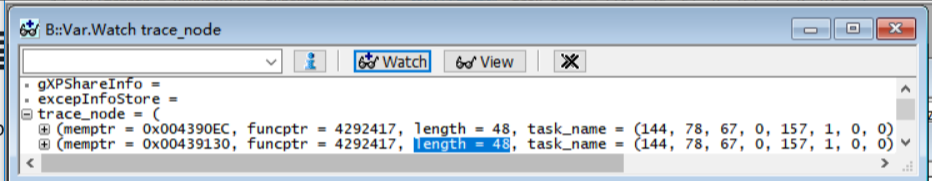
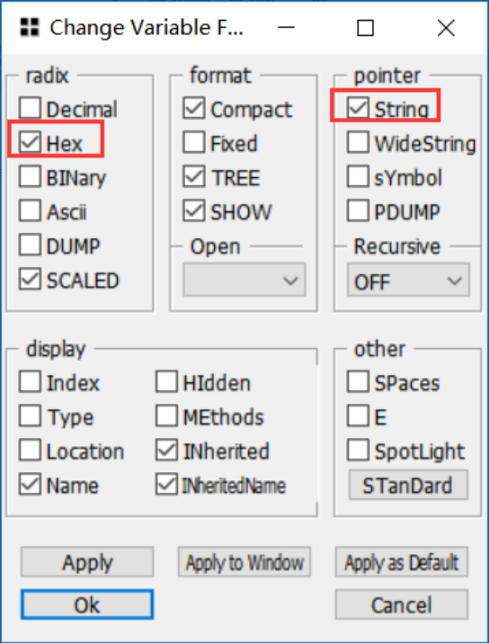
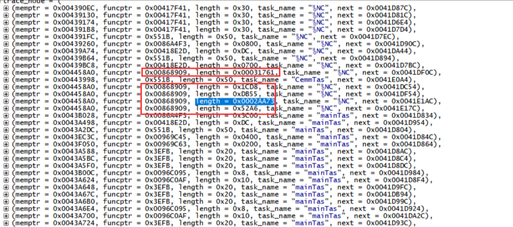
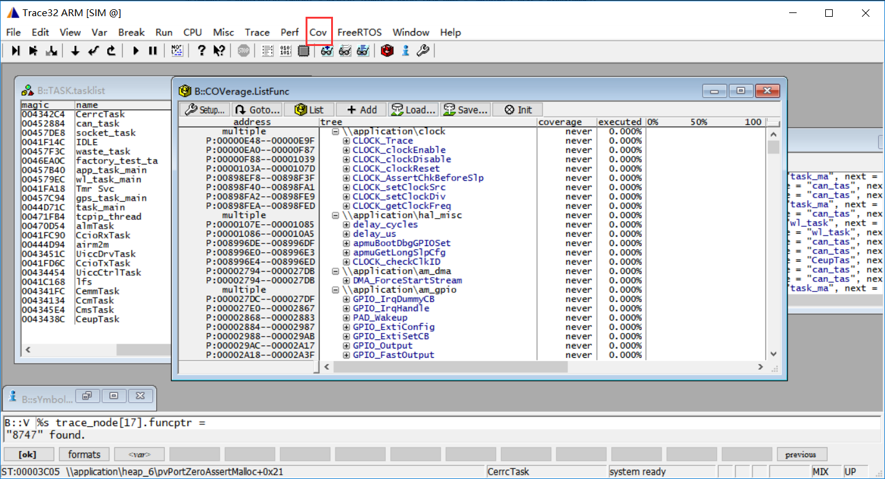
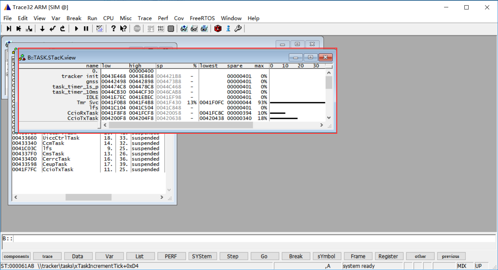

# 简介

> - 本文档扩展到目前移芯所有CAT1芯片，EC618 和 EC7XX（指716s、718p、716e等）
>
> - 关联文档和使用工具：
> 
>   - [移芯平台模块出现死机问题分析](ErrorDump.md)
>   - [trace32工具下载](https://repo.lauterbach.com/download_trace32.html)
> 
>   - [EPAT抓取底层日志](../%E5%BC%80%E5%8F%91%E5%B7%A5%E5%85%B7%E5%8F%8A%E4%BD%BF%E7%94%A8%E8%AF%B4%E6%98%8E/%E5%BA%95%E5%B1%82%E6%97%A5%E5%BF%97%E6%8A%93%E5%8F%96%E8%B0%83%E8%AF%95%E5%B7%A5%E5%85%B7%EF%BC%88%E7%A7%BB%E8%8A%AF%E5%B9%B3%E5%8F%B0%EF%BC%89.md)

# 从Ramdump里分析内存泄漏问题

对于遇到内存不足死机的问题，可以从ramdump里找出哪些函数在消耗ram。

进入trace32后，在自动弹出下发图片的窗口里能找到哪个函数在哪个task里用了多少ram没有归还，**如果遇到哪个API大量申请了ram没有归还，基本上就是问题点了**

为了查找方便，在trace_node选择某个数据，框里面右键 -> 点击format

上图里看到0x00868909 这个API在消耗大量的ram，从map文件，或者从trace_32工具菜单 view -> symbols -> browes 里搜索，Ctrl+F，或者Cov - > list functions，就能找到函数名称。

这样查找问题解答方向上 就相对明确了。

---------------------- 

# 从Ramdump里分析栈溢出

需要检查下trace32里有没有**freertos文件夹**，如果没有可以在这里下载放到根目录[freertos](https://e3zt58hesn.feishu.cn/docx/M8eldgmx4oIu9oxEfQpc36hCnif#X6qCdgkquoGaq4x2hClcOXjAntg)

一般来说，栈溢出会有断言的情况，但是也有代码申请了一大块栈空间，导致栈底的ram没有被改变，但是实际上代码已经操作了栈外空间，且freertos不会报错，燃石在trace32里能分析出来。

打开trace32 -> freertos -> stack Coverage -> List Stacks

可以看到ram使用情况，注意这里认为栈空间只有1KB，但是实际上可能是远超的，不过没关系，如果max里是0%，说明还有很多栈空间，不用去管

Tmr Svc这个task居然用到了93%

右键点击红框，在弹出菜单里选择display memory->dump

距离溢出只有不到70字节，如果用户代码里有类似uint8_t temp[71]，那么很容易就操作了栈外的ram，死机就很正常了

