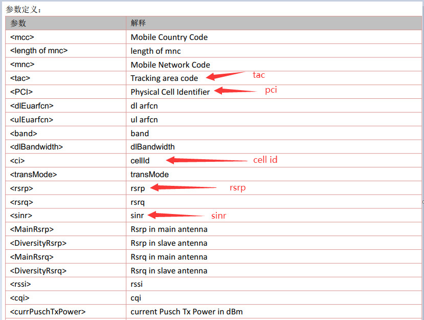
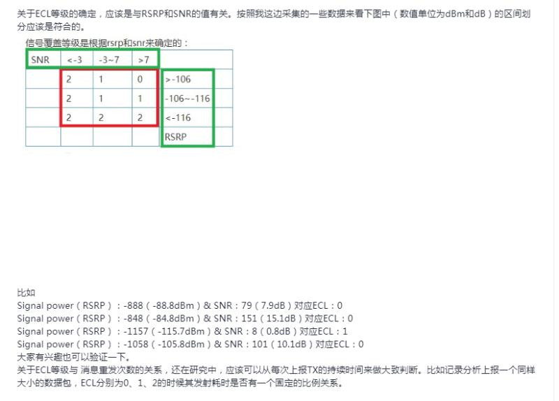

# 网络注册和附着问题

## 1. 无法注册网络、注册网络慢、无法附着网络、附着网络慢

1、参考SIM问题章节检查下是否不识卡。

2、检查下sim卡是否欠费，流量是否用完【4G模块有一种欠费表现：无法注册4G网络，可以注册2G网络】。【其他情况可以咨询卡商】

3、确认天线是否匹配。

4、检查天线是否连接、天线连接座子的接口是否正确、天线是否损坏【换天线确认】。

5、换卡、换板子对比测试，确保使用正常的硬件和sim卡测试。

6、确保模块支持当地的网络制式：各国网络频段汇总。

7、偏远地区的网络覆盖可能不全，或者产品的天线射频指标不合格，想办法用手机对比测试；用手机对比测试时，注意手机要设置为和模块同样的网络制式，同时借助Cellular-Z工具确认，详情参考：如何判主板的4G/2G信号接收性能的好坏。

8、环境因素（车库、地下室、电梯等）。

9、确认下是否所有设备在同一地点表现是否一致，有可能是伪基站造成的。

10、卡是不是专网卡，是否机卡绑定，专网卡需要设置正确的APN，机卡分离停机需要联系卡商，重新绑定。

## 2.PDP需要手动激活吗？

4G网络会自动激活PDP，只有2G网络的时候需要手动激活PDP。

## 3.怎么确认PDP是否激活，及如何获取IP地址？

### AT开发

发送AT+CGDCONT?查询，如图所示的IP地址不为空即为PDP已激活，可以开始做数据业务。其中10.8.112.225为UE的IP地址，此IP为LTE网络中的内网地址。

注：掉网后重新注册网络后AT+CGDCONT?查询的IP地址一般都会变化，也有可能跟上次的IP一样。

### LuatOS开发

移芯618/716/718平台可以使用 socket.localIP() 接口可以获取到ip地址。
展锐8910平台使用 ril.request("AT+CENG=1,1") 接口可以获取到ip地址。

### CSDK开发（移芯平台模块）

可以参考 example_mobile 示例中的 luat_mobile_get_local_ip(0, 1, &ipv4, &ipv6); 接口使用方式获取到ip地址。

618平台模块示例地址：https://gitee.com/openLuat/luatos-soc-2022/tree/master/project/example_mobile

716/718平台模块示例地址：https://gitee.com/openLuat/luatos-soc-2024/tree/master/project/example_mobile

## 4. 怎样获取模块公网IP？

获取不到，模块能获取的是运营商分配的内网IP，这也就决定了模块无法做服务器的原因。
如果一定要知道模块的数据是通过哪个外网IP发出去的，可以用模块连上服务器，跟模块建了链接后从服务器端查看此链接的client的IP。
如：可以借助 https://netlab.luatos.com/ 建一个TCP server，用模块通过tcp跟TCP server建了链接后就能查看外网IP。
image.png

## 5. 同一地点，同一张卡，手机可以注册上4G网络，为什么4G模块不可以

之前有客户遇到过类似问题，均为“测试地点，4G信号太弱”引起的，手机上的天线增益比4G模块大板上的天线增益要高，所以手机正常，4G模块不正常。4G模块更换高增益天线后，也变得正常。

## 6. 同样的设备在一个地方可以上网，在另外一个地方不能上网

按照上面的无法注册的步骤排查，确认一下是卡的问题，当还是地网络的问题。

## 7. 如何设置4G模块网络频段

1、指令：例如：AT+SETLOCK=1,0,8,34,38,39,41
锁定频段是8， 34，38，39，41 ，模块只能注册这5个频段，
注意： SETLOCK指令支持最多同时锁5个频段 ；重启生效，保存到模块的。

2、AT+SETLOCK= 0,0 解除锁定。

3、AT+SETLOCK= 2,0 获取锁定频段。

4、AT*BANDIND? 查询模块当前工作频段。

## 8. 如何判断4G模块注册的是什么网络

发送AT*BANDIND？命令主动查询，返回的查询结果格式为：*BANDIND: <n>[,<band>,<AcT>]；其中<AcT>表示当前注册的网络类型：

  <AcT>为0、1、3时表示2G网络

  <AcT>为2、4、5、6、8时表示3G网络

  <AcT>为7时表示4G网络

  <AcT>为其余值时表示未注册网络

## 9. 网络小区参数

在对接后台时，有些后台会要求终端上传一些小区参数，例如：
cell id：小区ID，
ecl、ce level：无线信号覆盖等级，
pci：物理小区标识，
sinr：信号与干扰加噪声比，
rsrp：参考信号接收功率，
tac：基站跟踪区域码，
strength：信号强度，通过AT+CSQ或者AT+CESQ获取。

一般来说，只有4G小区才具有这些参数信息，我们以4G小区为例，来说明如何获取这些参数，AT手册中有一个+EEMLTESVC的上报，上报的数据中包含了这些参数；有如下两种方式可以触发+EEMLTESVC上报：
通过AT+EEMOPT=1设置为主动查询模式，在需要查询时，发送AT+EEMGINFO?查询，
通过AT+EEMOPT=2,value设置为主动上报模式，根据value设置的上报周期定时上报，
+EEMLTESVC中的参数和我们需要的参数对应关系参考下图：

ecl、ce level：无线信号覆盖等级，没有现成的AT命令可以直接查询，可参考下图自行计算：
