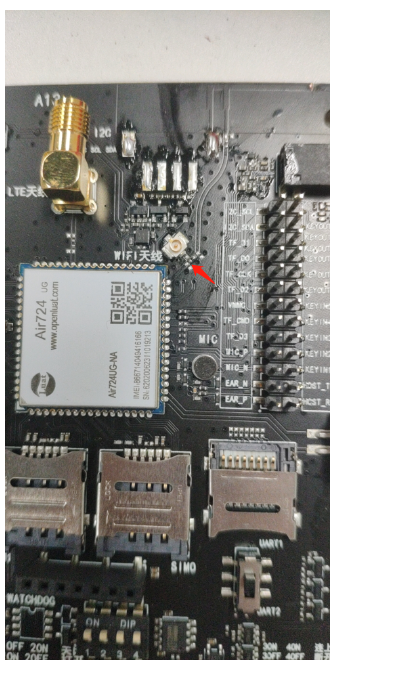

## 1.开发板默认使用的蓝牙/WIFI天线是板载天线，信号可能会不好
>可以将图中标识的0欧姆电阻跨到那个ipex天线座，外接天线。
>

## 2. 没有设置过蓝牙mac地址的模块，mac地址是随机的
>带蓝牙功能的模块出厂都会写一个唯一的蓝牙MAC的。可以用AT+BTMAC？查询验证。
>解决办法，可以自己手动写一个蓝牙MAC。用AT+BTMAC=<address>设置，如AT+BTMAC=B4:04:29:46:CF:2D

## 3. 蓝牙连接方式
>目前模块的蓝牙连接方式为一对一。

## 4. 蓝牙是双模的吗
>模块蓝牙是为双模蓝牙（经典蓝牙+BLE）。

## 5. 蓝牙版本
>蓝牙版本4.2

## 6. 是否支持pin码（配对码）
>目前不支持pin码（配对码），后续可能会支持（时间点不确定）。

## 7. 怎样获取当前的蓝牙连接的信号强度
>无法获取当前的蓝牙连接的信号强度（频率不小于10Hz，模拟测距时使用）。

## 8. 是否支持hid
>经典蓝牙无法支持蓝牙hid。

## 9. BLE蓝牙白名单广播和全局广播的切换
>LuatOS-Air：V3037版本后支持。
>
>AT版本：V301841版本后支持。

## 10. 蓝牙连接、扫描、数传范围
>与天线、应用场景等都有关系，需要自己根据实际应用场景进行测试，如：空旷的地带、室内。

## 11、是否支持SMP
>配对绑定模式（SMP）无法支持。

## 12、使用btcore.getaddr()获取的蓝牙mac地址是随机的
>从V3027到V3035，都有这个问题，3035后会解决这个问题，问题原因是，如果没打开蓝牙，使用接口获取的地址会变。

## 13. BLE蓝牙广播中的 MAC 地址在 IOS设备上是随机值，不保证每台 iOS 设备读出来的 DeviceId 是一样的
>可以通过在蓝牙广播包或响应包内添加本机的真实mac地址来规避。

## 14. 蓝牙名称
>LuatOS-Air开发方式：BEL slave如果使用了btcore.setname()，广播包里会自动添加蓝牙名称的数据，也可以不使用setname，直接在广播包数据里面手动添加蓝牙名称。
>
>AT开发方式：BEL slave如果使用了AT+BLECOMM=NAME，广播包里会自动添加蓝牙名称的数据，也可以不使用AT+BLECOMM=NAME，直接在广播包数据里面手动添加蓝牙名称。

## 15. 蓝牙自定义广播包数据
>BLE蓝牙自定义广播包数据或响应包数据需要遵从蓝牙广播包/响应包数据格式，具体格式请到互联网自行搜索，蓝牙slave的demo中也有示例。

## 16. BLE蓝牙主从模式如何选择？
>根据自己业务需求，以及蓝牙协议、蓝牙功能自行选择，蓝牙主从模式可通过互联网自行搜索。
>主模式与从模式的区别：主机是指能够搜索别人并主动建立连接的一方，从机则不能主动建立连接，只能等别人连接自己。

## 17 .经典蓝牙能否设置可见性
>V3032及以后版本支持，使用btcore.setvisibility()接口来设置，用法请到btcoreAPI章节查看。

## 18. 如果脚本内没有调用蓝牙开启的接口，烧录带蓝牙的底包后直接给模块上电，模块自带的蓝牙也会上电吗？
>不会，只有调用接口打开蓝牙，蓝牙才会上电。

## 19 .air724蓝牙可以设置发射功率吗，要让它信号弱一点
>不可以。

## 20. 请问下，蓝牙最大244个字节，如果超过244字节，是拆分后直接连续调用send，还是说要等第一个244个字节发送结束后才能再次调用send
>是拆分后直接连续调用send。

## 21. 名称设置
>设置名称、广播参数、广播数据等操作需要先打开蓝牙才可以设置

## 22. air724蓝牙，理论速度
>蓝牙4.2传输速度是1Mbps，有效吞量800kbps。

## 23. 是否支持MESH组网
>不支持MESH组网。

## 24. 无法主动断开连接
>经典蓝牙处于连接状态时，无法主动断开连接，
>
>LuatOS-Air开发方式：可以直接调用btcore.close()来关闭蓝牙。
>
>AT开发方式：可以直接调用AT+BTCOMM=0来关闭蓝牙。

## 25. 蓝牙低功耗有什么好办法吗
>不用的时候关掉就行。

## 26. AT蓝牙按照流程配置后，手机上无法找到该设备是什么情况么
>确认模块是否支持蓝牙功能，是否使用支持蓝牙功能的固件。
>是否是老模块，老模块没蓝牙射频的。

## 27. 蓝牙支持的指令集是AT吗，是透传还是带AES加密
>透传 AT命令参考AT命令手册17章（17 蓝牙相关命令）[AT版本固件资料](https://doc.openluat.com/wiki/21?wiki_page_id=2087 "AT版本固件资料")。

## 28. 在同时打开扫描跟广播的时候，只能打开一个，不能同时打开
>不支持主从一体。

## 29.请问Air820支持蓝牙SPP主机吗
>不支持SPP。

## 30. 724UG-NFM的模块中带 4G+蓝牙的，请问蓝牙有没有定频软件
>没有。

## 31. 724的音频  比如TTS通过蓝牙  播放给别的蓝牙音箱
>不行 ， 我们724 经典蓝牙，只能做从机 。

## 32.在IOS BLE开发中搜索到的设备名称和设备实际名称不相符的问题
>实际名称通过btcore.setname()设置。 
>原因是，在iPhone中，被连接过的BLE设备名称都会被缓存。如果你在连接过一次某设备后，更改了该设备的名字。那么在你的iphone BLE cache数据清除之前，你无论多少次搜索这个设备，都会是旧的名字。 
>解决办法：
>1、清除你iphone的BLE cache。
>2、另一个更简单的办法是，通过任何一款BLE测试软件连接该设备。或者通过设备的旧名称来连接一次设备。当设备被你再次连接过后，本地cache中该设备的BLE名字会更新。之后你搜到该设备就会显示它的新名字了。
>3、用一个从来没连过的手机，没有过缓存的，直接扫描 。
>4、换个没被这个手机连接过的板子也可以 。
