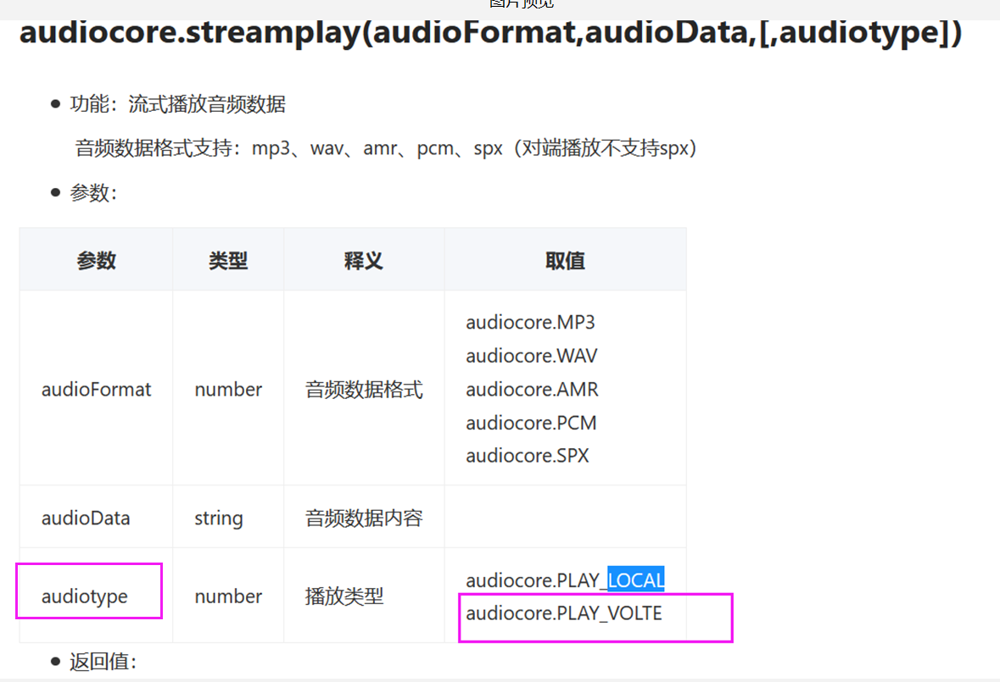
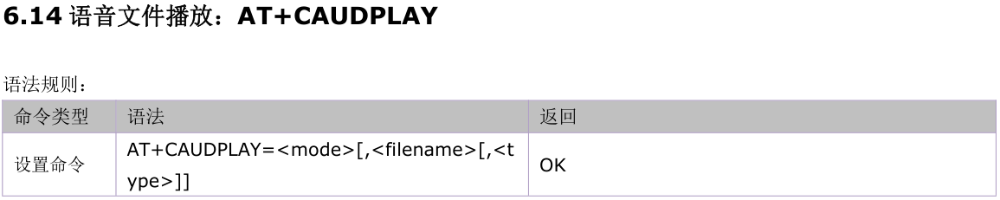
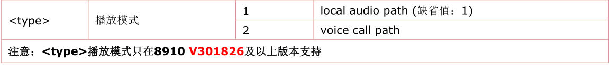
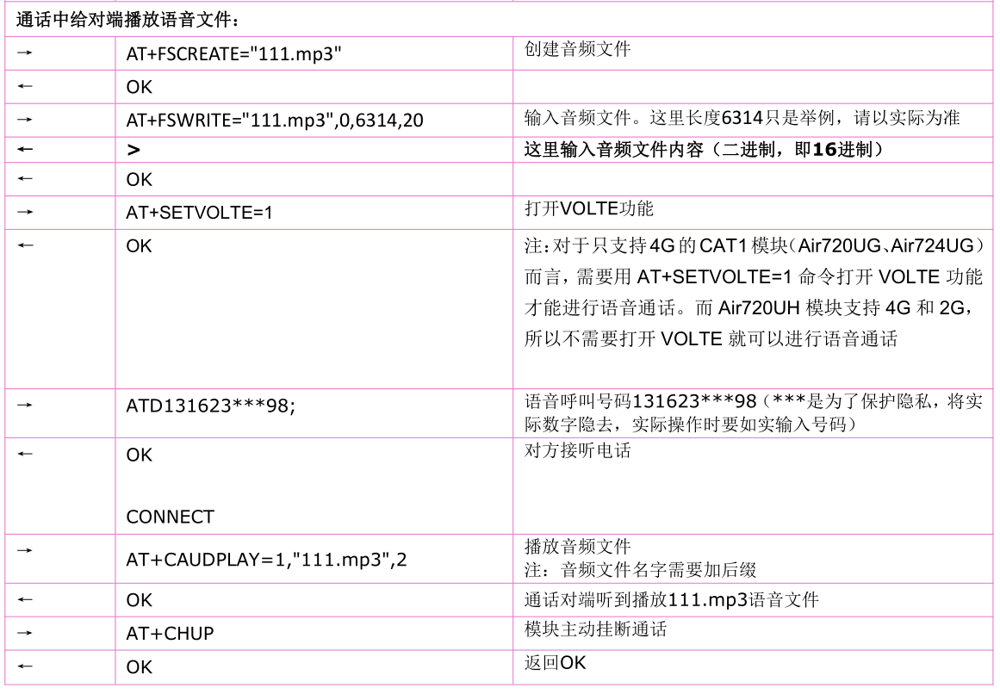

## 1. 打不了电话
>1、对于只支持 4G 的 CAT1模块（Air720UG、Air724UG、Air780EPV）而言，需要用支持VOLTE 功能的固件且卡开通了VOLTE功能才能进行语音通话。而 Air720UH 模块支持 4G 和 2G，而 2G 支持语音通话，所以不需要支持VOLTE 就可以进行语音通话。但不支持电信2G。
>2、确认能不能正常注册上网络，有没有欠费。（Air720UG、Air724UG、Air780EPV）模块确认卡是否开通VOLTE 功能， 只有开通 VOLTE 功能才能进行语音通话。固件是否支持VOLTE功能，只有支持VOLTE 功能的版本才能进行语音通话。

## 2. Air724模块天线厂调试天线时，如何提供来电自动接听的软件
>LuatOS-Air版本：ril.regUrc(“RING”,function()ril.request(“ATA”) end)。
>
>AT版本：开机后发送ATS0=1命令到模块，接收到来电，振铃1声后会自动接听。

## 3. Air724模块设置mic增益
>LuatOS-Air版本：audio.setMicGain()通话中设置mic增益，必须在通话建立以后设置。
>
>AT版本：AT+CACCP通话中设置mic增益，必须在通话建立以后设置。

## 4. 紧急号码拨号问题：
>1、常用紧急号码：报警求助 110 ，火警119 ，医疗救护 120 ，交通事故 122。 
>2、拨号流程： 移动卡注册时拨打110号码时是走的正常号码呼叫，VOLTE正常能正常接通；电信卡注册时网络是提供了一个紧急号码列表给终端，110在其列表里面，所以拨打110时终端走的是紧急呼叫，网络又实际不支持，所以会CSFB TO 2G尝试，所以打不通。而加上区号走的是正常号码呼叫流程，在LTE下可以呼叫成功。 
>3、具体实测数据如下：
>724开发板测试4G情况，720UH开发板测试2G情况，110，119，120，122情况应该一样，这里没有全部拨打，下面列举的是实际测试过的情况。

| 卡     | 网络 | 紧急号码是否加区号 | 是否可以成功呼叫紧急号码                        | 成功或失败的原因                                 |
| ------ | ---- | ------------------ | ----------------------------------------------- | ------------------------------------------------ |
| 不插卡 | 2G   | 加区号             | 112打不通，110，119，120，122打不通             | 只能拨打紧急号码                                 |
| 不插卡 | 2G   | 不加区号           | 112打通语音提示，110，119，120，122打通语音提示 | 属于紧急号码可以打通                             |
| 不插卡 | 4G   | 加区号             | 112打不通，110，119，120，122打不通             | 4G网络不支持紧急拨号                             |
| 不插卡 | 4G   | 不加区号           | 112打不通，110，119，120，122打不通             | 4G网络不支持紧急拨号                             |
| 移动卡 | 2G   | 加区号             | 112提示号码不存在，110可以正常打通              | 112加区号当不存在号码处理，110当普通号码处理     |
| 移动卡 | 2G   | 不加区号           | 112打通语音提示，110可以正常打通                | 属于紧急号码可以打通                             |
| 移动卡 | 4G   | 加区号             | 112打不通，110可以正常打通                      | 112加区号当不存在号码处理，110当普通号码处理     |
| 移动卡 | 4G   | 不加区号           | 112打不通，110，119，120可以正常打通            | 112当不存在号码处理，110，119，120当普通号码处理 |
| 联通卡 | 2G   | 加区号             | 112提示号码不存在，110可以正常打通              | 112加区号当不存在号码处理，110当普通号码处理     |
| 联通卡 | 2G   | 不加区号           | 112打通语音提示，110可以正常打通                | 属于紧急号码可以打通                             |
| 联通卡 | 4G   | 加区号             | 112打不通，110可以正常打通                      | 112加区号当不存在号码处理，110当普通号码处理     |
| 联通卡 | 4G   | 不加区号           | 112打不通，110可以正常打通                      | 112当不存在号码处理，110当普通号码处理           |
| 电信卡 | 2G   | 加区号             | 112打不通，110打不通                            | 不支持电信2G                                     |
| 电信卡 | 2G   | 不加区号           | 112打不通，110打不通                            | 不支持电信2G                                     |
| 电信卡 | 4G   | 加区号             | 112提示号码不存在，110可以正常打通              | 112加区号当不存在号码处理，110当普通号码处理     |
| 电信卡 | 4G   | 不加区号           | 112打不通，110打不通                            | 当紧急号码处理，4G网络不支持紧急拨号             |

## 5. Air724模块通话过程中给对端播放音频文件
>LuatOS-Air开发方式
>
>
>
>AT开发方式
>
>
>
>
>
>

## 6. CAT1是否支持视频通话？
>不支持。

## 7. 移动、电信，联通卡的通话功能支持情况列表
>固件是否支持VOLTE请查阅固件版本里的readme.txt文件中的固件功能说明。

| 模块  | 卡     | 固件是否支持VOLTE | 是否支持通话功能      |
| ----- | ------ | ----------------- | --------------------- |
| 720UH | 移动卡 | 是                | 是                    |
| 720UH | 移动卡 | 否                | 是                    |
| 720UH | 联通卡 | 是                | 是                    |
| 720UH | 联通卡 | 否                | 是                    |
| 720UH | 电信卡 | 是                | 是，卡要开通VOLTE功能 |
| 720UH | 电信卡 | 否                | 否                    |
| 724UG | 移动卡 | 是                | 是,卡要开通VOLTE功能  |
| 724UG | 移动卡 | 否                | 否                    |
| 724UG | 联通卡 | 是                | 是,卡要开通VOLTE功能  |
| 724UG | 联通卡 | 否                | 否                    |
| 724UG | 电信卡 | 是                | 是,卡要开通VOLTE功能  |
| 724UG | 电信卡 | 否                | 否                    |

## 8. Air724模块是否有电话呼入白名单设置？
>不支持，脚本处理，设置一个白名单列表，不在白名单的来电直接挂掉就可以。

## 9. Air724模块连接耳机的时候，通电话过程中，耳机没有声音
>默认是喇叭输出，可以通过audio.setChannel(1)设置耳机输出。
>详细接口说明：[音频播放](https://doc.openluat.com/wiki/21?wiki_page_id=2327 "音频播放")

## 10.  Air724模块是否支持视频通话
>暂不支持视频通话，且因为只有30W像素，效果较差。

## 11.  Air724模块支持dtmf解码功能么，模组在电话通话中，能识别对方电话按键吗？
>不能，暂不支持。

## 12. 可以读到SIM卡的手机号码（MSISDN）吗？
>目前有两种方式可以获取本机号码：
>一. sim卡出厂时，可以写入自己的手机号码到sim卡中，但这不是强制要求的。在中  国，运营商制卡时基本上都不会写入手机号码。如果可以确认自己用的sim卡中已经存储了手机号码，可以通过如下方式读取手机号码：
>LuatOS-Air开发方式：开机后调用sim.setQueryNumber(true)打开查询本机号码功能，会自动查询本机号码；可通过sim.getNumber()获取查询结果。 AT开发方式：发送AT+CNUM命令查询。
>
>二. 模块开机后，sim卡向短信平台发送一条短信（短信内容中可以包含imei或者imsi），短信平台收到短信后，识别手机号码后，可通过如下方式通知模块手机号码：
>
>   1) 短信平台下发一条短信给模块，短信内容中包含手机号码，模块收到后解析出号码。
  2) 模块连接一个后台服务器，后台服务器与短信平台相连，根据imei或者imsi读取到对应的手机号码，然后把这个号码，下发给imei或者imsi对应的模块。

## 13.  Air720 UH模块，不能通话
>1、720UH模块仅支持2G和4G网络。
>2、可以使用2G网络通话，但是现在全国各地的2G联通网络已经基本退网了。
>3、可以使用3G网络通话，但是我们的720UH模块不支持3G网络，所以在我们的模块上不能通话。
>4、可以使用4G网络VoLTE通话，前提是这张卡需要开通VoLTE功能，这样才能在我们的720UH模块上使用4G网络通话。
>5、客户想用2G通话，结果不行，因为联通2G已经退网，后来用4G也不能通话，因为他们这张卡未开通VoLTE功能。

## 14. 4G模块打电话然后手机里面会听到回音
>确认是不是喇叭的声音串到Mic声音里了，可以用耳机测试一下，看是否能听到回音。

## 15.  Air724模块参考DEMO播放来电铃音，用file播放 ， 文件是直接放在SD里，播放失败
>确认是否有挂载SD卡 。
