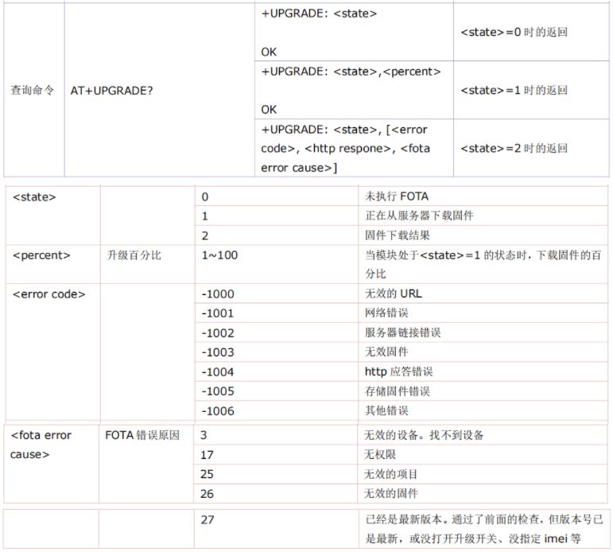
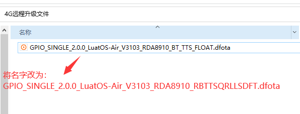
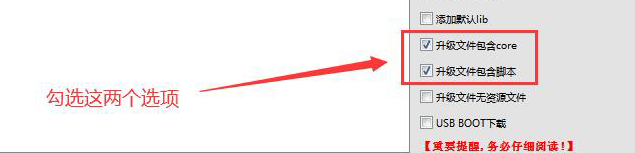

## 1. 差分包下载完成之后，对差分包会不会有校验？
>差分包下载完成之后，下次重启过程中，会对差分包进行校验；
>如果校验通过，则自编程应用新版本，之后自动删除差分包；
>如果校验失败，则自动删除差分包；
>所以说，差分包下载过程中，如果异常断电或者异常重启，并不会出现程序丢失或者变砖的问题。

## 2. 远程升级完需要多长时间？
>升级时间根据差分包的大小不同，升级时间会不同。跨越的版本越大，差分包越大，升级所需的时间越长。（8910平台）实测，升级一个600k左右的差分包，3分钟内能升级完成。

## 3.错误码
>如果升级失败，可以通过AT+UPGRADE?查看错误原因。
>

## 4. 升级服务已经配置了全项目升级，为啥还是有些设备报不在升级列表
>确认前面是否有低版本配置了IMEI号。
>指定了固件的，优先对应指定过的固件。没指定才去找最新的。所以如果配置全项目升级，只要IMEI 在项目内，不要添加到具体的固件里面。

## 5. 请问差分工具有离线版本吗？
>没有。

## 6.远程升级时，自己创建的文件会被删除吗？
>不会，会保留。

## 7. 检测到循环升级（已禁止升级，请到设备列表解除）
>一小时内连续向服务器请求6次后，服务器会禁止设备远程升级。

## 8. 开机后fota升级，底层会检测电量吗？
>不会。

## 10. 可以远程降级吗？
>合宙iot平台，不支持远程降级操作

## 11. Air724模块空中升级能跨基线升级吗？
>不可以，1.2基线升级1.3基线会升级失败。

## 12. 使用update函数更新的时候，出现这个错误是什么原因（-96）
>当返回值为-96时，可能是由于多种原因造成的。但是返回-96时就是固件校验错误。
>具体原因查看下表：

| 响应码 |   响应信息   |                       问题以及解决办法                       |                   云平台日志结果                   |
| :----: | :----------: | :----------------------------------------------------------: | :------------------------------------------------: |
|   3    |  无效的设备  |                 检查请求键名(imei小写)正确性                 |                         无                         |
|   17   |    无权限    | 设备会上报imei、固件名、项目key。 服务器会以此查出设备、固件、项目三 条记录， 如果 这三者不在同一个用户名下，就会认为无权限。 设备不在项目key对应的账户下， 可寻找合宙技术支持查询该设备在哪个账户下， 核实情况后可修改设备归属 |                       无权限                       |
|   21   |      21      |                    不允许8910从1.2升到1.3                    |                         21                         |
|   25   |  无效的项目  | productkey不一致，检查是否存在拼写错误， 检查模块是否在本人账户下，若不在本人账户下，请联系合宙工作人员处理 |                     未找到项目                     |
|   26   |  无效的固件  | 固件名称错误，项目中没有对应的固件。用户自己修改了固件名称，可对照升级日志中设备当前固件名与升级配置中固件名是否相同（固件名称，固件功能要完全一致，只是版本号不同）。 |                     找不到固件                     |
|   27   | 已是最新版本 | 1、设备固件版本高于云平台 2、固件版本设备脚本版本高于云平台版本 3、用户项目升级配置中未添加该设备 4、云平台升级配置中，是否升级配置为否 |    已是最新版本 设备不在配置的升级设备列表中    |
|   40   |   循环升级   | [云平台](https://iot.openluat.com/)进入设备列表搜索被禁止的imei，解除禁止升级就好了。 云平台防止模块在升级失败后，反复请求升级导致流量耗尽， 在模块一天请求升级六次后会禁止模块升级。可在平台解除。 | 检测到循环升级 (已禁止升级，请到设备列表解除) |
|   43   |    请等待    | 云平台生成差分升级包需要等待， 一到三分钟后云平台生成完成差分包便可以请求成功。 |                正在生成版本，请等待                |
|   44   | 基础版本缺失 | 平台未收录设备固件（多为定制固件， 可寻找合宙技术支持人员添加，需提供定制固件邮件） |                  基础CORE版本缺失                  |

## 13. 关于V30XX_RDA8910_RBTTSQRLLSDFT 更名为 V31XX_RDA8910_BT_TTS_FLOAT
>一、更名原因
>1.版本命名不规范和定制固件命名方式重合。
>2.升级到LVGL7.11 导致模块flash空间不足。 
>二、版本区别
>V31XX_RDA8910_BT_TTS_FLOAT 不支持LVGL 功能。
>V30XX_RDA8910_RBTTSQRLLSDFT 版本支持LVGL ,其他功能完全一样。 
>三、更名影响
>如果之前使用V30XX_RDA8910_RBTTSQRLLSDFT且没用LVGL的话，可以直接升级到。V31XX_RDA8910_BT_TTS_FLOAT ，功能上完全兼容。 
>四、远程升级注意事项
>从V30XX_RDA8910_RBTTSQRLLSDFT 升级到V31XX_RDA8910_BT_TTS_FLOAT 需要将生成的升级包中的【V31XX_RDA8910_BT_TTS_FLOAT.dfota.bin】 改为 【V31XX_RDA8910_RBTTSQRLLSDFT.dfota.bin】再进入 IOT 系统升级
>如图：
>

## 14. Air724远程升级对NVM，文件系统的影响
>一、远程升级时，会清除原有的para.lua吗？
>默认不会，如果需要清除，根据产品的业务逻辑，在合适的时间点，调用nvm.restore()恢复出厂设置即可。 
>二、远程升级时，可以在config.lua中增加新的参数吗？
>可以，需要执行一次初始化动作才会生效，一般是直接重启执行初始化。 
>三、远程升级时，可以在config.lua中删除旧的参数吗？
>可以，但是操作起来比较复杂，不建议这样做。
>如果旧的参数没用了，可以在config.lua中一直保留；脚本代码不要再读写这些参数就行了。
>NVM详细说明见：[NVM（参数存储）](https://doc.openluat.com/wiki/27?wiki_page_id=3135 "NVM（参数存储）")。 
>四、远程升级时，自己创建的文件会被删除吗？
>不会，会保留。

## 14. Air724模块手动生成差分包失败
>
>
>
>确保上传文件正确，升级版本和基础版本CORE支持的功能需要相同，选择.bin后缀的升级文件。
