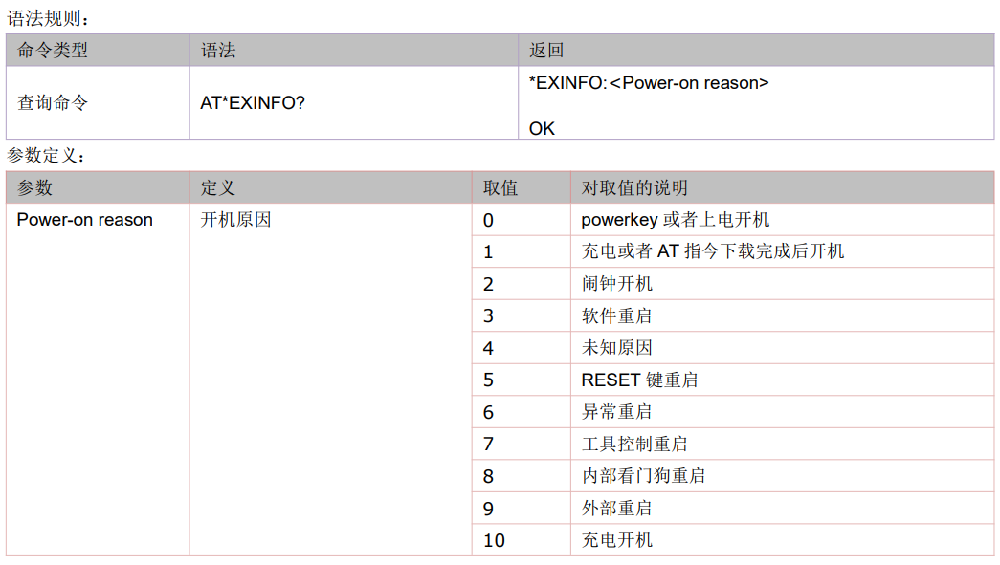
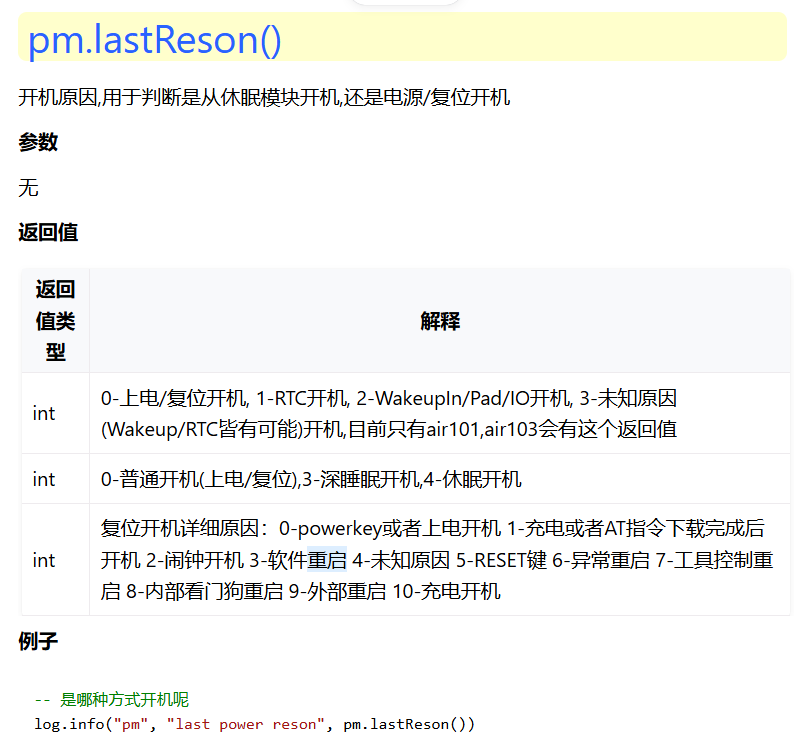

## 模块重启原因
>1、vbat引脚电压3.4V-4.3V之间，使用示波器测量vbat电压是否有跌落；模块峰值需要8910平台2A电流，EC618平台1.5A电流，断开模块与外部的连接，使用直流稳压电源直接对vbat供电对比测试。
## 无法开机或者模块反复重启原因
>1、（8910平台）V1.3固件出货的模块不能降级到V1.2的版本，V1.2版本不支持V1.3版本的校准参数，故V1.3的版本不能降级到V1.2的版本,否则会开不了机。 
>
>2、本地烧录未加密脚本，空中升级密钥加密脚本，会造成模块变砖。日志现象为串口反复断开。

## 开机原因查询指令
>1、可以通过发送AT*EXINFO?指令查询开机原因值。
>

## LuatOS-Air二次开发模式724模块重启原因
>1、如果是LuatOS-Air二次开发模式，使用官方发布的AT固件或者LuatOS-Air固件+随便一个demo，测试确认下，是不是自己写的软件有问题。 
>2、vbat引脚电压3.4V-4.3V之间，使用示波器测量vbat电压是否有跌落；模块峰值需要2A电流，断开模块与外部的连接，使用直流稳压电源直接对vbat供电对比测试。 
>3、LuatOS-Air版本，如果无法抓到日志，直接联系合宙技术支持人员处理；如果可以抓到日志，搜索poweron reason：
>1】reason为0，表示硬件重启，此时应该重点排查供电问题。如果存在瞬间电压跌落，可能会导致模块出现异常。
>2】reason为3，通常有两种情况：代码主动执行rtos.restart()或者sys.restart()实现软重启；代码运行出错（语法错误，内存不足、AT执行超时等多种可能性），底层自动重启。
>3】reason为6，只有这一种情况：底层出错，请上报bug。
>4】reason为8，通常是这种情况：Lua代码跑飞，底层亦无响应时，由外部看门狗芯片重启模块。
>5】一般不会出现poweron reason为255，如出现，请联系FAE。

## LuatOS二次开发模式780E模块重启原因

1、如果是LuatOS二次开发模式，使用官方发布的AT固件或者LuatOS固件+随便一个demo，测试确认下，是不是自己写的软件有问题。 
2、vbat引脚电压3.4V-4.3V之间，使用示波器测量vbat电压是否有跌落；模块峰值需要1.5A电流，断开模块与外部的连接，使用直流稳压电源直接对vbat供电对比测试。 
3、如果可以抓到日志，可以通过pm.lastReson()获取开机原因，用于判断是从休眠模块开机,还是电源/复位开机：

