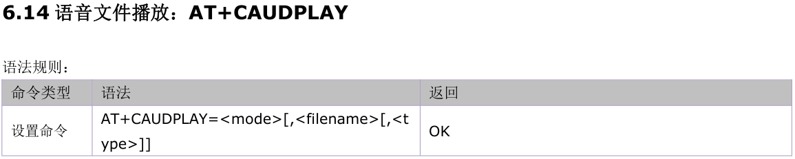
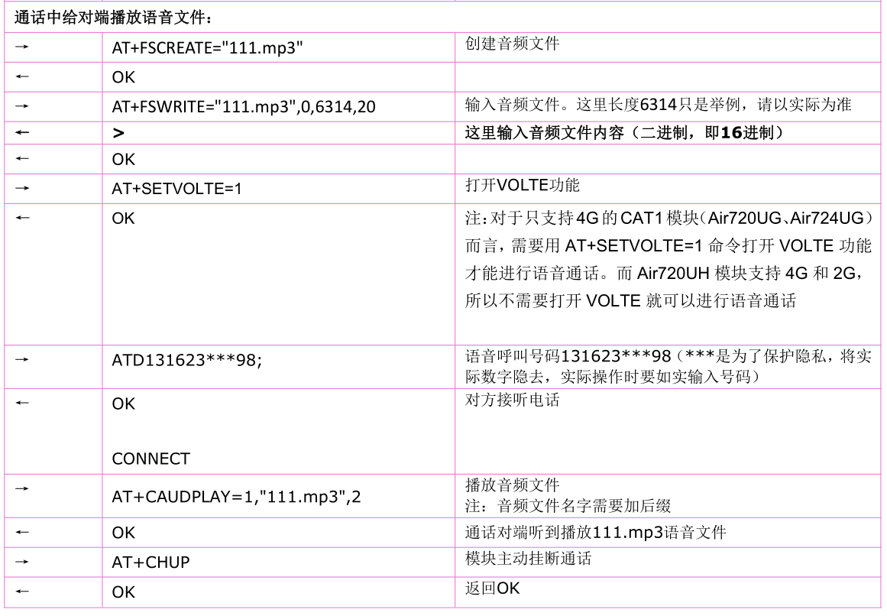

## 1. Air724模块播放提示priority error”
>原因是优先级高的音频还没有播放完。
>分析方法：在audio.lua开源库里看日志打印的地方。
>解决办法：可根据应用需要提高优先级。

## 2. Air724模块有些MP3用demo流播放失败
>原因：有些MP3包含很多歌曲说明，文件头比较大。如果第一个放入 audiocore.streamplay的数据不包含完整的头，就会播放失败。
>解决办法：
>修改 testAudioStream.lua
>local data = fileHandle:read(streamType == audiocore.SPX and 1200 or 1024)
>改为
>local data = fileHandle:read(streamType == audiocore.SPX and 1200 or 2048) 
>修改testHttpPlayMp3.lua
>if #tBuffer==1 then sys.publish("DATA_STREAM_IND") end
>改为
>if 2048 <=remainDataLen then sys.publish("DATA_STREAM_IND") end

## 3.TTS支持英文单词朗读吗？
不支持英文单词朗读，仅支持单字母朗读，例如bye，不会读成“白”，会读成“比、外、一”
## 4.TTS的数字朗读问题
>数字朗读时，根据特殊标记，可作为数值连续，也可以作为号码连读。默认是自动识别；
>例如"10086",默认状态下，根据语义，可能读成“幺零零八六”，也可能读成“一万零八十六”。
>如果主动配置为号码来读，加[n1]标记，变成"[n1]10086"，会读成“幺零零八六”
>如果主动配置为数值来读，加[n2]标记，变成"[n2]10086"，会读成“一万零八十六”
> 
>更多文本标记参考：[Aisound5.pdf](https://cdn.openluat-luatcommunity.openluat.com/attachment/20201113135045712_Aisound5.pdf)
## 5.Air724模块音频文件支持哪些格式？
>audiocore.play(audioFilePath)
>功能：播放音频文件
>音频文件格式支持：mp3、wav、amr、pcm; 
>audiocore.playdata(audioData,audioFormat[,audioLoop])
>功能：播放音频数据
> 音频数据格式支持：mp3、wav、amr、pcm、spx; 
>audiocore.streamplay(audioFormat,audioData)
>功能：流式播放音频数据
> 音频数据格式支持：mp3、wav、amr、pcm、spx; 
>
>AT开发方式：目前支持mp3，amr，pcm，wav，spx。

## 6.Air724模块模块音频最高码率支持多大
>通话中发送声音到对端,必须是12.2K AMR格式 ，播放mp3音乐为128kbps。

## 7.Air724模块支持通话过程中给对端播放音频文件吗？
>支持。
>

## 8. Air724模块AT版本在进行TTS播报时，手动中止后，继续发送下一条TTS，出现报错。
>TTS不管自动播放还是手动中止都会有个URC上报（+CTTS:0）,只有在收到该URC上报后再发送下一条TTS才不会报错。
## 9. Air724模块AT版本模块TTS功能最长能支持播放多长的文本
>支持2047字节的播放内容。使用AirM2M_720U_V301836_LTE_AT.pac 测试可以播放1023个汉字（里面有标点符号是没有播放的），播放时长四分钟。
## 10.Air724模块AT版本支持通话过程中给对端播放音频文件吗？

>支持。
>
>
>

## 11.Air724模块AT版本能支持通话中录音吗？
>支持，在语音通话进行时本命令仅能实现 voice call 录音。参考AT+CAUDREC指令。
