# FlashToolCLI工具下载

**下载链接：**[FlashToolCLI](https://cdn.openluat-luatcommunity.openluat.com/attachment/20240516175413469_FlashToolCLI_V4.1.11p01_240401.zip)

# FlashToolCLI工具安装

1. 下载后得到一压缩包，解压后找到一个文件名为**FlashToolCLI.exe**的运行程序。

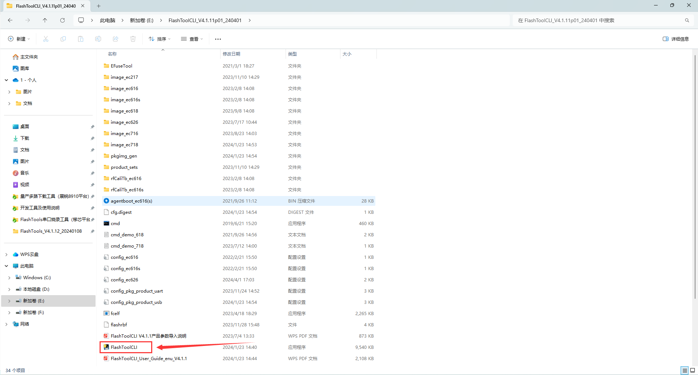

2. 使用**cmd**打开**FlashToolCLI.exe**文件，根据下方步骤进行烧录测试。

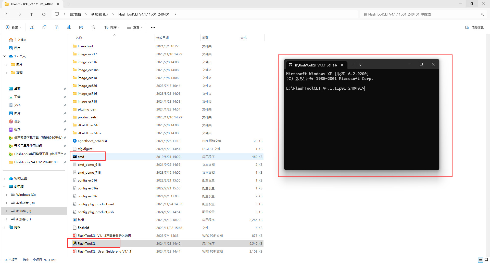

3. 同目录下的**“FlashToolCLI V4.1.1产品参数导入说明”**为使用手册。

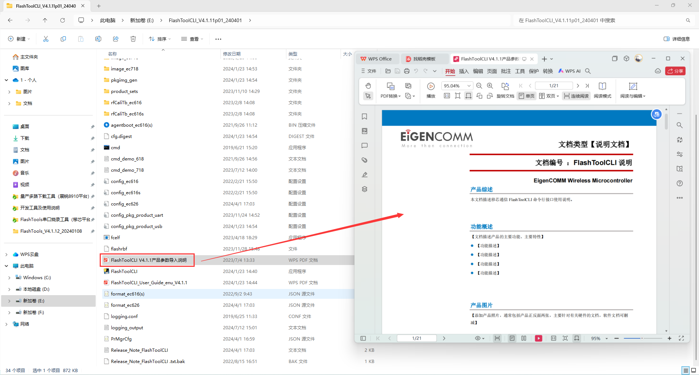

# UART烧录方式

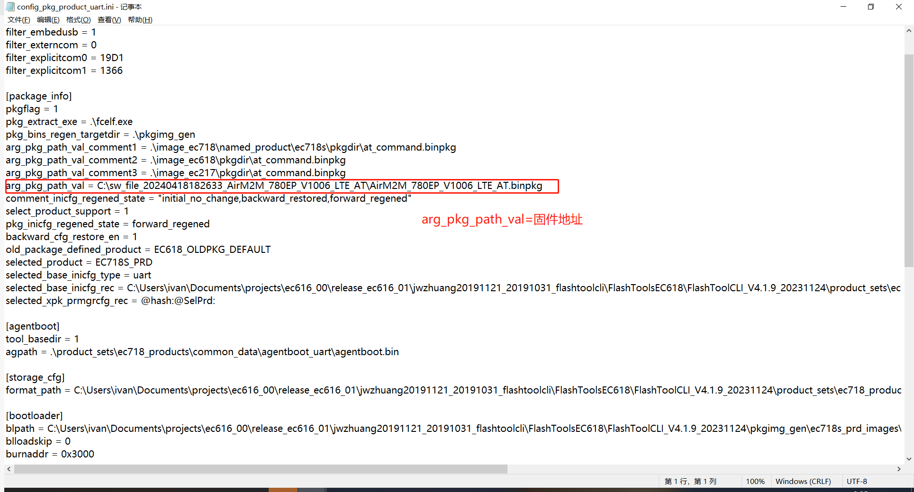

**更改.ini文件后找到cmd_demo_718.txt文件根据指令步骤去测试**

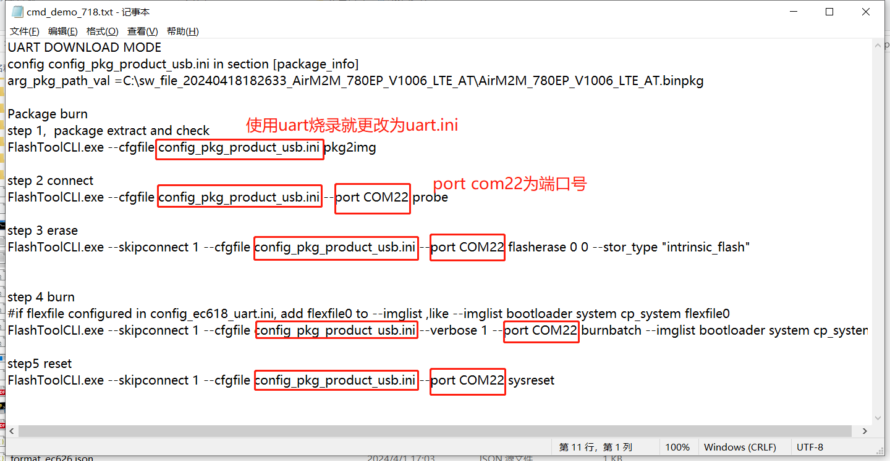

**step 1：**配置.ini文件
**step 2：**配置端口（uart选择端口为模块main_uart）
**step 3：**擦除
**step 4：**烧录固件
**step 5：**重启退出烧录模式

# USB烧录方式

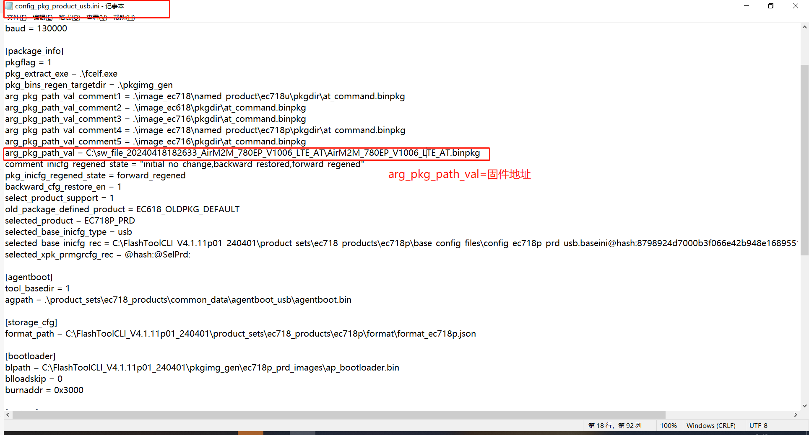

**更改.ini文件后找到cmd_demo_718.txt文件根据指令步骤去测试**

**step 1：**配置.ini文件
**step 2：**配置端口（usb烧录选用的端口是模块boot脚上拉到vdd_ext上电开机进入boot下载模式的设备端口）
**step 3：**擦除
**step 4：**烧录固件
**step 5：**重启退出烧录模式

# lua开发固件打包

通过**Luatools_v2**软件配置好底层core固件跟脚本，点击生成量产文件即可。

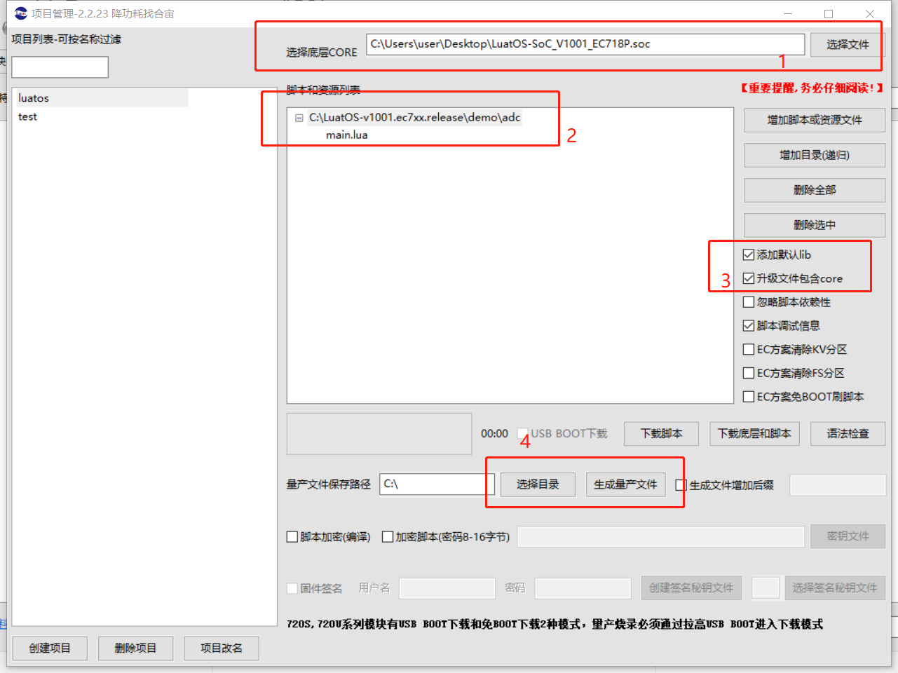

生成的量产文件中**.soc**和**.binpkg**文件都可以当作烧录文件。

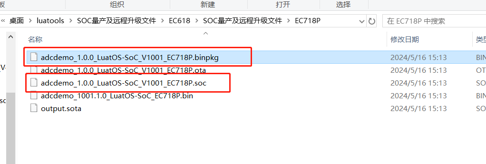

# 配置成功示例

**step 1：**配置.ini文件

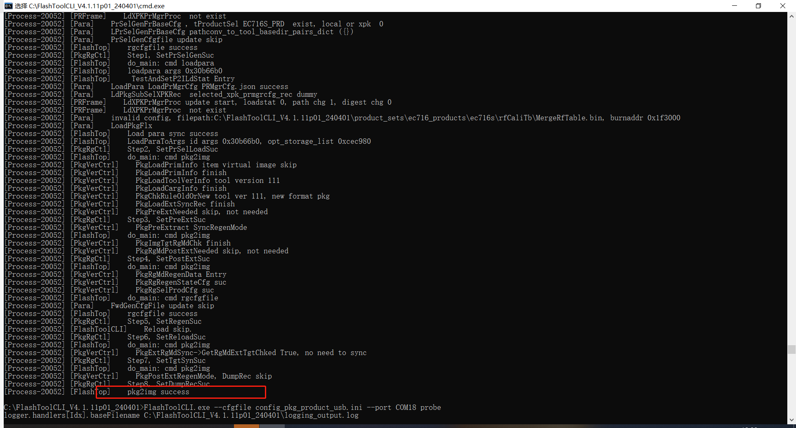

**step 2：**配置端口

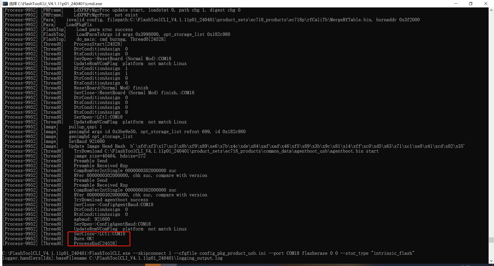

**step 3：**擦除

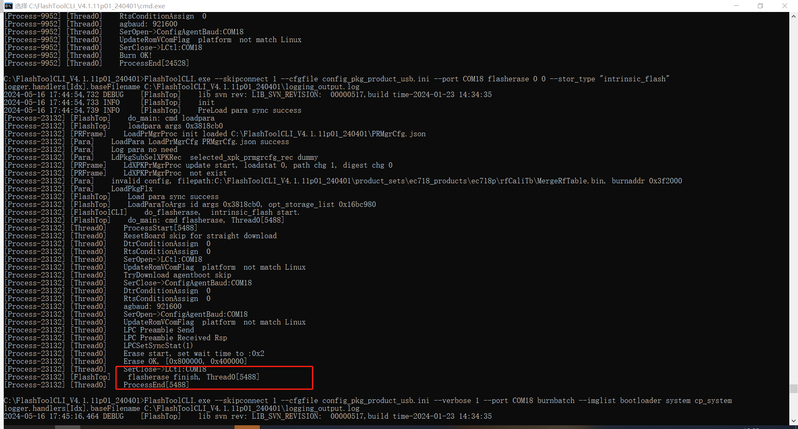

**step 4：**烧录固件

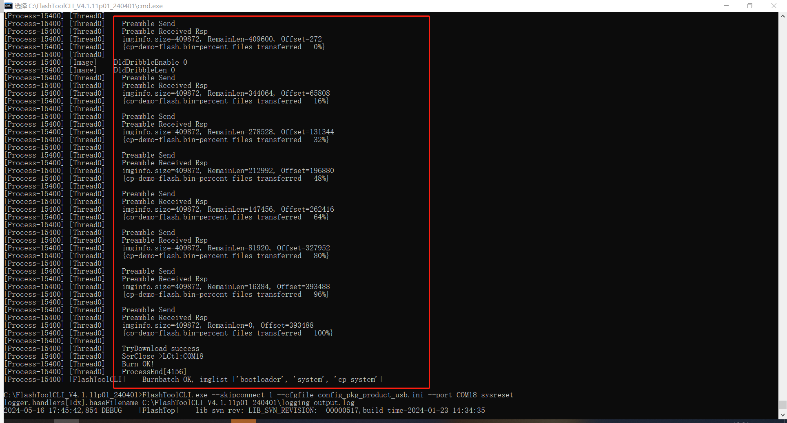

**step 5：**重启退出烧录模式

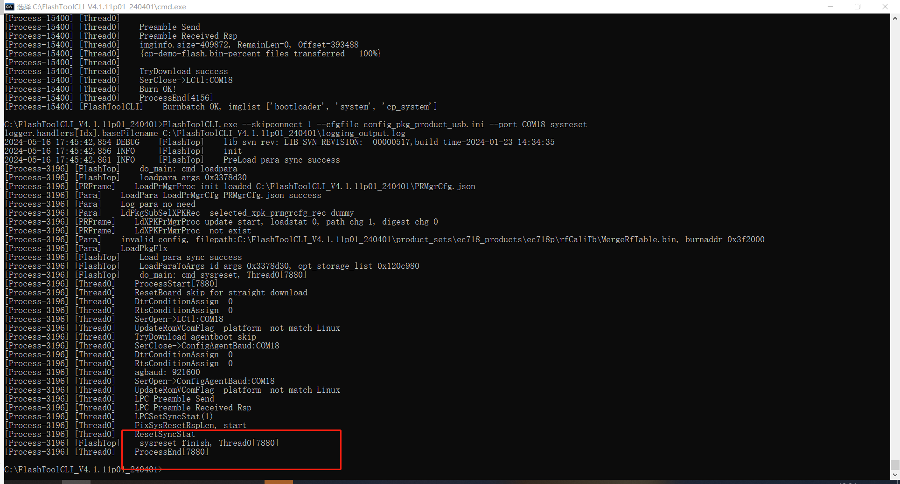