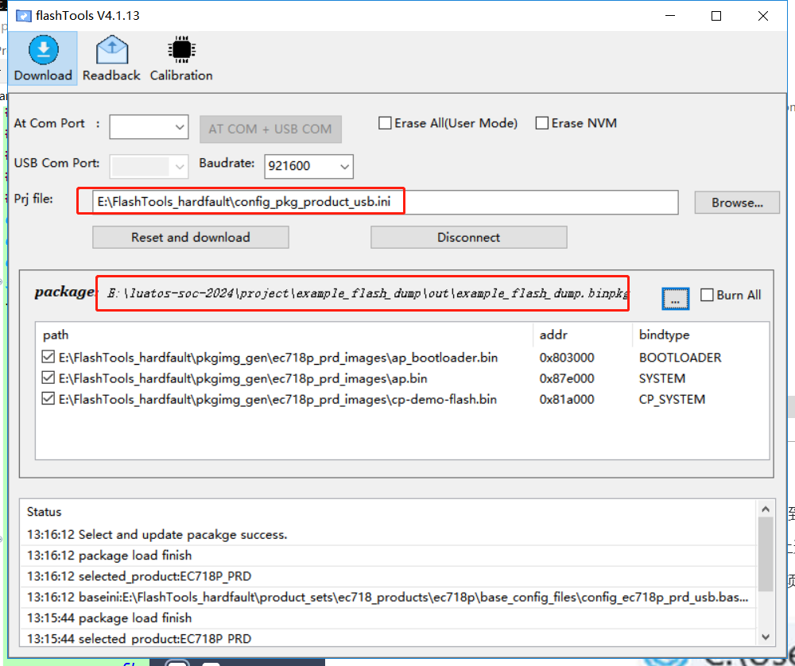
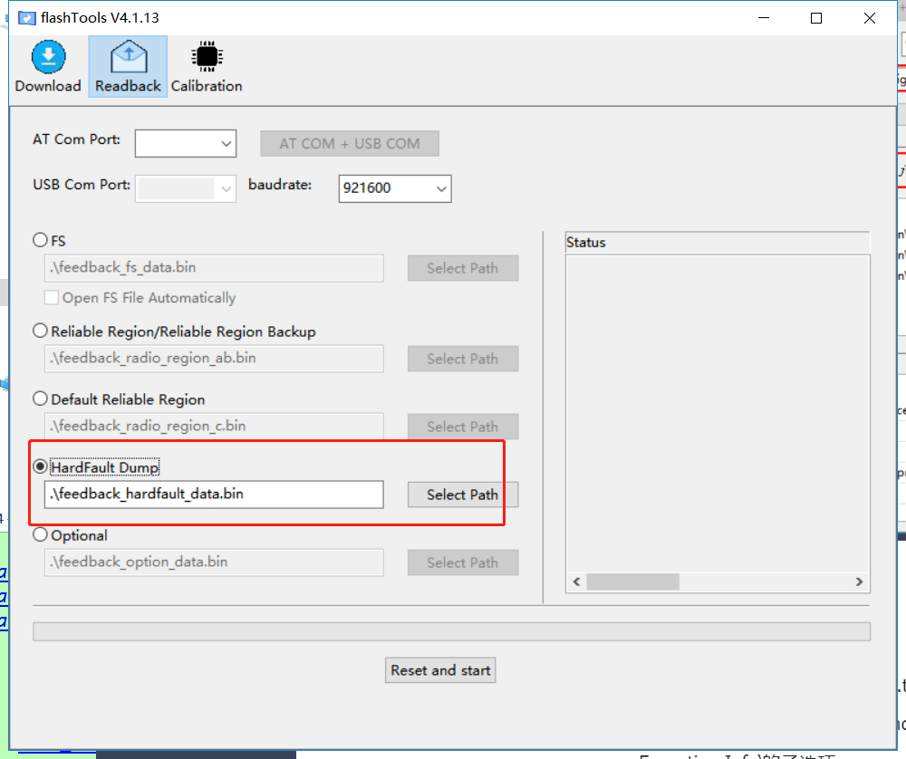
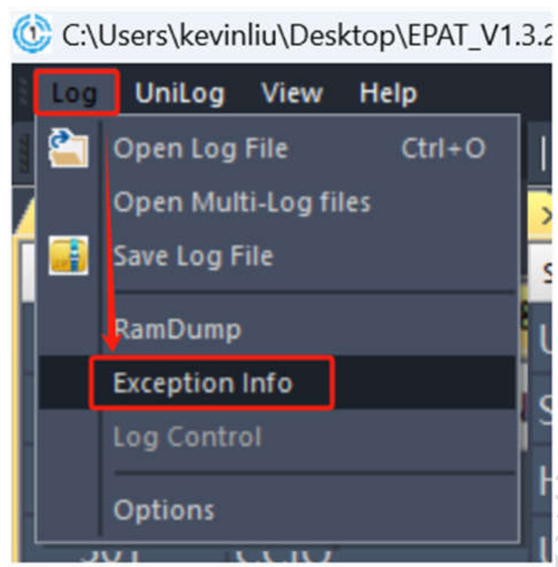
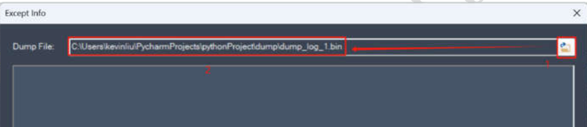
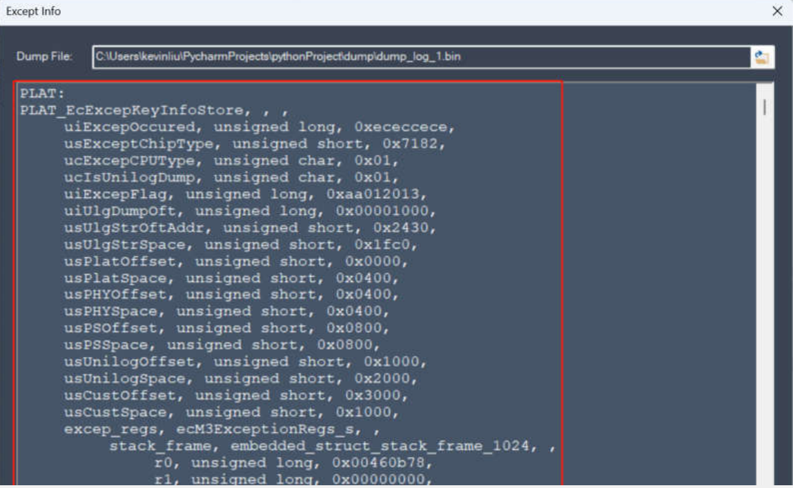

## 背景
EC7XX系列芯片，Flash 空间十分紧张，无法像 618 一样在异常处理时将所有 RAM 信息 dump 到Flash中保存以便后续分析，所以要求 dump 一些关键性信息到 flash 中，这样在无法抓log的场景下，用户可以将这些信息发送到电脑上后进行分析，以尽可能的分析死机问题。
718S软件上不支持，无法使用

## 准备
csdk需要更新到2024年7月9日之后的版本
luatools更新到2.2.29，目前未发布，不影响使用，只是无法自动获取flashdump
flashtools更新到专用版本 [FlashTools_hardfault.7z](https://cdn.openluat-luatcommunity.openluat.com/attachment/20240712101330084_FlashTools_hardfault.7z)
EPAT工具更新到EPAT_V1.3.262.573 [EPAT_V1.3.262.573.zip](https://cdn.openluat-luatcommunity.openluat.com/attachment/20240204134335482_EPAT_V1.3.262.573.zip)

## 如何开启

### csdk开发
注：是luatos-soc-2024仓库
task里加入luat_debug_set_fault_mode(LUAT_DEBUG_FAULT_SAVE_RESET);

### LuatOS开发
luatos脚本加入mcu.hardfault(3)

## 如何确认保存了死机信息
ecFlashDumpOccuredCheck()，此接口返回值为 ture，则说明芯片因异常而重启
在 dump 数据从 Flash 中读出来后，建议擦除一下 Flash dump 空间

## 死机后如何获取数据

### 方法一：
代码里从flash中读出16KB数据，然后通过串口/USB/网络等方式上传，串口/USB方式参考example_flash_dump

### 方法二：
luatools升级到2.2.29，可以自动读出并保存成文件，但是USB要能正常使用

### 方法三：
通过flashtools读取，USB或者UART1留出即可，以USB为例

选择好prj file和binpkg文件

在readback界面里选择hardfault dump

操作模块进入烧录模式，点击start即可，文件保存在binpkg所在目录

## 数据如何解析
项目编译生成目录里找到comdb.txt，如果对方提供了soc文件，解压出comdb.txt
EPAT里确保db文件是上述的comdb.txt，在主选项栏‘Log‘选项中可看到’
Exception Info‘的子选项，

选中此选项后会弹出 dump 文件处理窗，选择对应的 dump 文件后，会在 Excep Info 窗里显示解析后的 dump 数据，如图所示。

