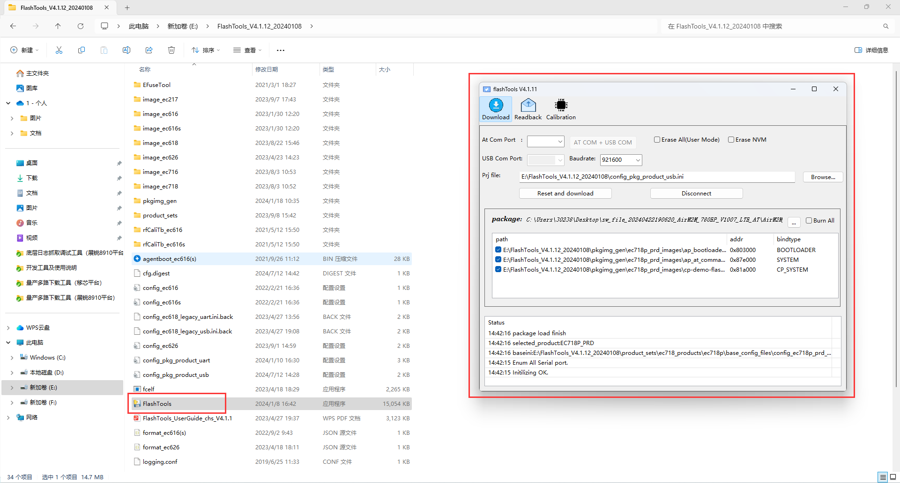
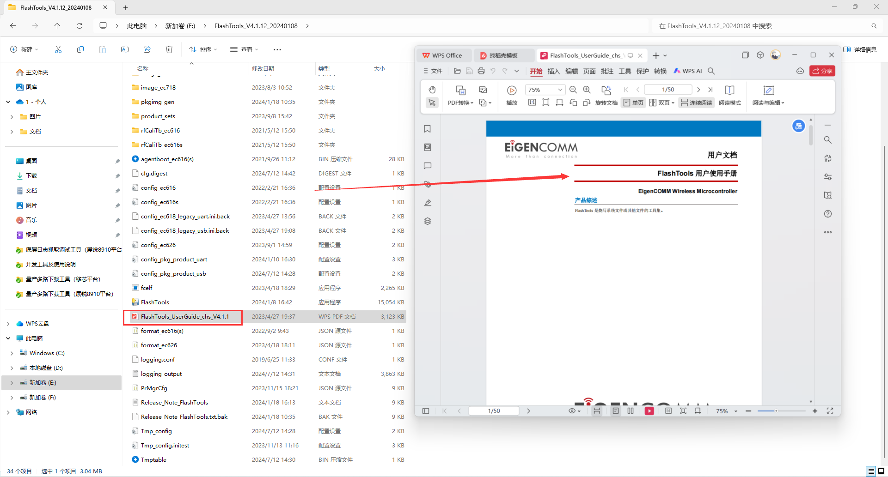
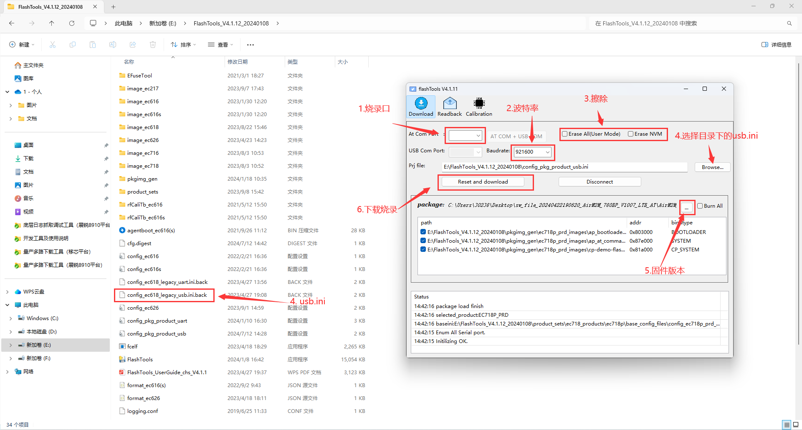
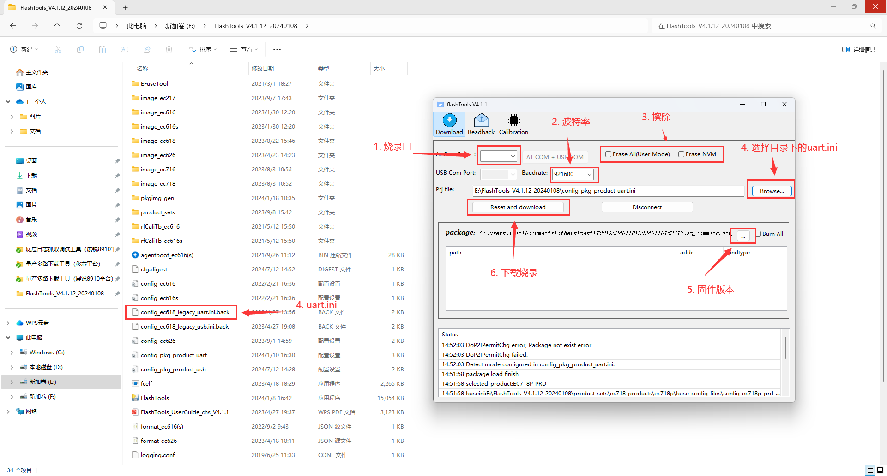

# 注意事项

1. **FlashTools串口烧录工具仅支持移芯模组，例如EC618、718等。**
2. **FlashTools串口烧录工具仅支持烧录AT固件。**

# FlashTools工具下载

**下载链接：**[Flashtools_v4.1.9](https://cdn.openluat-luatcommunity.openluat.com/attachment/20240515135114385_FlashTools_V4.1.9_20231106.rar)

# FlashTools工具安装

1. 下载后是一个压缩包，解压后找到一个文件名为**FlashTools.exe**的运行程序。

2. 同文件下的**FlashTools_UserGuide_chs_V4.1.1**为使用手册。

# USB烧录方式

# 串口烧录方式

