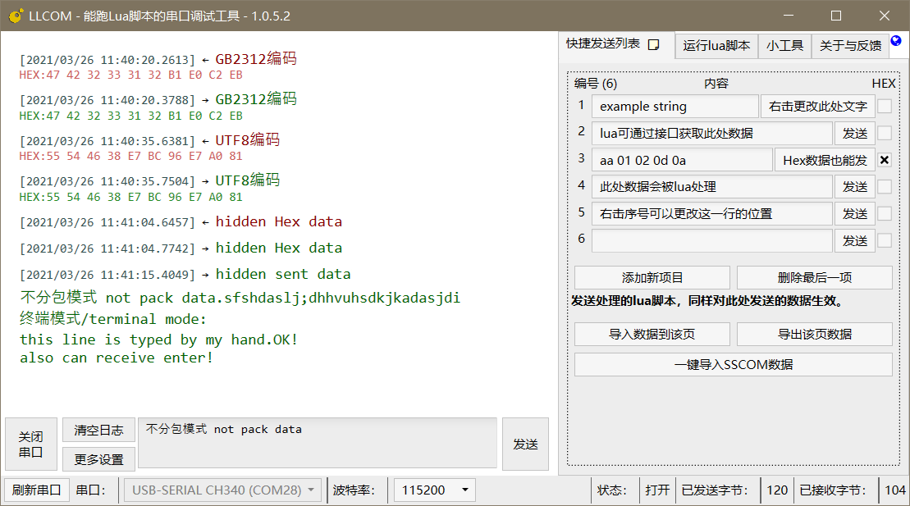
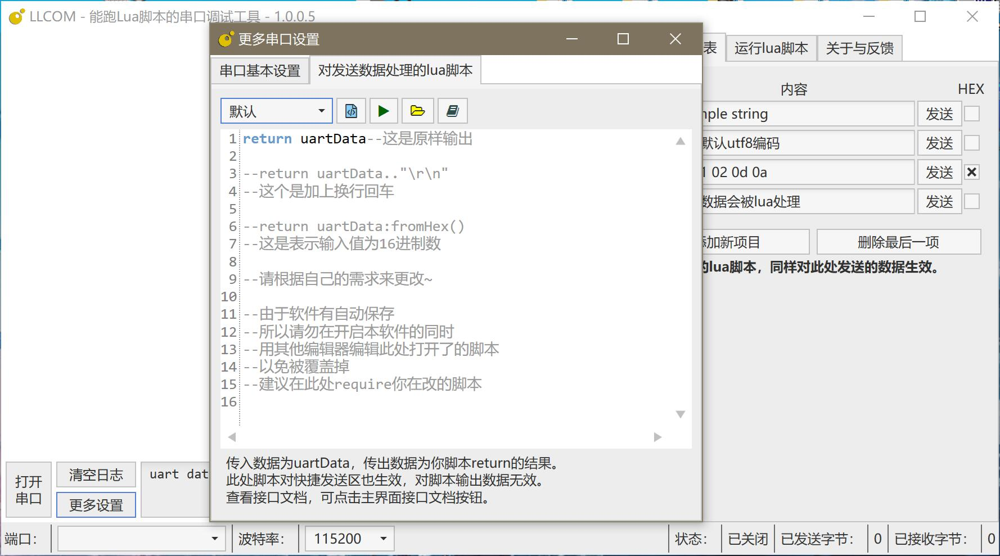
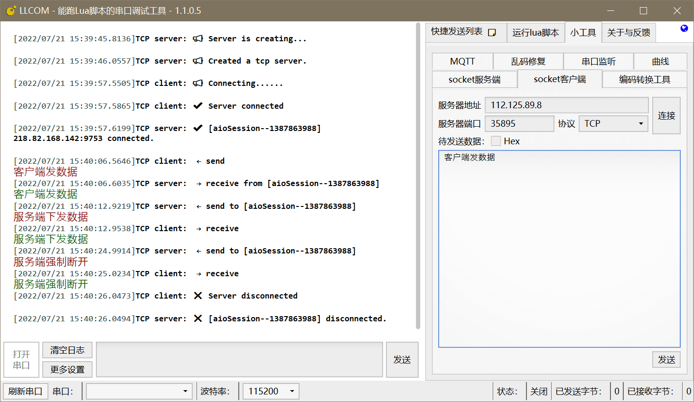

# 下载位置

**从微软商店下载：**[点我直接安装](ms-windows-store://pdp/?ProductId=9PMPB0233S0S&mode=mini&pos=0,0,2560,1395&referrer=storeforweb)

**exe便携版：**[国内用户点我下载](https://llcom.papapoi.com/llcom.zip)

**CI快照版：**[Appveyor Artifacts](https://ci.appveyor.com/project/chenxuuu/llcom/build/artifacts)

**所有正式版本：**[GitHub Releases](https://github.com/chenxuuu/llcom/releases/latest)

# 功能列表

- 其他串口调试功能具有的功能
- 收发日志清晰明了，同时显示HEX值与实际字符串
- 自动保存串口与Lua脚本日志，并附带时间
- 串口断开后，如果再次连接，会自动重连
- 发送的数据可被用户自定义的Lua脚本提前处理
- 右侧快捷发送栏，快捷发送条目数量不限制
- 可独立运行Lua脚本，并拥有定时器与协程任务特性（移植自[合宙Luat Task架构](http://wiki.openluat.com/doc/luatFramework/)）







# 特色功能示范

## 使用Lua脚本提前处理待发送的数据

1. **结尾加上换行回车**

```lua
return uartData.."\r\n"
```

2. **发送16进制数据**

```lua
return uartData:fromHex()
```

此脚本可将形如`30313233`发送数据，处理为`0123`的结果

3. **更多玩法等你发现**

```lua
json = require("JSON")
t = uartData:split(",")
return JSON:encode({
    key1 = t[1],
    key2 = t[2],
    key3 = t[3],
})
```

此脚本可将形如`a,b,c`发送数据，处理为`{"key1":"a","key2":"b","key3":"c"}`的结果

==此处理脚本，同样对右侧快捷发送区域有效。==

## 独立的Lua脚本自动处理串口收发

右侧的Lua脚本调试区域，可直接运行你写的串口测试脚本，如软件自带的：

```lua
--注册串口接收函数
uartReceive = function (data)
    log.info("uartReceive",data)
    sys.publish("UART",data)--发布消息
end

--新建任务，等待接收到消息再继续运行
sys.taskInit(function()
    while true do
        local _,udata = sys.waitUntil("UART")--等待消息
        log.info("task waitUntil",udata)
        local sendResult = apiSendUartData("ok!")--发送串口消息
        log.info("uart send",sendResult)
    end
end)

--新建任务，每休眠1000ms继续一次
sys.taskInit(function()
    while true do
        sys.wait(1000)--等待1000ms
        log.info("task wait",os.time())
    end
end)

--1000ms循环定时器
sys.timerLoopStart(log.info,1000,"timer test")
```

甚至你可以利用xlua框架的特性，调用C#接口完成任何你想做的事情

```lua
request = CS.System.Net.WebRequest.Create("http://example.com")
request.ContentType = "text/html;charset=UTF-8";
request.Timeout = 5000;--超时时间
request.UserAgent = "Mozilla/5.0 (Windows NT 10.0; Win64; x64) AppleWebKit/537.36 (KHTML, like Gecko) Chrome/71.0.3578.98 Safari/537.36 Vivaldi/2.2.1388.37";

response = request:GetResponse():GetResponseStream()

myStreamReader = CS.System.IO.StreamReader(response, CS.System.Text.Encoding.UTF8);

print(myStreamReader:ReadToEnd())--打印获取的body内容

myStreamReader:Close()
response:Close()
```

使用此功能，你可以完成大部分的自动化串口调试操作。

# 接口文档

接口文档可以在[这个页面](https://github.com/chenxuuu/llcom/blob/master/LuaApi.md)查看。