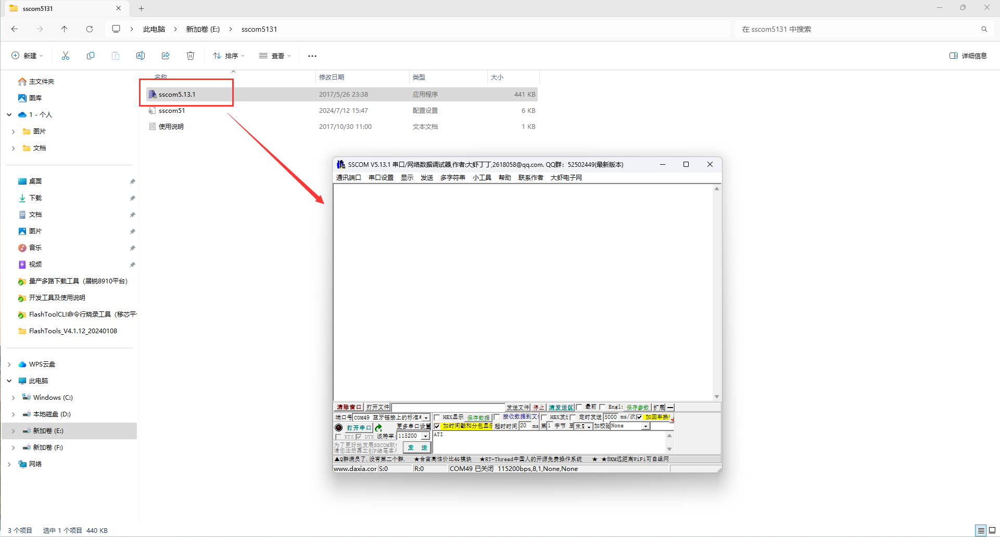
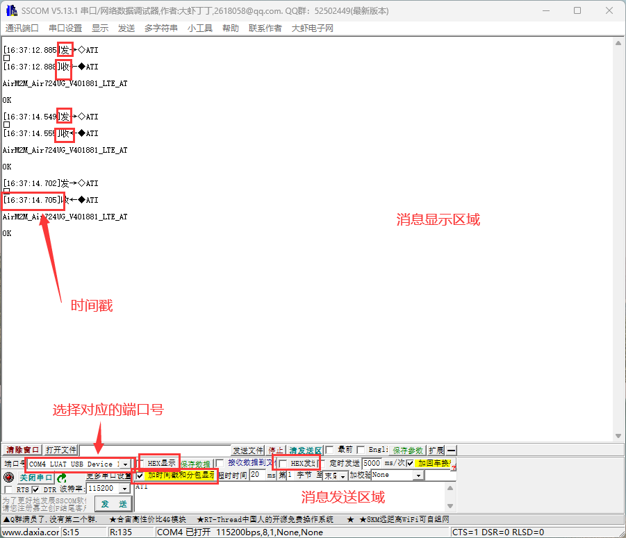
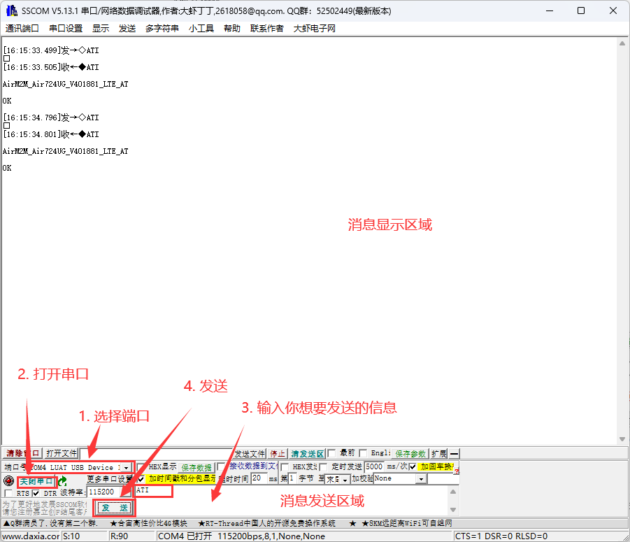
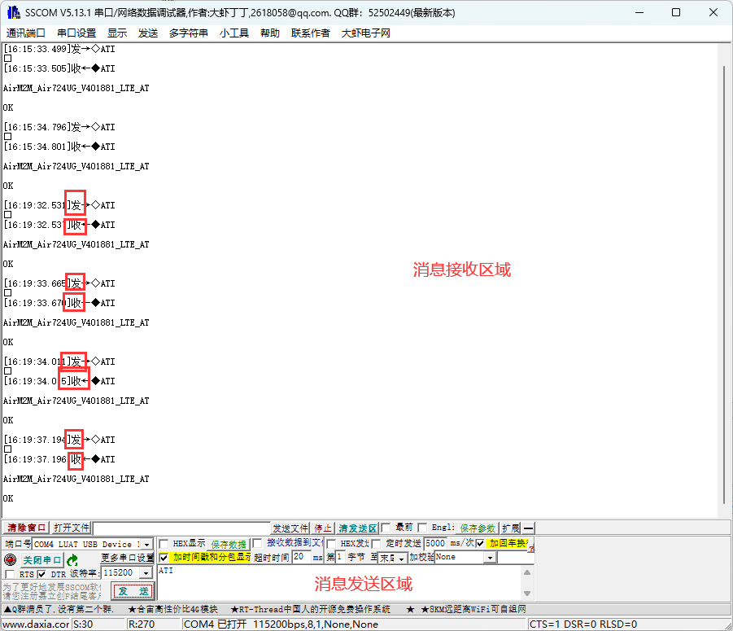

# 简介

```text
SSCOM作为简单实用的串口通信助手工具，可以在计算机与设备之间建立串口通信连接，实现数据的发送与接收。
```

```text
主要特点：
	串口设置：用户可以轻松设置串口的参数，如波特率、数据位、停止位和校验位等。合适的串口参数设置可以确保数据的稳定传输。
	数据发送与接收：SSCOM提供了用户友好的界面，使用户可以方便地输入要发送的数据并进行发送操作。同时，用户可以实时监视串口接收到的数据，以便及时调试和分析。
	数据显示格式：SSCOM支持以多种格式显示接收到的数据，如16进制、ASCII码等。这对于不同类型的数据交互非常有用，让用户更加清晰地了解数据的内容。
	快捷指令：为了提高效率，SSCOM允许用户创建和保存一些常用的指令，以便在后续的通信中快速使用。这在一些特定场景下尤为方便。
```

# SSCOM串口调试工具下载

**下载链接：**[sscom5131.zip](https://cdn.openluat-luatcommunity.openluat.com/attachment/20240712154150770_sscom5131.zip)

# SSCOM串口调试工具安装

将下载后的压缩包解压后打开目录下的**sscom5.13.1**程序即可直接使用。



# 基本操作说明

## **基本设置**

```text
消息发送区域：在该区域可以输入你想要发送的信息
消息显示区域：在该区域会打印你刚才发送的和接收到的信息
端口号：要选择正确的端口号，否则无法收发信息
波特率：SSCOM上的波特率要与设备上的一致，否则无法进行通信
HEX发送：勾选后在[消息发送区域]以HEX形式发送信息，不勾选则以字母形式发送信息
HEX显示：勾选后在[消息显示区域]会以HEX形式显示信息，不勾选则以字母形式显示信息
时间戳：勾选后在[消息显示区域]的收发信息前面有对应的时间，不勾选则没有
```



## 发送消息

```text
在[端口号]选择对应的通信端口（如COM4），点击[打开串口]，然后在[消息发送区域]填入你想要发送的信息，最后点击发送即可。
在[消息显示区域]开头标有[发]的信息即为你发送的信息。
```



## 接收消息

```text
打开串口，通过串口接收到的信息会直接显示在[消息显示区域]。
[消息显示区域]开头标有[收]的即为接收到的信息。
```

