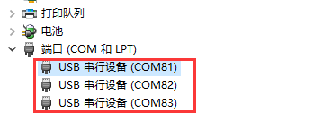

# USB驱动安装教程（移芯平台）

**目前移芯平台采用的驱动方式为微软官方推荐的[USB 串行驱动程序 (Usbser.sys)](https://learn.microsoft.com/zh-cn/windows-hardware/drivers/usbcon/usb-driver-installation-based-on-compatible-ids)，只要使用了该方法，即可免驱动安装，方便用户开发项目。**

## 目录名称

- [USB驱动说明](#USB驱动说明)
  - [win10系统](#win10系统)
  - [win7及其以下系统](#win7及其以下系统)
- [包含在 Windows 中的 USB 设备类驱动程序](#包含在 Windows 中的 USB 设备类驱动程序)

## USB驱动说明

### win10系统

USB驱动无需安装，插入电脑后(**模块需要powerkey接地1.2S，VBAT供电4.2-3.3V，USB口和电脑相连，USB线为数据传输线并非充电线，区别在于线里有没有DM与DP 。一个很方便的验证方法为，C口插入手机，电脑是否弹出大容量存储设备，如果弹出则证明该线为数据线，反之则该线只能充电即只有VCC 和GND**)会虚拟出如下端口：前２个口81，82可以用来发送AT命令，83口对应的为LOG口（也可能是前2个口是LOG口，以实际测试为准）。

### win7及其以下系统

**不支持**

## 包含在 Windows 中的 USB 设备类驱动程序

[Windows 中包含的 USB 设备类驱动程序](https://learn.microsoft.com/zh-cn/windows-hardware/drivers/usbcon/supported-usb-classes)